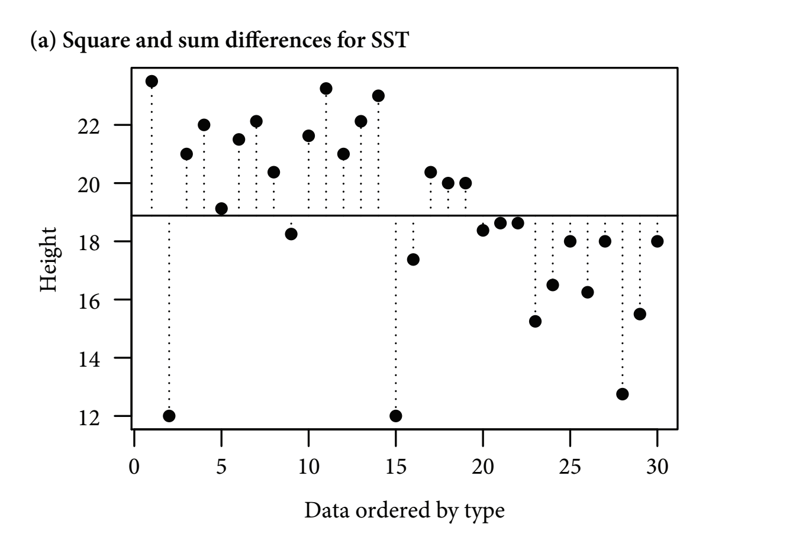
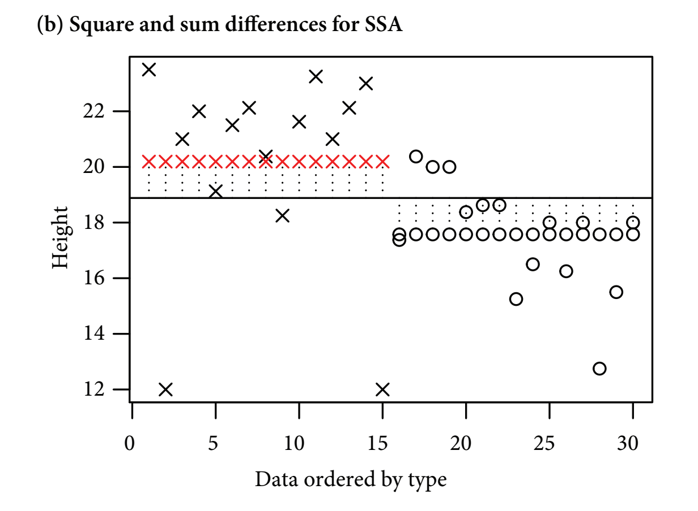
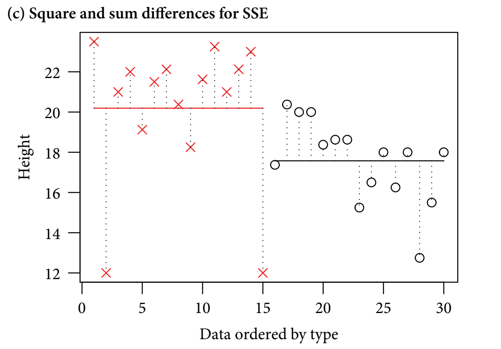
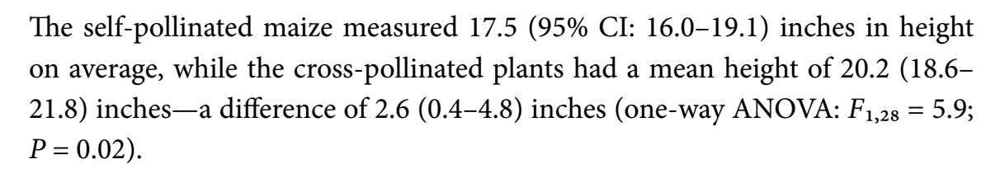

# Analysis of Variance 

## ANOVA tables 
- Pairwise t-tests become less effective as experimental designs become more complex 
  - The more pairwise comparisons there are, the greater the risk of generating false positives 
- It can be useful to instead use an approach such as the analysis of variance 
- Generally ANOVAs deal with categorical explanatory variables, but there are versions can evaluate continuous explanatory variables too 
- We can use ANOVA to evaluate Darwin's maize data 

```{r install-011, echo=T, message=FALSE, warning=FALSE, results='hide'}
install.packages("arm",  repos = "https://cran.us.r-project.org")
install.packages("ggplot2",  repos = "https://cran.us.r-project.org")
install.packages("SemiPar",  repos = "https://cran.us.r-project.org")
install.packages("SMPracticals",  repos = "https://cran.us.r-project.org")
```

```{r load-libs-011, echo=T, message=FALSE, warning=FALSE, results='hide'}
library(arm)
library(ggplot2)
library(SemiPar)
library(SMPracticals)
```

## ANOVA tables: Darwin's maize 

Simple linear model from chapter 6: 
```{r ch6-mod-09, tidy=TRUE, tidy.opts=list(width.cutoff=60)}
ls1 <- lm(height ~ type, data = darwin)
```

- Since there is only one explanatory variable, the model is called a one-way ANOVA 
- An anova aims to quantify the overall variability within a dataset, then parse the variability between and within groups (i.e. self and cross pollinated offspring)
  - Then calculate a signal:noise ratio
    - The greater the signal to noise ratio, the more confidence we can have about whether or not the test has detected a real effect 
- The variability is quantified through a method known as least squares 
  - This method calculates the overall variability (the total sum of squares, SST) by measuring the differences between individual data points and a reference point, or 'intercept': 
  - Often the most intuitive reference point to use is the grand mean 

```{r figA, echo=FALSE, out.width="65%", fig.cap="Figure 11-1A. Total Sum of Squares"}

```

- Horizontal line: the grand (overall) mean 
- Vertical lines: measure the differences between the data point and the reference (the horizontal line) 
  - These differences (distances to the reference line) are squared and summed 
- The most intuitive reference point is the grand mean, but any value can be used 
  - Statistical software usually choose a different reference point
- Next, least squares quantifies how much of the overall variability is explained by classifying the datapoints into treatment groups:

```{r figB, echo=FALSE, out.width="65%", fig.cap="Figure 11-1B. Treatment Sum of Squares"}

```

- figure b 
  - The next step is called least squares
    - Least squares quantifies how much overall variability is explained by classifying the datta points into treatment groups 
  - The vertical lines show the differences between the overall mean (the solid vertical line) and the treatment mean (the row of red crosses or black circles (these are also the fitted values))

- Finally, the residual variation is explained: 
```{r figC, echo=FALSE, out.width="65%", fig.cap="Figure 11-1C. Error sum of squares"}

```

- figure c 
  - After the treatment groups' variability is subtracted from the total variability, the unexplained residual variability is leftover 
  - The vertical dotted lines show the differences between the observed data values and the treatment level means 
  
- Overall, the least squares method quantifies the overall varability and splits it into signal and noise 
  - It works with the sums of squared distances between the individual data points and the means - the 'sum of squared differences' or 'sum of squares (SS)' 
  

Draw up an analysis of variance table for the model: 
```{r anova-tab1}
anova(ls1)
```

- output: 
  - first unnamed column - shows source of variation (type and Residuals)
    - Sources of variation: pollination treatment (signal) or to the residual variation (noise) 
  - **Df** (degrees of freedom) - this is an indication of the number of treatment levels and experimental units (sample size)  
  
<center> 
$total \; df_{sample \; size} = N-1$
</center>
  
- **Sum Sq** = sum of squares 
    - R doesn't provide the total variation but to find that we would just have to add the two values from SumSq up 
  - **Mean Sq** is the same as the variance 
    - The mean square is calculated by dividing the row's Sum Sq value by the corresponding Df value
    - Essentially, this gives an average amount of variability per treatment level or per experimental unit 
    - The mean square for the residual is calculated by pooling the variation within both samples in order to get a better estimate of the overall noise 
    - This is very useful when there are a number of different treatments with a smaller sample size
    - Linear models almost always rely on the pooled estimate of variance 
    - Because of this, the standard errors for the estimates of the means will only differ if the treatment groups have different sample sizes

## Hypothesis testing: F-values 
  - The signal to noise ratio is calculated by dividing the treatment variance (mean square) by the residual error variance (mean square) to produce the F-value which is given in the fifth column:
  
<center> 
$F \; value = \frac{Mean \; square \;treatment}{Mean \; square \;residual}$
</center>

  - In the anova table, the signal estimated signal (51.352) is 5.9x larger than the estimated noise (8.646)
    - The larger the signal to noise ratio, the more confident we can be that it is not a false positive
  - the sixth column - the **p value**; says that there is a 2% chance of observing a signal to noise ratio of at least this large if the null hypothesis is true (i.e. there is actually no effect of pollination type)
    - If we repeated Darwins experiment over and over, then we would expect, 2% of the time, there would be actually no effect of pollination type then we would expect an F value of the size or larger 
    - Critics argue that P = 0.05 creates too many false positives and a minimum P value of < 0.004 would be more appropriate 
    - Generally, the larger the sample, the lower the p value (due to increased statistical power)
    - This makes it hard to use p values to compare the strength of results from different analyses when sample sizes vary 
    - p values generally create a dichotomy of significant and non-significant result
    -Instead, estimates and confidence intervals can be used 

Recreate the p value by plugging in the values from the anova table: 
```{r pval}
pf(
  5.9395,  #the F value
  1,       #degrees of freedom for the signal (numerator)
  28,      #degrees of freedom for the noise (denominator)
  lower.tail = FALSE) #prints the probability of being in the tail of the distribution with an F-value => the observed value (5.9) in this case approximately 2%

```

- Often p values are presented with no supporting information, but readers can't interpret these without knowing from what test they come and the number of degrees of freedom 
- author's suggested description of the analyses: 
```{r fig-txt, echo=FALSE, out.width="65%", fig.cap="Figure 11-1C. Error sum of squares"}

```

## Two-way ANOVA 
- A two-way anova is an analysis that deals with two explanatory variables 
- In this example, we will continue to use Darwin's maize data
- The new explanatory variable we will use is 'plant pairing' 

Create linear model that factors in the plant pairings: 
```{r two-way-anova}
ls2 <- lm(height ~ type + pair, data = darwin)
```

Compare the tables for one-way and two-way anova: 
```{r oneway-anova}
options(show.signif.stars = FALSE) 
anova(ls1)
```

```{r two-way-anova-comp}
anova(ls2)
```

- From the two way anova, we find one "unsatisfying" thing about darwin's experiment: the pairing doesn't work the way he intended 
- If it worked, then we would have expected its Mean Sq value to be larger than that of the Residuals (it would have explained more of the variability than the noise does)
  - Plant pairing only explains about 8.8% of the total variation 
- Since the mean sq for pair (6.162) is smaller than the mean sq for residuals (11.130), this implies a 'negative variance component'. Could be two explanations for this: 
  - Sampling variability 
  - An issue with the experimental design 
    - Darwin didn't randomize his experimental units (the experiment pre-dates this principal)
