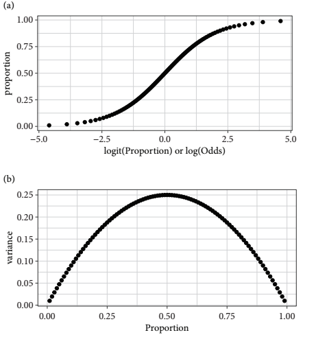

# Binomial GLMs

## Binomial counts and proportion data 
- Binomial counts arise when the data are comprised of variables in which there is a known number of occasions (binomial trials) on which something of interest could occur 
  - We know how many times something happened (successes) and how many times it did not (failures)
    - The sucesses + failures sum give the binomial denominator 
- Binomial count data can be expressed as proportions (that is, the proportion of successes) 
- But if the binomial denominator (the number of trials) varies then it is better to use binomial count data because all trials are weighted equally 
- When the size of the trials is not recorded, then proportion version of the data must be used 


```{r include=FALSE}
knitr::opts_chunk$set(echo = TRUE)
```

```{r echo=T, message=FALSE, warning=FALSE, results='hide'}
install.packages("arm",  repos = "https://cran.us.r-project.org")
install.packages("ggplot2",  repos = "https://cran.us.r-project.org")
install.packages("dplyr",  repos = "https://cran.us.r-project.org")
install.packages("AICcmodavg",  repos = "https://cran.us.r-project.org")
```

```{r echo=T, message=FALSE, warning=FALSE, results='hide'}
library(arm)
library(ggplot2)
library(dplyr)
library(AICcmodavg)

```

## The beetle data 
- For this chapter, we will focus on data from an experiment that examined mortality rates of eight batches of the flour beetle *Tribolium confusa* when these groups were exposed to different doses of a pesticide (carbon disulfide) in 1935 
- Insecticide treatment lasted 5 hours 
- The unit for Dose is $mg \cdot L^{-1}$

```{r}
data("beetle")
beetle
```

Change column names: 
```{r}
names(beetle)[2] <- "tested"
names(beetle)[3] <- "killed"
names(beetle)

```

Add a column for number of individuals that survived the pesticide treatment: 
```{r}
beetle$alive <- beetle$tested - beetle$killed
head(beetle)
```

- A binomial GLM will investigate the number of beetles killed (successes) out of the number tested (the binomial denominator) as a function of dose of insecticide (concentration in $mg \cdot L^{-1}$)
- When binomial count data are expressed in proportions, they are bounded by (0,1) 
  - The floor and ceiling of values constrain the variance 
- The expected means require some form of S-shaped relationship for a model of the mean 
  - The variance decreases towards the extremes (0 and 1) and is greatest in between 
- A GLM using the binomial distribution with the logistic curve (the default link function) models the mean with a symmetric S-shape 

### Logits and the logistic curve 
- The logistic transformation converts proportions to logits 
  - Logits are natural logs of the odds, which are the ratio of successes to failures 
  - For a binomial denominator of 10 with five successes and five failures, the logit is $log(5/5) = 0$
- One logit worth remembering is that a proportion of 0.5 is a logit of zero 
  - Negative logits correspond to proportions less than 0.5 
  - Positve logits correspond to proportions greater than 0.5 
- Logistic transformations map proportions from zero to one onto a symmetric S-shaped curve that asymptotes towards $\pm\infty$

```{r , echo=FALSE, out.width="65%"}

```

## GLM for binomial counts
- The GLM of the binomial counts analyses the number beetles killed in each batch while taking into account the size of each group 
- The numbers of successes and failures must be bound together so that they can be jointly supplied as the response variable in the binomial GLM model formula 

Create model for binomial count data: 
```{r}
m1_logit <- glm(cbind(killed, alive) #written as (successes, failures) as we are interested in mortality rate
                ~ Dose, data = beetle,
                family = binomial(link = "logit"))
```

Extract the regression intercept and slope of the line (linear on the logit scale):
```{r}
coef(m1_logit)
```


Zero falls way outside of the 95% CI, we can probably reject the null hypothesis that there is not a dose dependent relationship with beetle mortality rate:
```{r}
confint(m1_logit)
```

The `display()` function provides the same result in different form: 
```{r}
display(m1_logit)
```

Model formula for an equivalent analysis - a weighted GLM on proportion data:
```{r}
m2 <- glm(Mortality_rate ~ Dose, data = beetle,family = binomial, #mortality rate as a function of dosage
          weight = tested) #ensures that group size is taken into account 
summary(m2)
```

- The coefficents of models m1 and m2 are the same 
- We can use the weighted GLM to help plot the data:

It is more clear to plot mortality rate as a proportion:
```{r}
fig17_2 <- ggplot(beetle, aes(x = Dose, y = Mortality_rate)) + 
  xlab("Dose (mg/L)") + ylab("Mortality rate") + 
  geom_point() + 
   geom_smooth(method = "glm", method.args = list(binomial), aes(weight = tested)) + 
  scale_x_continuous(limits = c(45, 80),
                     breaks = seq(45, 80, by = 5))
fig17_2
```

- Referring back to the `summary()` output table, we see that the ratio of residual deviance to degrees of freedom is 8.4379:6  giving us a dispersion parameter of approximately 1.4 
  - The author says that the data are not too overdispersed, but since the index value is above the rule of thumb value of 1.2 for overdispersed data, we can account for it using a quasi-maximum likelihood approach 

Quasi-binomial approach baked into model: 
```{r}
m1_quasi <- glm(cbind(killed, alive) 
                ~ Dose, data = beetle,
                family = quasibinomial)
summary(m1_quasi)
```

- This summary output table gives a specific like for the dispersion parameter and it is lower than it was previously 
- The standard errors are a little bit larger 
- No AIC value is provided 

## Alternative link functions 
- In some cases, including for this beetle dataset, there is more than one link function that can be used within a given distribution in a GLM 
- For the binomial GLM, two common alternatives to the logistic function, which is the default, include:
  - The complimentary log-log (cloglog) 
  - The probit

Complimentary log-log version of m1: 
```{r}
m1_cloglog <- glm(cbind(killed, alive) #written as (successes, failures) as we are interested in mortality rate
                ~ Dose, data = beetle,
                family = binomial(link = "cloglog"))
```

Probit version of m1: 
```{r}
m1_probit <- glm(cbind(killed, alive) #written as (successes, failures) as we are interested in mortality rate
                ~ Dose, data = beetle,
                family = binomial(link = "probit"))
```

- One way to approach comparing these different models is to use the information criteria (AIC)
  - We take the same size as 471, which is the total number of beetles tested

### Model selection using information criteria
- AIC values are one of many tools to help choose a model 
- Lowered AIC values are preferred over higher ones 
- Because AIC values are one of many tools, models shouldn't not be chosen solely based upon having the lowest AIC value 
- There is usually no 'right' model 
  - Presenting any such model this way would shroud the complex model generating process 
  - It is better to present 2-3 models than a single best one 
- Information criteria has more fuzzy lines than hard cuts off that are associated with levels of statistical significance, but it makes them trickier to explain 
- Two models that have AIC values within ~2 units of each other are considered indistinguishable 
- Usually models that are 10-20 AIC units higher (that is, worse) are left out of the final short list of candidates 
- When choosing between models that have similiar AIC values, it's best to narrow down models to favor the simpler models 

Create dataframe of AIC values: 
```{r}
cand.models <- AIC(m1_logit, m1_probit, m1_cloglog)
cand.models$delta_AIC <- cand.models$AIC - max(cand.models$AIC)
cand.models
```

- The probit model gives a very small improvement over the original model, and is considered virtually the same based on this measurement 
- On the other hand, the cloglog model provides a 4-5 unit improvement over the first model 
  - This hovers around the boundary where one might prefer this model over others 
- Still models within 5 AIC units over each other can be considered as equal viable alternatives 
- Burnham & Anderson (2002) say to do a test called multimodel inference to make predictions based off of all models 
  - Picking the 'best' model does not reflect model selection uncertainty involved in arriving at that model 
    - 'the journey through the 'garden of forking paths' 
- In this example, the use of AIC is overkill because the number of parameters is the same in each case 
  - The AIC is only variable as a result of changes in likelihood, which is a measure of goodness of fit 
