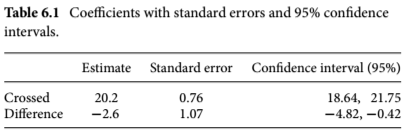

# Linear models

- Chapter 5 introduced Darwin's maize data, and the manual calculation of confidence intervals (CIs)
- In this chapter, the author discusses more efficient methods of calculating CIs

## Introduction 

```{r install-06, echo=T, message=FALSE, warning=FALSE, results='hide'}
install.packages("DAAG", repos = "https://cran.us.r-project.org")
install.packages("ggfortify",  repos = "https://cran.us.r-project.org")
install.packages("SMPracticals",  repos = "https://cran.us.r-project.org")
install.packages("ggplot2",  repos = "https://cran.us.r-project.org")
install.packages("arm",  repos = "https://cran.us.r-project.org")
install.packages("reshape2",  repos = "https://cran.us.r-project.org")
install.packages("tidyverse",  repos = "https://cran.us.r-project.org")
```

```{r load-libs-06, echo=T, message=FALSE, warning=FALSE, results='hide'}
library(arm)
library(DAAG)
library(ggfortify)
library(ggplot2)
library(SMPracticals)
library(reshape2)
library(tidyverse)
```

## A linear model analysis for comparing groups 
- The general function for creating linear models is `lm()` 
- It's good practice to assign a model to an object (i.e. ls0)
  - Short for least squares model 0 because the linear model analysis uses a technique known as least squares 

Create first model: 
```{r first-lm-06}
ls0 <- lm(formula = height ~1,  #the 1 indicates that we just want to
                                  #estimate an intercept
          data = darwin) 
```
  
- ls0 is a model of height in relation to 1 (not another variable)
- When no comparisons are made in the model the intercept equals the grand mean


Generate a concise summary (table of coefficients) of key output of linear models: 
```{r summ-ls0-06}
display(ls0) #from the arm package
```
- display(ls0) output: 
  - **coeff.est** = the intercept (it's the grand mean in this case)
  - **coeff.se** = the standard error
  - **n** = sample size 
  - **k** = # of parameters estimated by the model 
    (in this case it's 1 since it's just the grand mean)
  - **residual sd** = the SD of the heights of all 30 plants 
  - **R-squared** 0.00 = 0% of the variation in the data is accounted for by the 
    explanatory variable  since there is no explanatory variable, the proportion is 0% 
    
The intercept is the grand mean of all of the Darwin maize data. Confirmation:
```{r round-mean-06}
x<-format(round(mean(darwin$height), 2), nsmall = 2)
x <- as.numeric(x)
x
```

Visualize the data: 
```{r maize-viz-06, tidy=TRUE, tidy.opts=list(width.cutoff=60)}
base_plot<-ggplot(darwin, aes(x = type, y = height)) + 
  geom_boxplot() +
theme_bw()
base_plot # the marked points are outliers 
```

Create model of height by pollination type: 
```{r lm-ls1-06}
ls1 <- lm(height ~ type, data = darwin) #does height vary as a function of type of pollination? 
```

Summarize the model ls1: 
```{r summ-ls1-06}
display(ls1)
```

- display(ls1) output: 
  - Need to figure out what "**Intercept**" is in the table of coefficients 
    - It is no longer equal to the grand mean
  - There are two levels encompasses in the explanatory variable "type"
    - One is "self" and is listed as typeSelf
    - So the intercept must be the other explanatory variable (cross)
      - Also, R lists levels in alphabetical order (cross before self)
  - In the table, the **coeff.est** of the intercept is the average height of cross pollinated progeny 
    - **coef.se** of the Intercept is the SE of the mean
  - The **coeff.est** of typeSelf is the difference in mean height of the cross pollinated and self pollinated progeny (that's why it is negative)
  - This will help us answer the question, Is there any difference in plant height that results from the different pollination treatments? 
    - The **coeff.se** for typeSelf is also something new:
    - It's the standard error of the difference 
      - Variation expected around the difference 
  - The linear model calculates a pooled variation across all groups to take advantage of the fuller sample (greater n)
    - Assumes that the groups have the same variance; this assumption must be checked 
  - **residual sd** - square root of the residual error variance 
  - **R-squared** - 18% of the variation is explained by the pollination variable


Annotate mean on scatterplot: 
```{r scatterp-06}
ggplot(darwin, aes(x = type, y = height)) + geom_point() +  
  stat_summary(fun = mean, #superimpose the mean on the plot 
               geom = "point", 
               colour = "blue", shape =8, size =5)
```

## Standard error of the difference 

- Standard error of the difference (SED) - standard error of the difference between two means: 

<center>
$SED = \sqrt{\frac{s_1^2}{n_1} + \frac{s_2^2}{n_2}}$
</center>

- The subscripts indicate there are two groups (i.e. treatment groups)


## Confidence intervals 

Calculate upper and lower bounds of the CI for the model: 
```{r ls1-CI-06}
CI_ls1<-confint(ls1)
CI_ls1
```

- Output: 
  - Similar output to the `display()` function
  - The first row (the Intercept) shows the 95% CI for the height of the seed developed from outcrossing 
  - The second row shows the 95% CI for the difference in height between the two groups
- The upper (97.5%) and lower (2.5%) bounds are percentiles of the normal distribution 
- Helpful to incorporate all the data into one table: 

```{r insert-table6-1, echo=FALSE, out.width="65%"}

```

- Darwin hypothesized that progeny produced through selfing would have lower fitness levels (reflected in height)
- CIs can be used to figure out if this is reflected in the data

## Answering Darwin's question 

- The null hypothesis in this experiment is that there is no difference in fitness (height) of the progeny produced through selfing or outcrossing 
- A confidence interval test can be used to uphold or reject the null hypothesis
  - This requires that we determine if the predicted null value (zero) lies inside the confidence interval (see figure 5.3)
  - If zero lies outside these bounds, then the null hypothesis can be rejected at that confidence interval because the estimated mean difference (-2.62 inches) can be distinguished from the null predicted value given the variability in the data
  - Variability in the data is quantified through the standard error, which is used to calculate the CI 
- We can visualize this on a numberline
  
  
Plot a number line with difference of means and its respective CI: 
(see [guide](https://rdrr.io/cran/coefplot/man/coefplot.default.html))
```{r numline-ls1-06}
figu6_4 <- coefplot(ls1, xlim = c(-5,0))
```

- Number line conclusions: 
  - since 0 is outside the 95% CI, we can reject the null hypothesis at this standard 

Create a model with a 99% CI requirement: 
```{r CI99-ls1-06}
confint(ls1, level = 0.99)
```
- Output: 
  - note the change in sign in the upper bound of typeSelf shows that 0 is now within the CI 

Redraw the number line with the new model: 
```{r numline99-ls1-06}
fig6_5 <- coefplot(ls1,  
                   sd = 3) #sd actually refers the # of standard errors here 
```

- Conclusions: 
  - cannot reject the null hypothesis at a 99% CI as 0 is within it

## Relevelling to get the other treatment mean and standard error 

- A limitation of these methods is that the table of coefficients from `display()` will not produce the mean and standard error for another level
  - As we have seen, you can only get the difference of means and the SED
- To find the mean and standard error for the other level(s), the variables have to be relevelled 

Relevel to get the mean and standard error data for the selfed progeny population: 
```{r darwin-relevel-06}
darwin$type <- relevel(darwin$type, #in this column:
                       ref = "Self") #make the reference the Self group 
```

Summarize the model: 
```{r relevel-display}
display(lm(height ~type, data = darwin)) #now, Intercept's coef.est and coef.se refer to those of the selfed population 

```

- The standard error of the mean (Intercept$coef.se) is the same for typeSelf as for typeCross (0.76)
  - Based on the formula for SE, SE value depends on $variance^2$ and the sample size (n) for each group
  - However, R's `lm()` function uses a single (pooled) estimate of the residual variance for all treatment levels (this concept will be revisited in the ANOVA section)
  - So if the SEMs for different treatments vary, then it must be due to the sample size in each group differing 
  - But in the case of Darwin's maize data, each group was comprised of 15 plants 
  - Since both groups had an equal number of biological reps and the `lm()` was used, then we didn't have to relevel the groups because we could have already known that the SEMs of the groups would be the same 

## Assumption checking

- The objective here is to assess that the assumptions that the unexplained variations in the two treatment groups are approximately normal are are equal in their variability 
- It is recommended to plot the residual differences to assess this 
- Residuals are the differences between the observed values (heights) and the 'fitted' values which are predicted by the linear model 
- This assumption of approximate normality applies here because linear models use the normal distribution as a model for the variabiliity 
  - This is where measures of precision (SEs) and confidence (CIs) are derived from
- The assumption of approximately equal variance follows from the use of a single pooled estimate of variance across all treatment groups 

### Normality 

- Check assumptions using the diagnostic plots using ggfortify - 
  - Display the normal quantile (Q-Q) plot: 
```{r ls1-assumptions-06}
fig6_6 <- autoplot(ls1, 
                   which = c(2), #refers to which of the graphs you want displayed 
                                      #in this case it's it can be c(1,2,3,4) 
                   ncol = 1) #sets the orientation in which the plots are displayed 
fig6_6
```

- fig6_6 takeaways: 
  - This plot graphs the quantiles of the distribution of the residuals compared to the quantiles of a random sample of normally distributed numbers 
  - The dotted diagnonal line represents that normal distribution
  - When most of the dots fall around the dotted line, they closely match the normal model 
  - A large portion of the residuals are approximately normally distributed 
  - The points that deviate from normal are  at the extremes 
    - This is not a surprise because we already know there are outliers in the data
  - Overall, this assessment shows that data are not ideally normal, but not appropriate still 

### Equal variance 

- Two graphs to assess if the variances in the treatment groups are approximately equal: 
  - Raw residuals plot (left) - positive and negative values 
  - Standarized residuals plot (right) - positive values 
    - $\sqrt|\frac{residuals}{residuals.SD}|$


```{r ls1-var-check-06}
fig6_7 <- autoplot(ls1, 
                   which = c(1,3),
                   ncol = 2)
fig6_7
```

- fig6_7: 
  - The group with the higher fitted values is the outcrossed group, which has a higher mean height
  - These plots confirm our impressions of the raw data (see base_plot) that the cross pollinated treatment data are more variable, mainly due to the outlier values 

## Appendix 6b: Robust linear models {-}

Robust linear model function (`rlm()`): 
```{r rlm-06}
summary(rlm(height ~ type, data = darwin)) 
```

## Appendix 6c: Exercise {-}

Repeat analysis with Darwin's mignonette data... 
```{r data-str-06}
str(mignonette)
```
- mignonette data is in wide form, but I want to make the pollination type a variable

Add two variables for the pollination type: 
```{r addvars-06}
mignonette$type1 <- "type_cross"
mignonette$type2 <- "type_self"
head(mignonette)
```
Combine type1 and type2 variables into one new column - type: 
```{r melt-df-06}
df.new<-melt(mignonette, id.var = c('type1','type2'), variable.name = 'type')
head(df.new) 
```
Subset this dataframe and change one of the variable names: 
```{r subset-06}
mignonette2 <- subset(select(df.new, -type1 & -type2))
head(mignonette2)

mignonette2$height <- mignonette2$value
head(mignonette2)
```

Create scatter plot: 
```{r scatterp-mig-06}
base_plot<-ggplot(mignonette2, aes(x = type, y = height)) + 
  geom_boxplot() +                    
  theme_bw()
base_plot # there are no outliers
```

Change height to numeric object: 
```{r mig-height-06}
mignonette2$height <- as.numeric(mignonette2$height) 
str(mignonette2)

```

Use wide-format dataframe now for some calculation:
```{r mig-diff-06}
mignonette$difference <- mignonette$cross - mignonette$self 

```

Calculuate mean, SD, and standard error: 
```{r mig-sumstats-06}
mig.mean<-mean(mignonette$difference) 
mig.sd<-sd(mignonette$difference)
mig.se <- mig.sd/sqrt(12)
```


Create linear model: 
```{r mig-lm-06}
mig_ls <- lm(value ~ type,data = mignonette2)
```

Summarize the mig model:
```{r mig-summ-lm-06}
display(mig_ls)
```

Calculate 95% CI for the model: 
```{r mig-95CI-06}
confint(mig_ls)
```

Plot model on a number line: 
```{r mig-95CI-NL-06}
mig_NL <- coefplot(mig_ls, xlim = c(-5,0)) 
```

- CI does not contain zero, we can reject the null hypothesis at a 95% CI 

Now create model at a 99% CI:
```{r mig-99CI-06}
confint(mig_ls, level = 0.99)
```

- now the 99% CI does contain zero, so we will fail to reject the NH at this level

Check some diagnostics, starting with the normal q-q plot: 
```{r mig-QQ-06}
autoplot(mig_ls, which = c(2), ncol=1)
```

- since most of the points are on or near the dotted line, the data seem to fit the model appropriately 


Next, the residual variance plots: 
```{r mig-vars-06}
autoplot(mig_ls, which = c(1,3), ncol=2)
```

- the variances look comparable 
