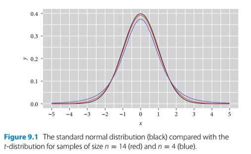
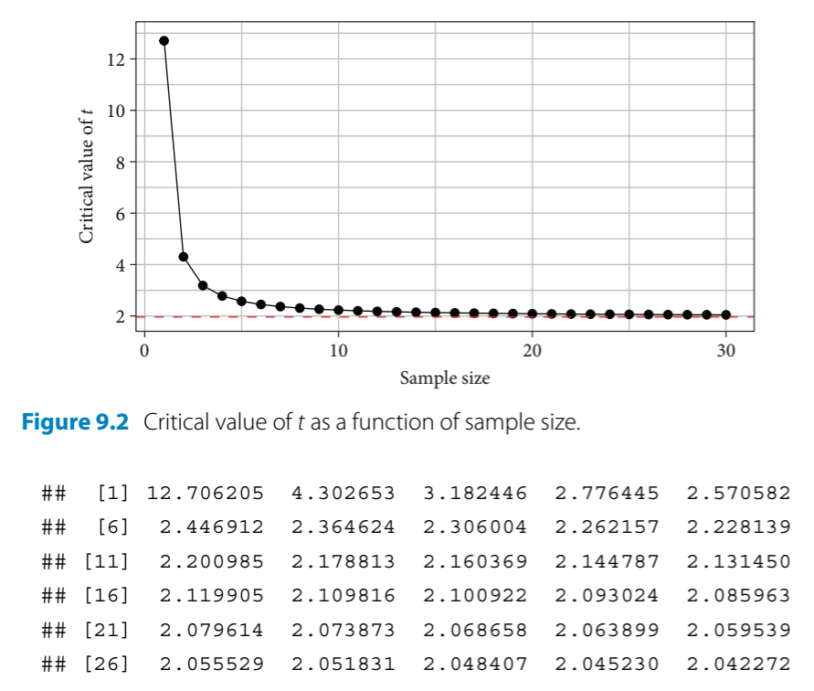

# Testing

## Significance testing: Time for t 

- Statisticians think that the overfixation on p-values has contributed to the reproducibility crisis in science
- That's why the author's focus of this text is on estimation, which relies on estimates and confidence intervals 
- This chapter introduces the Student's t-test which will generate a p-value 

```{r echo=T, message=FALSE, warning=FALSE, results='hide'}
install.packages("arm",  repos = "https://cran.us.r-project.org")
install.packages("ggplot2",  repos = "https://cran.us.r-project.org")
install.packages("Sleuth2",  repos = "https://cran.us.r-project.org")
install.packages("SMPracticals",  repos = "https://cran.us.r-project.org")
```

```{r echo=T, message=FALSE, warning=FALSE, results='hide'}
library(arm)
library(ggplot2)
library(Sleuth2)
library(SMPracticals)
```

## Student's t-test: Darwin's maize 
- The Student's t-test
  - Uses the t-distribution 
    - This is like a small sample size version of the normal distribution 
  - There are two basic forms a t-test can take: 
    - The one sample t-test takes the mean of a sample and compares it with a null hypothesis of zero 
    - The two sample t-test compares the difference between the means of two samples against a null a hypothesis of no difference (zero)
      - The paired two sample t-test is a subtype that applies when the values of two samples come in pairs (like in the darwin maize data)
  - R has a function for the t-test but the author tends to avoid it. Criticism from the author about the default R t-test: 
    - the parts of the t-test include: 
      - a difference 
      - its standard error (and the CI used to calculate it)
      - the observed value of t
      - the critical value of t 
      - the degrees of freedom 
      - the P-value 
    - the default R t-test output is poorly ordered and missing some of this information 
    - the default is not the classic t-test but another variant called Welch's 
      - Welch's might be good for research since it doesn't assume equal variance though 
    - but adds another twist so it's not appropriate for teaching beginners 
- the general form of a t-test is: 

<center>
  -  $observed \;t = \frac{difference}{SE}$
</center> 

  - this is a more formal version of what was done in earlier chapters in which the output of the display() function - the estimates and the standard errors were compared 
  - as a rule of thumb/eyeball test, the estimate should be twice as large as its standard error to reject the null hypothesis at the lowest level of confidence (95%) and three times as large for the next level (99% CI) and so on 
- when sample sizes are larger, t converges to the normal distribution 
- when sample sizes are smaller, the t distribution is shorter and wider than normal 

```{r insert-fig-9-1, echo=FALSE, out.width="65%"}

```

- two t values of the t-test: 
  - critical t value - sets the bar for comparison - this is the minimum t value required to achieve a given level of significance (P = 0.05, 0.01, etc.)
  - observed t value - calculated by dividing the estimate by its standard error 
    - if the observed t value is larger than the critical t value, then the result is declared significant at that level 
    

```{r insert-fig-9-2, echo=FALSE, out.width="65%"}

```

- For performing a paired t-test with darwin's maize data, the observed t value must be compared to the critical value with the corresponding critical t value for the sample size that Darwin had ($n = 15 \;pairs$)

Calculate the critical t value when P = 0.05 and n = 15 pairs: 
```{r, tidy=TRUE, tidy.opts=list(width.cutoff=60)}
qt(0.975, df =14)  #mean + 2SEs; 0.975 is the upper CI limit for a 95% CI 
```

Summarize the model for a version of the maize data that omits the pairing aspect (for standard two sample t-test): 
```{r}
summary(
  lm(height ~ type, data = darwin)) #this linear model omits the pairing aspect 
```

- `summary()` takeaways: 
  - The second row of the coefficients table tests the null hypothesis by comparing the observed difference in height between progeny of selfed and cross pollinated plants (-2.6167) 
  - The first row tests the mean height of the cross pollinated plants versus a null hypothesis of an average height of zero 
    - This was not a comparison we intended to make in advance or really at all 
- It can be beneficial to specify only the tests we want to have run even if it means more typing 
- The average difference in height is -2.6167 and its standard error of the difference is 1.0737 

This produces an observed t value of: 
```{r}
-2.6167/1.0737 #difference/standard error of the difference 
```

- critical t value for this data is 2.144787
- observed t value for the data is -2.437087

It is better/more informative to work with CIs:
```{r}
confint(lm(height ~ type, data = darwin))
```

- Again, this 95% CI does not encompass 0; therefore, the null hypothesis can be rejected at this level
- In the previous `summary()` chunk, the standard two sample t-test was performed without factoring in the pairing 

Generate table of coefficients for a paired t-test:
```{r}
summary(lm(height ~ type + pair, data = darwin))
```

- New table of coefficients output: 
  - Takes the crossed plant from pair 1 as the intercept 
  - Shows the mean difference in height of the crossed plants (-2.6167)
  - Then shows the average difference of each pair relative to pair 1 
- Ignore these differences of pairs and see that the second row gives us the t value for the paired t-test: 

```{r}
-2.6167/1.2182
```

- This is the observed t value, which is way smaller than the critical t value (2.144787)
 - This finding corresponds to the large p value in the table which is 0.6434
 
 We can use a the linear model function to perform the equivalent of a one-sample t test: 
 - generate a single sample of differences:
```{r}
ex0428$Difference <- ex0428$Cross - ex0428$Self
```

Fit a linear model that only estimates the mean difference: 
```{r}
summary(lm(Difference ~1, #the 1 indicates the intercept, which is the mean of a single sample of differences
           data = ex0428))
```

## Summary: statistics

 - [Alternate source on t-tests](https://www.scribbr.com/statistics/t-test/)
  - I will probably rarely if ever use a one sample t-test 
  - use two-tailed t-test since we don't need to determine the direction of the difference 
  - use a paired t-test if the groups come from a single population
    - i.e. if you are measuring gene expression in two groups of cannabis plants over time or before/after methyl jasmonate treatment 
  - use a two sample (unpaired) t-test if the two groups come from different populations 
    - i.e. comparing some feature of two varieties of P. cubensis 
    - if they are different, then the CI will not include 0 so the null hypothesis can be rejected 
 
 
 
