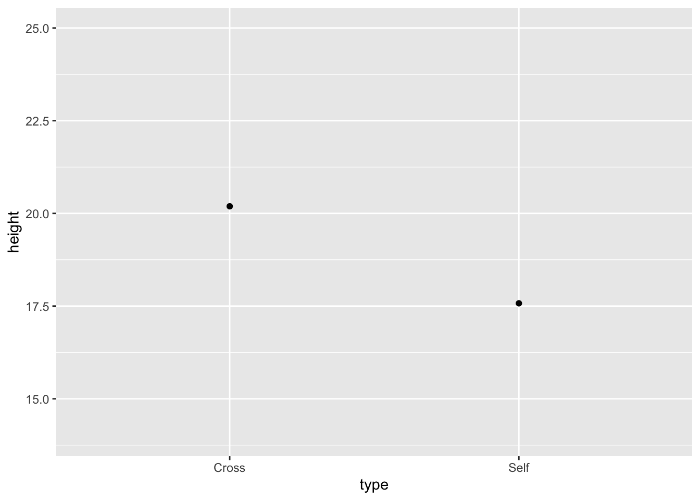
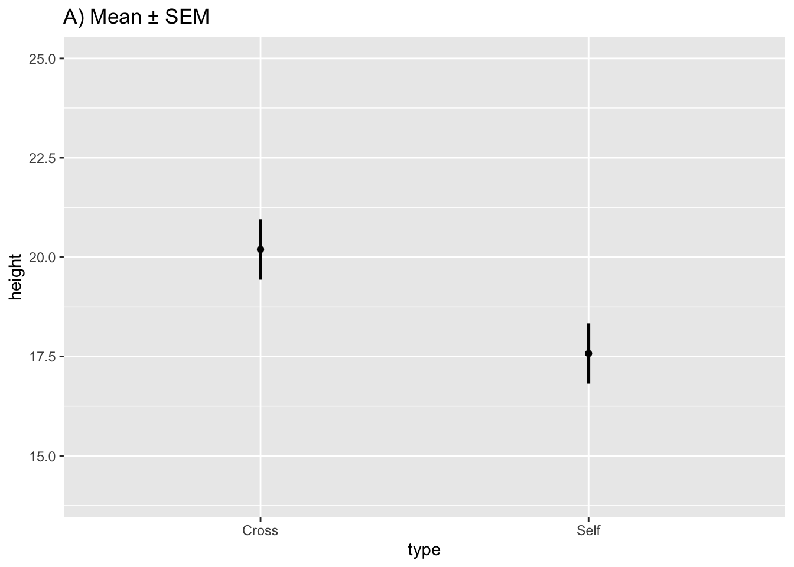
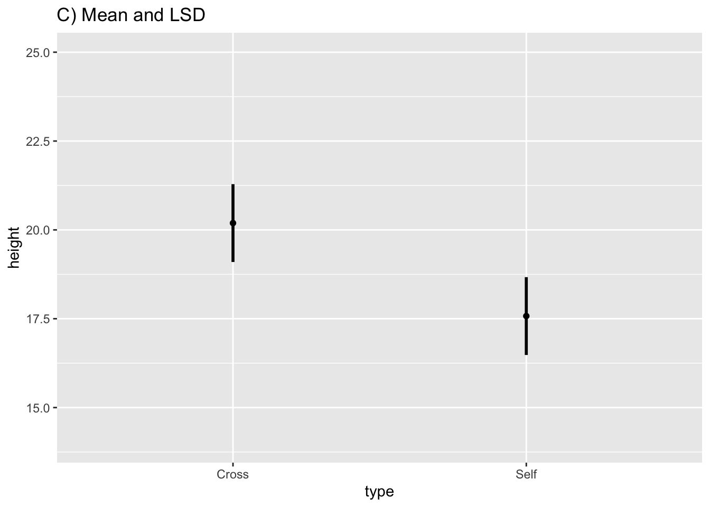
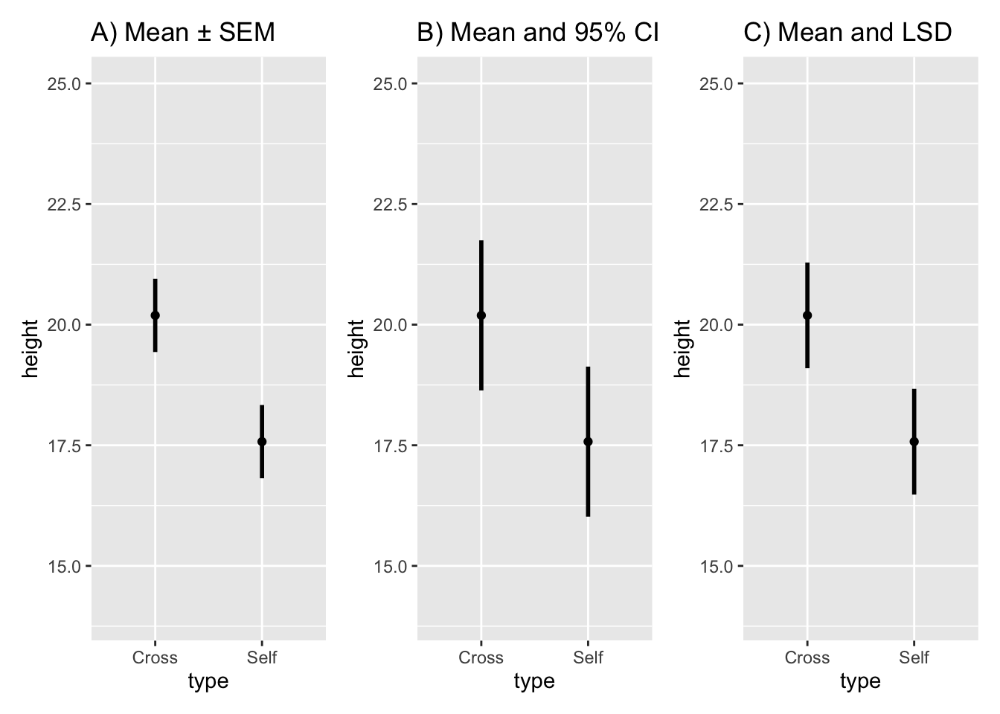
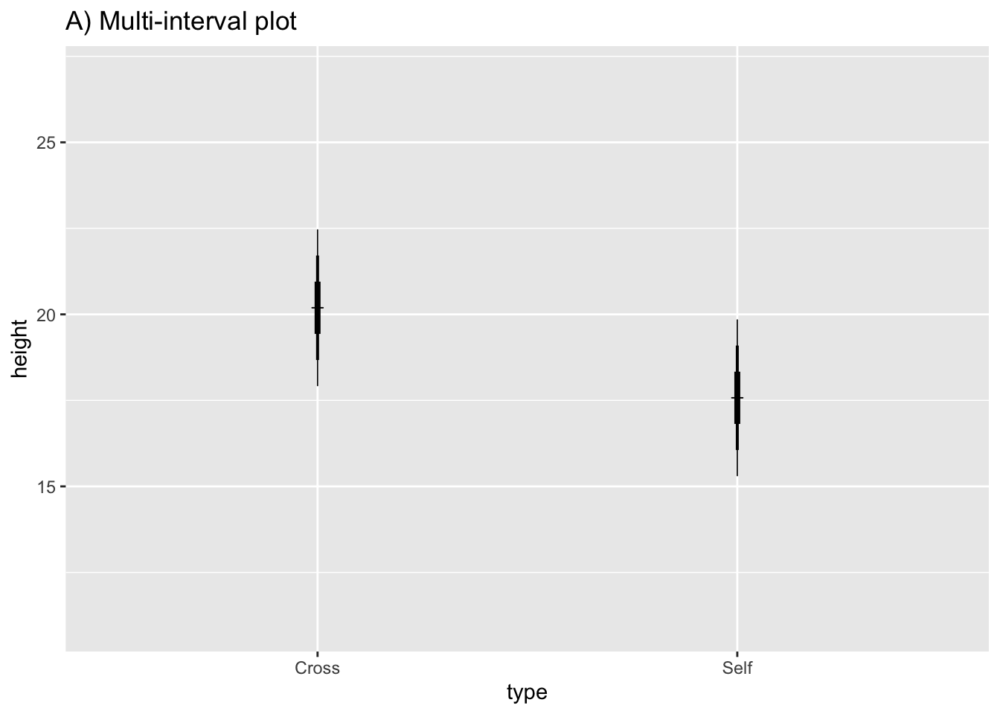
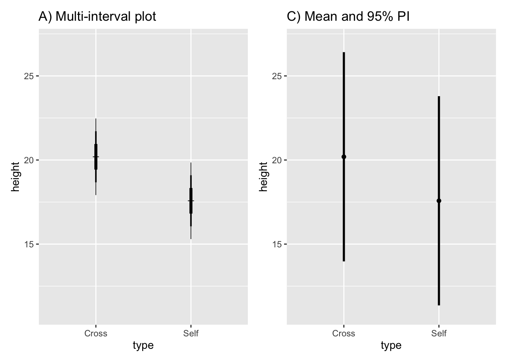
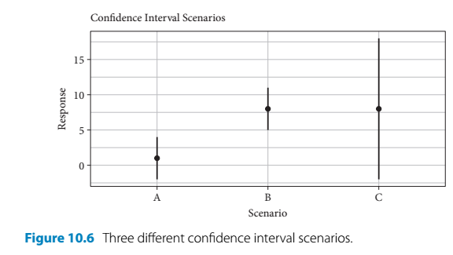
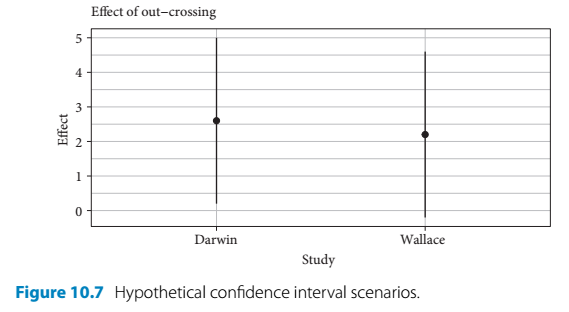

# Intervals

## Comparisons usings estimates and intervals 
- One action to combat the reproducibility crisis in science is to prefer an estimation based approach over a focus on p-values 
- This section gives an overview on how intervals can be applied to linear model analysis 


```r
install.packages("arm",  repos = "https://cran.us.r-project.org")
install.packages("cowplot",  repos = "https://cran.us.r-project.org")
install.packages("ggplot2",  repos = "https://cran.us.r-project.org")
install.packages("Sleuth2",  repos = "https://cran.us.r-project.org")
install.packages("SMPracticals",  repos = "https://cran.us.r-project.org")
install.packages("patchwork",  repos = "https://cran.us.r-project.org")
```


```r
library(arm)
library(cowplot)
library(ggplot2)
library(Sleuth2)
library(SMPracticals)
library(patchwork)
```

## Estimation based analysis 
- Author's argument for estimation-based analysis: 
  - Making conclusions using the significance testing approach is based on the signal:noise ratio of the ANOVA table F-tests or the summary table t-tests and whether or not these ratios pass the arbitrarily set level of statistical significance 
  - Whereas, estimates and intervals are on the original scale of the data so they keep our understanding closer to the data and our questions about them 
  - On the other hand, the different types of error bars and intervals can be confusing 
  - Dividing statistics into two classes: descriptive and inferential 
  - In many examples in the rest of the book two assumptions are made about the data: 
    - Large sample sizes so the t-distribution assumes a normal distribution 
    - Samples sizes are equal between treatments 
      - Simplifies the relationship between standard error of the mean and standard error of the difference 

## Descriptive statistics
- Chapter 3 introduced different descriptive approaches for looking at Darwin's maize data such as 
  - Plotting individual datapoints if a dataset has a small number of datapoints 
  - Using a boxplot if there is a much greater number of datapoints 
  
### Error bars 
- Another common type of graph presents a measure of central tendancy (such as the mean)
  - This often comes in the form of a bar plot, but these often misleading
  - Author argues that it is better to plot all of the datapoints, indicate the mean with a unique symbol, and show error bars for the variability 
- Descriptive statistics for continuous data (i.e. Darwin's maize data) are the mean and standard deviation 
- An alternative approach to showing the means with their SDs is through a linear model analysis that calculates a 'pooled' estimate of the residual variability across all treatments 
  - This can be used instead of calculating separate SDs for different groups as we have done previously with the maize data 
- We are going to calculate the intervals and then use `geom_linerange()` to display them 
  - `geom_linerange` can be used for any error bar or interval 

First, re-fit the linear model of the maize data, which will provide the estimate of the pooled SD:

```r
ls1 <- lm(height ~type, data = darwin)
```

- Using this model, we will draw a variety of graphs that showcase the pollination means with error bars with different calculated intervals 

Set up a dataframe that will hold the calculated value to later plot: 

```r
estimates <- expand.grid(type = levels(darwin$type)) #distills a dataframe variable down to just its  unique levels 
estimates
#>    type
#> 1 Cross
#> 2  Self
```

Add the height means to the corresponding levels:

```r
estimates$height <- predict(ls1, newdata = estimates) #grabs the corresponding means calculated in ls1 
estimates
#>    type   height
#> 1 Cross 20.19167
#> 2  Self 17.57500
```

Generate the pooled standard deviation that we want to display as an error bar: 

```r
lmDisplay <- display(lm(height ~type, data = darwin))
#> lm(formula = height ~ type, data = darwin)
#>             coef.est coef.se
#> (Intercept) 20.19     0.76  
#> typeSelf    -2.62     1.07  
#> ---
#> n = 30, k = 2
#> residual sd = 2.94, R-Squared = 0.18
```

The pooled standard deviation is called "sigma.hat": 

```r
lmDisplay
#> $call
#> lm(formula = height ~ type, data = darwin)
#> 
#> $sigma.hat
#> [1] 2.94038
#> 
#> $r.squared
#> [1] 0.175003
#> 
#> $coef
#> (Intercept)    typeSelf 
#>   20.191667   -2.616667 
#> 
#> $se
#> (Intercept)    typeSelf 
#>   0.7592028   1.0736749 
#> 
#> $t.value
#> (Intercept)    typeSelf 
#>   26.595880   -2.437113 
#> 
#> $p.value
#>  (Intercept)     typeSelf 
#> 2.049810e-21 2.141448e-02 
#> 
#> $n
#> [1] 30
#> 
#> $k
#> [1] 2
```

Add the sigma.hat value to our estimates table: 

```r
estimates$SD <- rep(lmDisplay$sigma.hat, 2)
estimates
#>    type   height      SD
#> 1 Cross 20.19167 2.94038
#> 2  Self 17.57500 2.94038
```

- This adds a value for pooled variation for both treatments 


```r
base.plot10 <- ggplot(estimates, aes(x = type, y = height)) +
    ylim(14, 25) + geom_point()
base.plot10
```



Plot the values in estimates with their corresponding pooled residual variation as error bars: 

```r
Fig10_1 <- 
base.plot10 + 
    ggtitle("Mean and Standard Deviation") + 
  geom_linerange(aes(ymin = height - SD, ymax = height + SD), size = 1)
Fig10_1
```


- I don't understand why you would want to use the pooled standard deviation and display the variability specific to that treatment? 
  - The answer is: you would not use this type of graph because: 
- This graph provides the descriptive statistics - a summary of central tendancy and variability
- However, to address scientific questions, inferential statistics often must be utilized to determine how different treatments are from each other relative to background noise 
  
## Inferential statistics 
### Standard error bars 
- Standard error can be thought of as the standard deviation of estimated statistics 
- Standard error of the mean (SEM) is the SD of the estimated means 
  - Reflects the uncertainty related to sampling 
    - Different samplings would provide different means 
  - Shows the confidence in where the true mean probably lies 
- SEM is the basis for other inferential statistics 
  - The other error bars to be discussed are multiples of the SEM 
    
Extract the standard error from the predict table: 

```r
estimates$SEM <- predict(ls1, newdata = estimates, se.fit = TRUE)$se.fit
estimates
#>    type   height      SD       SEM
#> 1 Cross 20.19167 2.94038 0.7592028
#> 2  Self 17.57500 2.94038 0.7592028
```

Draw graph of the means with their respective SEs: 

```r
fig10_2a <- 
  ggplot(estimates, aes(x = type, y = height)) + ylim(14, 25) + geom_point() +
 ggtitle("A) Mean ± SEM") + 
  geom_linerange(aes(ymin = height - SEM, ymax = height + SEM), size = 1)
fig10_2a
```



### Confidence intervals
- 95% CI make the best general purpose interval and what is recommended to present in most cases 
- They show the point estimates (the means) plus/minus 2 standard errors 
  - When the sample sizes are small, the t-distribution increases the number of SEs required to achieve the same level of confidence 
- CIs express both confidence in the estimate and allow for hypothesis testing too: 
  - Values inside the interval are consistent with the data and those falling outside of it are not
  - CIs can be used to test whether the observed means are significantly different from hypothesized values (or any value, but often zero - to reject the null hypothesis) 
  - So CIs do everything the t- or F-test does and more 
    
Extract the 95% CI values and add them to the estimates dataframe: 

```r
estimates$CI95_lwr <- predict(ls1, newdata = estimates, interval = "confidence")[, 2] #the square bracket extracts the specific datapoint
estimates$CI95_upr <- predict(ls1, newdata = estimates, interval = "confidence")[, 3]
estimates
#>    type   height      SD       SEM CI95_lwr CI95_upr
#> 1 Cross 20.19167 2.94038 0.7592028 18.63651 21.74682
#> 2  Self 17.57500 2.94038 0.7592028 16.01984 19.13016
```

Substitute the CI values into the base plot: 

```r
fig10_2b <- 
ggplot(estimates, aes(x = type, y = height)) + ylim(14, 25) + geom_point() + #the base.plot10 wasn't working so I had to put the whole line of code in 
  ggtitle("B) Mean and 95% CI") + 
  geom_linerange(aes(ymin = CI95_lwr, ymax = CI95_upr), size = 1) 
fig10_2b
```


- A limitation of show standard erros or 95% CI bars is that they do not show exacty when the two means are statisticsally significant or not 
- Showing this unambiguously can come in two forms: 
  - Plot the difference of means and this difference's corresponding CI 
  - Plot the two means with standard error bars that show the least significant difference (LSD)

### Confidence intervals for differences between means

Show whether a difference of means is significant or not: 

```r
fig10_3 <- coefplot(ls1, xlim = c(-5,0))
```

<div class="figure">

<p class="caption">(\#fig:unnamed-chunk-15)Figure 10.3</p>
</div>

- In Figure 10.3, because 0 is outside the 95% CI, we can reject the null hypothesis that there is no difference between the means at this level of confidence 
  - The issue with this method is that we do not see the means themselves 
- We can use the LSD to plot the means and using standard error of the difference to construct confidence intervals that show whether the means are significantly different from each other or not

### Least significant differences 

$LSD = t \cdot SED$

- when there are 2 SEDs with a large sample size
- So LSD is equivalent to a 95% CI for the difference of means 
- This type of intervals shows both means and there is a shared interval between them 
  - An overlap of the shared interval of each mean would indicate that the two are not significantly different 
  
Extract the SED from the linear model: 

```r
estimates$SED <- summary(ls1)$coefficients[2,2] #the values in the brackets show that we want to extract the value in the 2nd row and 2nd column
estimates
#>    type   height      SD       SEM CI95_lwr CI95_upr
#> 1 Cross 20.19167 2.94038 0.7592028 18.63651 21.74682
#> 2  Self 17.57500 2.94038 0.7592028 16.01984 19.13016
#>        SED
#> 1 1.073675
#> 2 1.073675
```
Calculate t (critical) value: 

```r
qt(0.975, df = 28)
#> [1] 2.048407
```


Center the LSD interval on each mean (show each estimate $\pm$ half of the LSD): 

```r
fig10_2c <- 
ggplot(estimates, aes(x = type, y = height)) + ylim(14, 25) + geom_point() + ggtitle("C) Mean and LSD") + 
  geom_linerange(aes(ymin = height - 1.02 *SED, ymax= height + 1.02*SED), size = 1)
fig10_2c
```

<div class="figure">

<p class="caption">(\#fig:unnamed-chunk-18)Figure 10-2C</p>
</div>

- An overlap of the error bars in Figure 10-2C would indicate that the means are not significantly different from each other 
  - In this case, they do not overlap; therefore, the means are different from each other at the 95% CI 


```r
fig10_2 <- (fig10_2a| fig10_2b|fig10_2c)
fig10_2
```



### Multi-interval plots

Plot multiple intervals with different levels of significance(through the use of different multiples of the SEM): 

```r
Fig10_4a <- 
ggplot(estimates, aes(x = type, y = height)) + ylim (11, 27) +
geom_point(shape = 3) + 
ggtitle("A) Multi-interval plot") +
  geom_linerange(aes(min = height - 1*SEM, max = height + 1*SEM), size = 1.4) + #67% CI
  geom_linerange(aes(min = height - 2*SEM, max = height + 2*SEM), size = 0.7) + #95% CI
  geom_linerange(aes(min = height - 3*SEM, max = height + 3*SEM), size = 0.3)   #99% CI
Fig10_4a
```



### Prediction intervals 


```r
estimates$PI95_lwr <- predict(ls1, newdata = estimates, interval = "prediction")[, 2] #the square bracket extracts the specific datapoint
estimates$PI95_upr <- predict(ls1, newdata = estimates, interval = "prediction")[, 3]
estimates
#>    type   height      SD       SEM CI95_lwr CI95_upr
#> 1 Cross 20.19167 2.94038 0.7592028 18.63651 21.74682
#> 2  Self 17.57500 2.94038 0.7592028 16.01984 19.13016
#>        SED PI95_lwr PI95_upr
#> 1 1.073675 13.97104 26.41229
#> 2 1.073675 11.35437 23.79563
```

Plot the graph with a prediction interval: 

```r
fig10_4b <- 
ggplot(estimates, aes(x = type, y = height)) + ylim(11, 27) + geom_point() + ggtitle("C) Mean and 95% PI") + 
  geom_linerange(aes(ymin = PI95_lwr, ymax= PI95_upr), size = 1)
fig10_4b
```


Show that the prediction interval is substantially wider: 

```r
fig10_4 <- (Fig10_4a|fig10_4b)
fig10_4
```



## Relating different types of interval and error bar
- The SED is the basis for relating the differences between means  
- If we know how the SED is related to the SEM, then we can determine how different intervals are related to eachother too
- The author presents rules of thumb and approximate eye ball tests for looking at means with 95% CIs 

### Interpreting confidence intervals 
- The author presents a hypothetical scenario to emphasize the nuanced advantages of the estimation-based approach 
- In the following example, there are three treatments - A, B, and C - which all generate different responses: 



- Scenarios:    
  - Given treatment A, the meaan is close to 0 and the 95% CI encompasses 0 
    - A significance test (such as a t-test) would produce a non-significant result 
  - Given treatment B, the 95% CI has the same width as treatment A, but the mean is further away from 0 and the CI does not include it 
    - A significance test would produce a result showing statistical significance 
  - Given treatment C, the mean is the same as with B but the 95% CI is much wider and encompasses zero 
    - A significance test would produce a non-significant result 
- Using traditional significance testing would lead the audience to believe that A and C treatments produce the same outcome and only B has an effect 
- However, the use of estimates and intervals encourages different thinking 
- The results produced by treatments A and B are pretty straightforward 
- But treatment C leads to a mean response that is similiar treatment B 
  - It is just accompanied by greater uncertainty 
  - But this means that larger response values are plausible 
- Treatment C's effect is non-significant by the convention of p < 0.05 
- But there is a possibility of a large effect that is possibly even greater than the one produced by treatment B 
  - This thinking should encourage further consideration of treatment C and its sample size 
  - The study could be repeated to further examine the effects of treatment C perhaps with a larger sample size 
  
### Point estimates and confidence intervals for research synthesis and meta-analysis 
- Treatment C is the type of 'boring' non-significant result that is unlikely to be published 
- Therefore, it is less likely to be inclcuded in meta-analysis 
- Meta-analysis a major tool for the detection of repeatability 
- If a meta analysis is aiming to examine the effects of inbreeding (selfing) on maize fitness, then it might look at Darwin's maize data and, for the purposes of this section, imaginary data by Wallace 
- Darwin's data showed inbreeding passed the lowest level of confidence (95%) 
- Whereas, Wallace showed that there was not a statistically significant effect
- But if you look at both studies using estimates and intervals it gives a different impression: 



- This way of looking at the data shows that both studies were very similiar in terms of their level of effect 
- One study's interval just merely contains 0 (and the null hypothesis is rejected) and the other one just barely includes this arbitrary null value 
- Both studies together show consistency in terms of mean response and variability (assuming wallace used similiar sample sizes) for measuring this effect of inbreeding 
