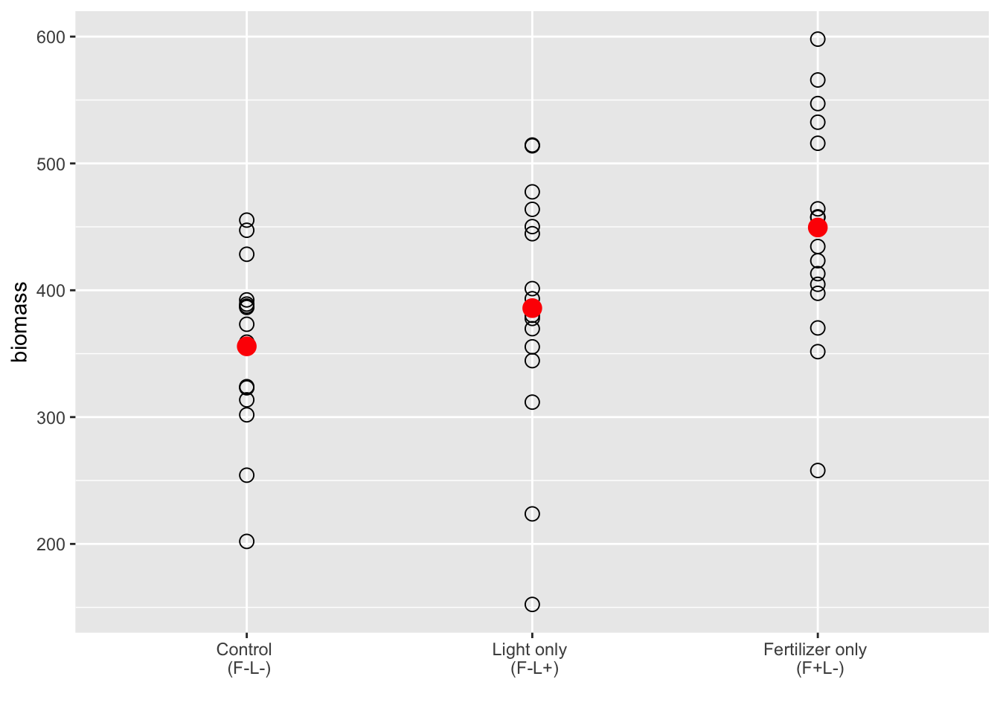
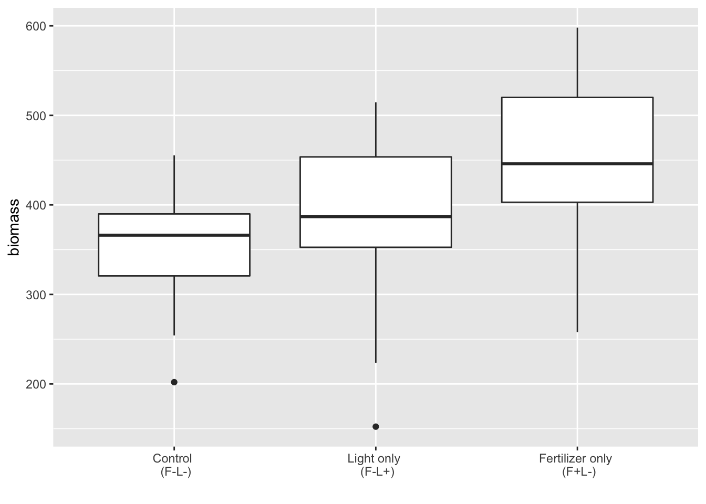
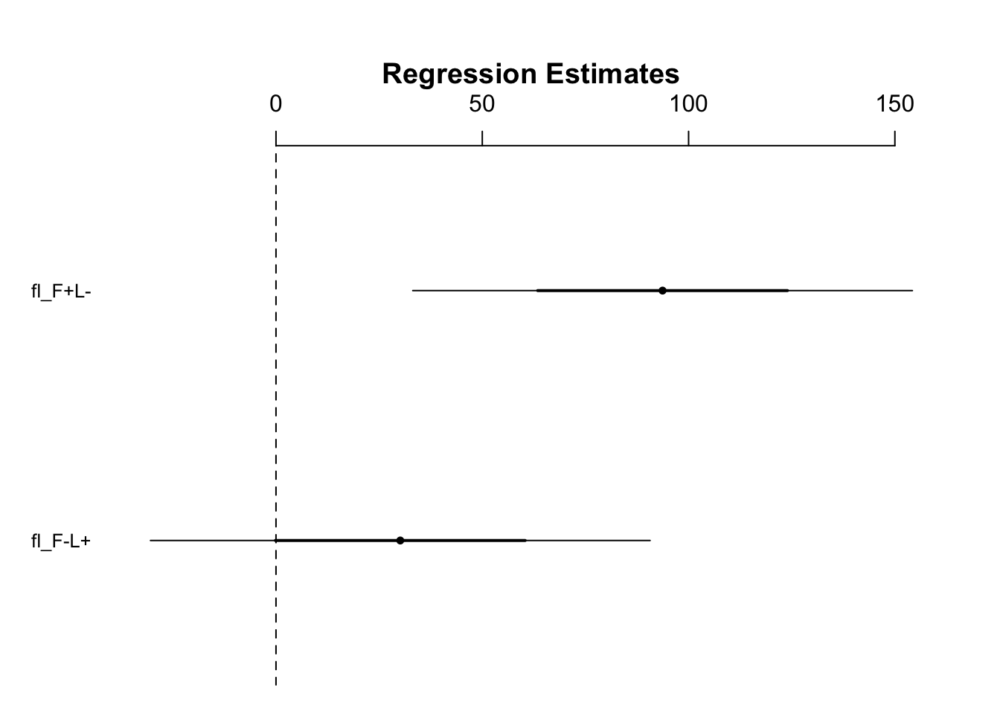
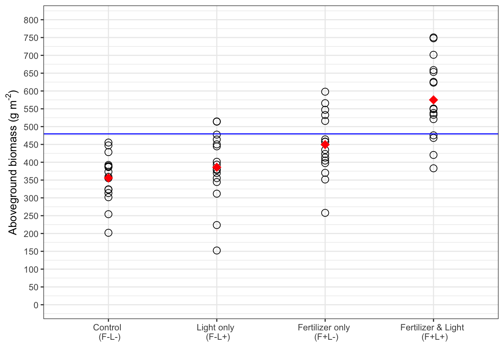
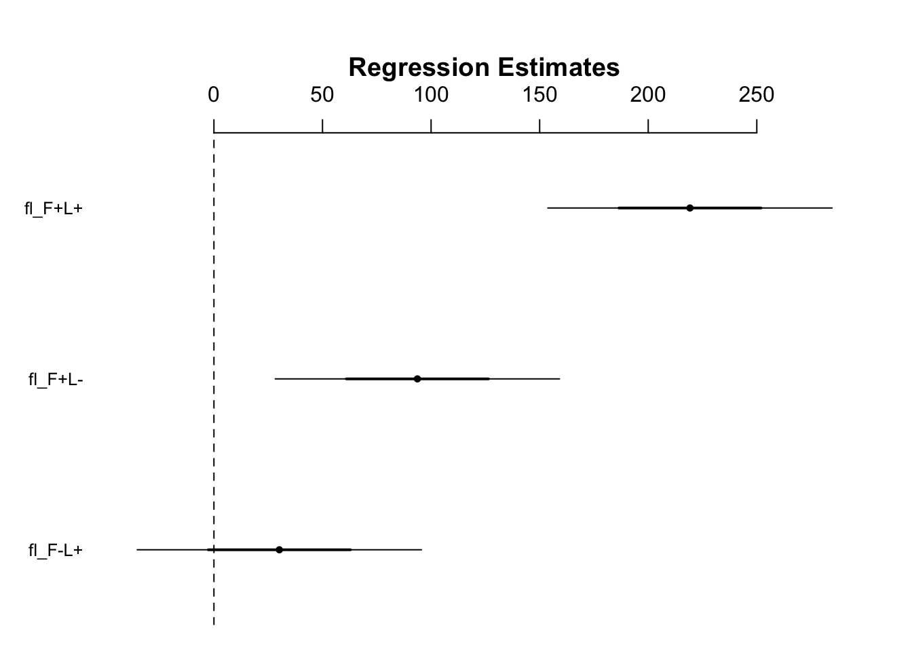
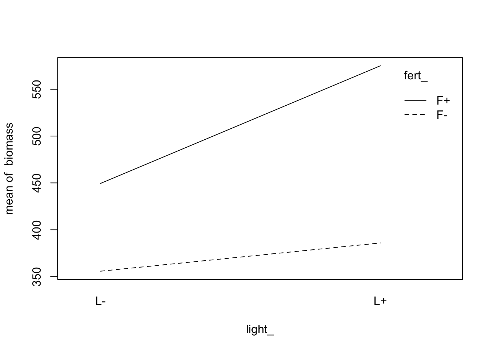
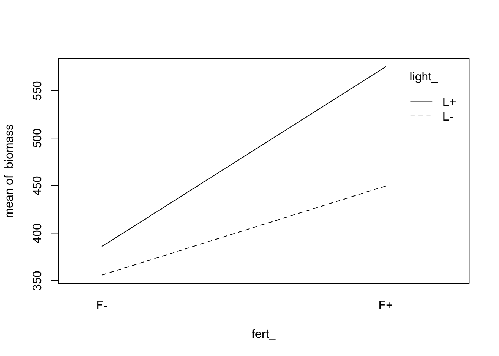
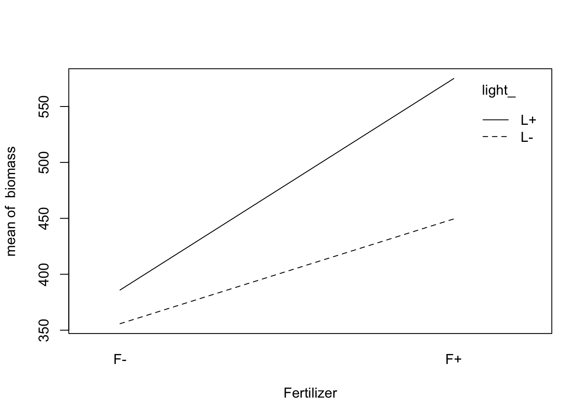
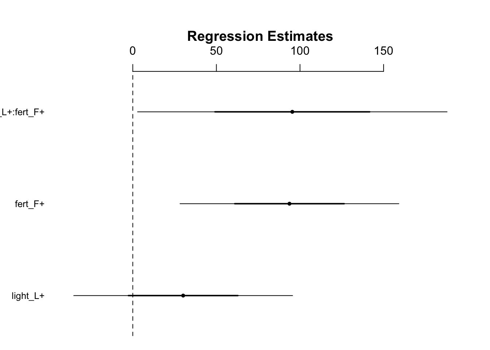
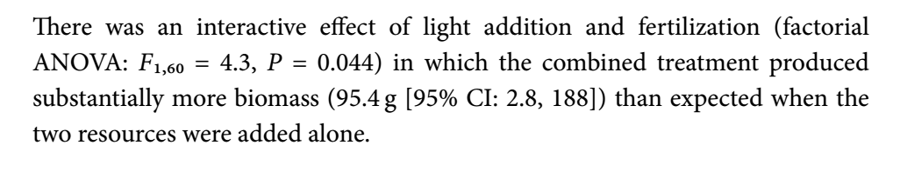

# Factorial designs 

## Introduction
- For experimental designs that have two categorical explanatory variables 
- Can look at interaction effects between the variables 


```r
install.packages("arm",  repos = "https://cran.us.r-project.org")
install.packages("ggplot2",  repos = "https://cran.us.r-project.org")
install.packages("cowplot",  repos = "https://cran.us.r-project.org")
install.packages("patchwork",  repos = "https://cran.us.r-project.org")
install.packages("dplyr",  repos = "https://cran.us.r-project.org")
install.packages("readr",  repos = "https://cran.us.r-project.org")
```


```r
library(arm)
library(ggplot2)
library(cowplot)
library(dplyr)
library(patchwork)
library(readr)
```

## Factorial designs 
- Fully factorial designs analyze for interactions by applying two or more treatments (factors) in all possible combinations 
- The effects of these treatments can be analyzed by treatment alone and in combination with other treatments 
- This example dataset in this chapter comes from a peer-reviewed publication (Hautier et al. 2009) in which the response of net aboveground plant biomass in grassland plots is being evaluated when treated with fertilizer and light 
- The dataframe encompasses two variables (factors) and each factor has two levels (i.e. with or without fertilizer)
  - There are four possible treatment combinations 
- We want to determine if there is an interaction between the addition of light and fertilizer treatment together 
  - It could be a negative interaction in which the addition of fertilizer creates a canopy that shades out the understory 
  - It could be a positive interaction in which there is a synergistic effect on grassland productivity in terms of biomass  

Load data and create dataframe:

```r
urlfile="https://raw.githubusercontent.com/apicellap/data/main/Data_Factorial.txt"
fact<-read_table(url(urlfile))
#> 
#> ── Column specification ────────────────────────────────────
#> cols(
#>   Fert = col_character(),
#>   Light = col_character(),
#>   FL = col_character(),
#>   Biomass.m2 = col_double()
#> )
head(fact)
#> # A tibble: 6 × 4
#>   Fert  Light FL    Biomass.m2
#>   <chr> <chr> <chr>      <dbl>
#> 1 F-    L-    F-L-        254.
#> 2 F-    L-    F-L-        202 
#> 3 F-    L-    F-L-        392.
#> 4 F-    L-    F-L-        455.
#> 5 F-    L-    F-L-        359.
#> 6 F-    L-    F-L-        386.
```

- this dataset: 
  - control (no added fertilizer or light: F-, L-)
  - fertilizer only (F+, L-)
  - light only (F-, L+)
  - both fertilizer and light added simultaneously (F+, L+)
  - biomass is the response variable 


```r
str(fact)
#> spec_tbl_df [64 × 4] (S3: spec_tbl_df/tbl_df/tbl/data.frame)
#>  $ Fert      : chr [1:64] "F-" "F-" "F-" "F-" ...
#>  $ Light     : chr [1:64] "L-" "L-" "L-" "L-" ...
#>  $ FL        : chr [1:64] "F-L-" "F-L-" "F-L-" "F-L-" ...
#>  $ Biomass.m2: num [1:64] 254 202 392 455 359 ...
#>  - attr(*, "spec")=
#>   .. cols(
#>   ..   Fert = col_character(),
#>   ..   Light = col_character(),
#>   ..   FL = col_character(),
#>   ..   Biomass.m2 = col_double()
#>   .. )
```


```r
 names(fact)[names(fact) == 'Fert'] <- 'fert_'
 names(fact)[names(fact) == 'Light'] <- 'light_'
 names(fact)[names(fact) == 'FL'] <- 'fl_'
 names(fact)[names(fact) == 'Biomass.m2'] <- 'biomass'
 head(fact)
#> # A tibble: 6 × 4
#>   fert_ light_ fl_   biomass
#>   <chr> <chr>  <chr>   <dbl>
#> 1 F-    L-     F-L-     254.
#> 2 F-    L-     F-L-     202 
#> 3 F-    L-     F-L-     392.
#> 4 F-    L-     F-L-     455.
#> 5 F-    L-     F-L-     359.
#> 6 F-    L-     F-L-     386.
```
- There are two ways of looking at the data 
- if we focus on column fl_, then we can approach the dataset as if it were a one-way anova design
  - fl_ is an individual factor with four levels 
- if we focus on the columns fert_ and light_, which have two levels each, then we approach the design as a factorial 


Generate some summary statistics about the response variable biomass: 

```r
summary(fact)
#>     fert_              light_              fl_           
#>  Length:64          Length:64          Length:64         
#>  Class :character   Class :character   Class :character  
#>  Mode  :character   Mode  :character   Mode  :character  
#>                                                          
#>                                                          
#>                                                          
#>     biomass     
#>  Min.   :152.3  
#>  1st Qu.:370.1  
#>  Median :425.9  
#>  Mean   :441.6  
#>  3rd Qu.:517.2  
#>  Max.   :750.4
```

## Comparing three or more groups
- In this chapter, we will build up to a full factorial analysis
- First we will perform a linear model analysis with two factors but no interaction 
  - This will involve the untreated control (F-L-) and the fertilizer only (F+) and light only (L+) treatment 

Subset the data to only look at the two invdividual treatments (they each encompass the control):

```r
subs <- subset(fact, fl_ != "F+L+") 
head(subs)
#> # A tibble: 6 × 4
#>   fert_ light_ fl_   biomass
#>   <chr> <chr>  <chr>   <dbl>
#> 1 F-    L-     F-L-     254.
#> 2 F-    L-     F-L-     202 
#> 3 F-    L-     F-L-     392.
#> 4 F-    L-     F-L-     455.
#> 5 F-    L-     F-L-     359.
#> 6 F-    L-     F-L-     386.
```

Generate some summary statistics for a quick data visualization: 

```r
cntrl<- subset(subs, fl_ == "F-L-") 
lght <- subset(subs, fl_ == "F-L+")
fert <- subset(subs, fl_ == "F+L-") 

cntrl.mean<- summarise(
         group_by(cntrl, fl_), 
         biomass = mean(biomass)) 
lght.mean<- summarise(
         group_by(lght, fl_), 
         biomass = mean(biomass)) 
fert.mean<- summarise(
         group_by(fert, fl_), 
         biomass = mean(biomass))
```

Visualize this subsetted data: 

```r
xlabels <- c("Control \n (F-L-)", "Light only \n (F-L+)", "Fertilizer only \n (F+L-)") #the \n tells R to put the next bit of text on the next line 

ggplot(subs, aes(x = fl_, y = biomass)) + 
  geom_point(data = subs, shape = 1, size = 3) + 
    geom_point(data = cntrl.mean, color = "red", size = 4) + 
    geom_point(data = lght.mean, color = "red", size = 4) +
    geom_point(data = fert.mean, color = "red", size = 4) + 
  scale_x_discrete(limits = c("F-L-", "F-L+", "F+L-"),
                   labels = xlabels) + xlab("")
```



- Based on Figure 12.1, there might be an effect of fertilizer relative to the control 
  - I can't make a guess if there is an effect of the light only treatment based on this graph 
- But this graph doesn't tell us if there are outliers 


Quick check for outliers: 

```r
ggplot(subs, aes(x = fl_, y = biomass)) + geom_boxplot() +  
  scale_x_discrete(limits = c("F-L-", "F-L+", "F+L-"),
                   labels = xlabels) + xlab("")
```



Create a linear model (one factor with three levels)

```r
mod1 <- lm(biomass ~ fl_, data = subs)
display(mod1)
#> lm(formula = biomass ~ fl_, data = subs)
#>             coef.est coef.se
#> (Intercept) 355.79    21.41 
#> fl_F-L+      30.12    30.27 
#> fl_F+L-      93.69    30.27 
#> ---
#> n = 48, k = 3
#> residual sd = 85.63, R-Squared = 0.18
```

- This model treats the design as a one-way anova by using a single factor 
  - (Intercept) has an actual value of the mean for F-L- 
    - Has mean biomass of $356 g$ with a standard error of $21 \;g$
  - fl_F-L+ is the difference between the mean of this factor and the intercept 
    - Has a difference (relative to the control) of $30 g$ with a standard error of $30 \;g$
  - fl_F+L- is the difference between the mean of this factor and the intercept 
    - Has a difference (relative to the control) of $94 g$ with a standard error of $30 \;g$ 
      - Signal seems to outweigh the noise here as the difference is about 3x higher than its SED 
    - The fertilizer only treatment has a difference of the mean of $60 \;g$ higher than the light only treatment relative to the control

Visualize the treatment differences: 

```r
fig12_2 <- coefplot(mod1)
```



- This plot shows that we fail to reject the null hypothesis for the light only treatment 
  - We do not have confidence that the light only treatment produces a real effect in increasing biomass 
- However the the null hypothesis can be rejected for the fertilizer only treatment at the 95% CI 

## Two-way ANOVA (no interaction)
- In the next step towards the full factorial analysis, we can fit a model with two factors (light_ and fert_)
- This does not allow for an interaction analysis 

Create a model for two factors (two way anova without interaction):

```r
display(lm(biomass ~ light_ + fert_, data = subs))
#> lm(formula = biomass ~ light_ + fert_, data = subs)
#>             coef.est coef.se
#> (Intercept) 355.79    21.41 
#> light_L+     30.12    30.27 
#> fert_F+      93.69    30.27 
#> ---
#> n = 48, k = 3
#> residual sd = 85.63, R-Squared = 0.18
```
- The output is exactly the same as the last model, which was the one way anova but for the fl_ factor with 4 levels 
- Here though, the fertilizer and light treatment variables have both separately been compared with the control 
- There is a third comparison that could be made and that is one between the light and fertilizer treatments 
  - But there are more possible pairwise comparisons that can be made than we have degrees of freedom (three treatment levels gives us two degrees of freedom (n-1 = df))
- R has picked the control (fl_F-L-) as the reference/intercept. If it did not do this we could use the relevel function to restructure 
- If we specify some *a priori* comparisons that ask the major questions while staying within the limits of the degrees of freedom we have at our disposal then making adjustments for multiple comparisons can be avoided (avoid because they tend to generate false positives)

## Additive treatment effects 
- To be able to measure interactive effects, we need to be able to compare the effect of the the combined treatment (i.e fertilizer plus light treatment) with what we would expect if there were no interaction 
  - a factorial anova creates this no-interaction scenario by assuming that treatment effects are independent and therefore additive 
    - if one treatment has an effect size of A 
    - and another treatment has an effect size of B 
    - then a linear model anova testing the combination would predict the result to be A + B 
    - in terms of this data that would mean: 
    

```r
coef(mod1)[2] + #the coefficient of fl_F-L+   (30 g)          - the difference between the mean of F-L+ and the mean of the intercept 
  coef(mod1)[3] #the coefficient of fl_F+L-   (94 g)          - the difference between the mean of F+L- and the mean of the intercept 
#>  fl_F-L+ 
#> 123.8187
```
- 123.8 g represents the combined, additive expected effect of these two treatments (Light alone and fertilizer alone) 
  - This is a difference 
  - So if the control had a coefficient of 100 g, the combined F+L+ treatment would produce biomass of 223.8 g


```r
coef(mod1)[1] + #the coefficient of Intercept (fl_F-L-) - the mean of the intercept 
coef(mod1)[2] + #the coefficient of fl_F-L+             - the difference between the mean of F-L+ and the mean of the intercept 
  coef(mod1)[3] #the coefficient of fl_F+L-             - the difference between the mean of F+L- and the mean of the intercept 
#> (Intercept) 
#>    479.6125
```
- This is the additive prediction - the threshold above which must be passed for us to determine that there is an interaction effect of the fertilizer and light treatments combined 


Plot whole dataset: 

```r
xlabels2 <- c("Control \n (F-L-)", "Light only \n (F-L+)", "Fertilizer only \n (F+L-)", "Fertilizer & Light \n (F+L+)") 
ylabel <- expression(paste("Aboveground biomass (g m"^"-2",")"))
fig12_3 <- 
  ggplot(fact, aes(x = fl_, y = biomass)) + 
  geom_point(data = fact, shape = 1, size = 3) +
  scale_x_discrete(limits = c("F-L-", "F-L+", "F+L-", "F+L+"),
                   labels = xlabels2) + xlab("") + ylab(ylabel) +
  scale_y_continuous(
    limits = c(0,800),
    breaks = seq(0,800, by = 50)
  ) +
  geom_hline(yintercept = 479.6125, color = "blue") + #add horizontal line at this y position - represents the additive prediction 
  stat_summary(fun = mean, geom = "point", color = "red", shape = 18, size = 4) + #calculate statistics (in this case the only mean) across all four levels of the categorical variable, fl_
  theme_bw()
fig12_3
```



- The mean biomass for F+L+ is well above the threshold (blue line), so there is probably a positive interaction 
  - To measure our confidence in this assertion, we have to create a linear model of the entire dataset 
  - This will help us determine difference between the observed mean and the expected value relative to the background noise 

Create a one-way ANOVA using the single factor with four levels: 

```r
mod2 <- lm(biomass ~ fl_, data = fact)
display(mod2)
#> lm(formula = biomass ~ fl_, data = fact)
#>             coef.est coef.se
#> (Intercept) 355.79    23.14 
#> fl_F-L+      30.12    32.72 
#> fl_F+L-      93.69    32.72 
#> fl_F+L+     219.22    32.72 
#> ---
#> n = 64, k = 4
#> residual sd = 92.56, R-Squared = 0.47
```
- Author says we are first using the one-way anova on to evaluate the additive effect to understand the shortcomings of the test 
- Compared to mod1, the fourth treatment combination changes the pooled estimate of the variance (the residual error - "residual sd") and therefore the standard errors change with it. From mod1, the residual sd increased by 6.93 units 
- coefficients
  - Intercept: displays the mean biomass for the untreated control treatment with the standard error of the mean ($355.79 \pm 23.14 \;g$)
  - F-L+: displays the difference (of means) between the untreated control and the light only treatment ($30.12 \pm 32.72 \;g$)
  - F+L-: displays the difference (of means) between the untreated control and the fertilizer only treatment ($93.69 \pm 32.72 \;g$)
  - F+L+: displays the difference (of means) between the untreated control and the combined treatment ($219.23 \pm 32.72 \;g$)
  
Visualize the coefficients by plotting them: 

```r
coefplot(mod2)
```



- Figure 12.4 takeaways: 
  - There is no discernible effect of adding light 
  - The addition of fertilizer alone has an effect and we can be confident of this because the lower bound is well into positive territory 
  - For the same reasons, we can be confident that the combination treatment has an effect 
  - The confidence intervals provide us with a range of plausible effect sizes that are consistent with the data (something using p values does not do)
- Adding light and fertilizer on their own increase biomass by 30 and 94 g, respectively 
  - If the treatments acted independently and their effects were additive, we would expect an increase relative to the control of 124 g  
  - It turns out that adding the treatments in combination increases biomass by approximately 220 g 
    - This is substantially more than the mean effects found when either treatment is applied alone 
- The 220 g increase is almost 100 g higher than the additive prediction of 124 g 
- We could estimate the size of the interaction 
  - This can be accomplished manually but with no standard error through a one way ANOVA 
- Therefore we need a linear model that takes into account the factorial design 

## Interactions: Factorial ANOVA 
- The factorial ANOVA allows for the estimation of the interactive effect directly and it will produce a standard error for this coefficient too
- The standard error can be used to calculate a measure of confidence so that we can formally test the interaction effect 

Visualize the interaction: 

```r
fig12_5a <- with(data = fact, 
                 interaction.plot(light_, #display on x axis
                                  fert_,  #display for lines
                                  biomass)) #the response variable 
```



```r
fig12_5b <- with(data = fact, 
                 interaction.plot(fert_, light_, biomass))
```



### Factorial ANOVA in R

- The factorial anova allows for the direct estimation of the interactive effect and its standard error 
  - The standard error can be used to measure our confidence around this asserted effect 
  

Visualize the interaction in the data: 

```r
fig12_5a <- 
  with(        #interaction.plot doesn't have an argument that lets you provide the dataframe so you have to do it using the with() function 
    data = fact, 
    interaction.plot(
      fert_,   #variable on the x axis 
      light_,  #variable inscribed into the lines 
      biomass, #response (y) variable 
      xlab = "Fertilizer"
    )
)
```



```r
fig12_5b <- 
  with(        #interaction.plot doesn't have an argument that lets you provide the dataframe so you have to do it using the with() function 
    data = fact, 
    interaction.plot(
      light_,   #variable on the x axis 
      fert_,  #variable inscribed into the lines 
      biomass, #response (y) variable 
      xlab = "Light"
    )
)
```


### Factorial ANOVA in R

Create model that takes into account the interaction: 

```r
mod3 <- lm(biomass ~ light_+ fert_ + fert_:light_, data = fact)
display(mod3)
#> lm(formula = biomass ~ light_ + fert_ + fert_:light_, data = fact)
#>                  coef.est coef.se
#> (Intercept)      355.79    23.14 
#> light_L+          30.13    32.72 
#> fert_F+           93.69    32.72 
#> light_L+:fert_F+  95.41    46.28 
#> ---
#> n = 64, k = 4
#> residual sd = 92.56, R-Squared = 0.47
```

- Table of coefficients 
- The factorial analysis has less power to estimate the interaction
  - This is evidenced by the fact that the light_L+:fert_F+ row has a larger SE than those of the other variables 
- The interaction coef.se is larger than the standard errors for the main effects
  - This is because the test has less estimating power for the interaction 
- It's important to note that the coefficient for the last line is 95.41 because this is the difference between this mean and the mean for the control's biomass 
  - If the combined treatment had actually generated a biomass equal to the additive prediction (see blue line in fig12_3), which is: 
    - The biomass of the control + the biomass increase due to fertilizer + biomass increcase due to light, then 
    - Then the coefficient for light_L+:fert_F+ would be zero since there would be no difference between the mean of the control and the mean of the combined treatments 
  
Visualize the coefficients table: 

```r
fig12_6 <- coefplot(mod3)
```



Calculate the mean biomass for the light only treatment: 

```r
coef(mod3)[1] + #coefficient of the intercept (this is the mean for the control)
  coef(mod3)[2] #coefficient for light_L+ (this is the difference between the biomass means of the control and light)
#> (Intercept) 
#>    385.9187
```
  
Calculate the mean biomass for the fertilizer only treatment: 

```r
coef(mod3)[1] + #coefficient of the intercept (this is the mean for the control)
  coef(mod3)[3] #coefficient for fert_F+ (this is the difference between the biomass means of the control and fertilizer treatment)
#> (Intercept) 
#>    449.4875
```

Calculate the mean biomass for the interaction treatment: 

```r
coef(mod3)[1] + 
  coef(mod3)[2] +
  coef(mod3)[3] + 
  coef(mod3)[4] #coefficient for light_L+:fert_F+ (this is the difference between the biomass means of the control and combination treatment) 
#> (Intercept) 
#>    575.0187
```

- In the table of coefficients, the mean is given for the intercept (in this case, the control) and this coefficient has a corresponding standard error - the standard error of the mean (SEM)
- The next two rows - for light_L+ and fert_F+ - also have coefficients 
  - But these coefficients are differences between means (between the respective variable and the control)
  - These coefficient's standard errors are the standard error of the difference (SED)
- The third row, which contains the interaction, also gives information for the interaction's difference between the mean of the prediction and the mean of the control plus its corresponding SED 

Generate confidence intervals for these estimates: 

```r
confint(mod3)
#>                       2.5 %    97.5 %
#> (Intercept)      309.508816 402.07868
#> light_L+         -35.331781  95.58178
#> fert_F+           28.236969 159.15053
#> light_L+:fert_F+   2.836382 187.97612
```

- Based on these CIs, the author suggests caution to not make the mistake of deciding that there is not significant effect of light since its interval contains zero
 - He goes on to say that if there is evidence that there is an interaction effect in the data between two or more treatments, then all of those treatments must be investigated thoroughly for their contribution
 - All treatments must be investigated even if a treatment's main effect is non-significant 
 
 
Create a model (two way anova) that doesn't evaluate the interaction: 

```r
mod4 <- lm(biomass ~ light_ + fert_, data = fact)
```


```r
options(show.signif.stars = FALSE)
anova(mod3, mod4)
#> Analysis of Variance Table
#> 
#> Model 1: biomass ~ light_ + fert_ + fert_:light_
#> Model 2: biomass ~ light_ + fert_
#>   Res.Df    RSS Df Sum of Sq      F  Pr(>F)
#> 1     60 513998                            
#> 2     61 550407 -1    -36409 4.2501 0.04359
```

- In this table, R renames the models that we cited in anova()
- The function compares the two models using the f-test 
- The table involves: 
  - The identity of the model (1 or 2)
  - The number of degrees of freedom 
  - The residual sum of squares 
  - Df - shows that 1 degree of freedom has been used 
  - Sum of squares 
  - **Probability value - shows that the null hypothesis can be rejected (just barely beneath the 0.05 threshold)**
    - Author goes on to say later that it would be a mistake to focus solely on this p-value since the effect size is large 
      - He is referring to the fact that the combined treatment of fertilizer + light led to substantially more biomass than expected when treatments were added in isolation 
- The `drop1()` function does this too but with a twist: 

```r
drop1(mod3, test = "F")
#> Single term deletions
#> 
#> Model:
#> biomass ~ light_ + fert_ + fert_:light_
#>              Df Sum of Sq    RSS    AIC F value  Pr(>F)
#> <none>                    513998 583.43                
#> light_:fert_  1     36409 550407 585.81  4.2501 0.04359
```

- The twist with `drop1()` is that it starts with the highest order (in this case, that's the interaction) 
- Then if the highest order is significant then the analysis stops there
  - Authors says that it stops the analysis rather than "inappropriately" continuing to look at the main effects in the the presence of an interaction 
- The `drop1()` function also provides the value of the Akaike information criterion (AIC) which can be used for model selection as an alternative to P-values - more on this later 
- The author goes on to say that if p-values are going to be provided, then to include more information such as what analysis was performed, the value of the test statistic, the exact value of P, and the number of degrees of freedom. This can be done like this: 



- Since the interaction effect is such a robust result, it might be misleading to say that the main effect of light is non-significant so instead the main effects of the individual treatments are not reported 
