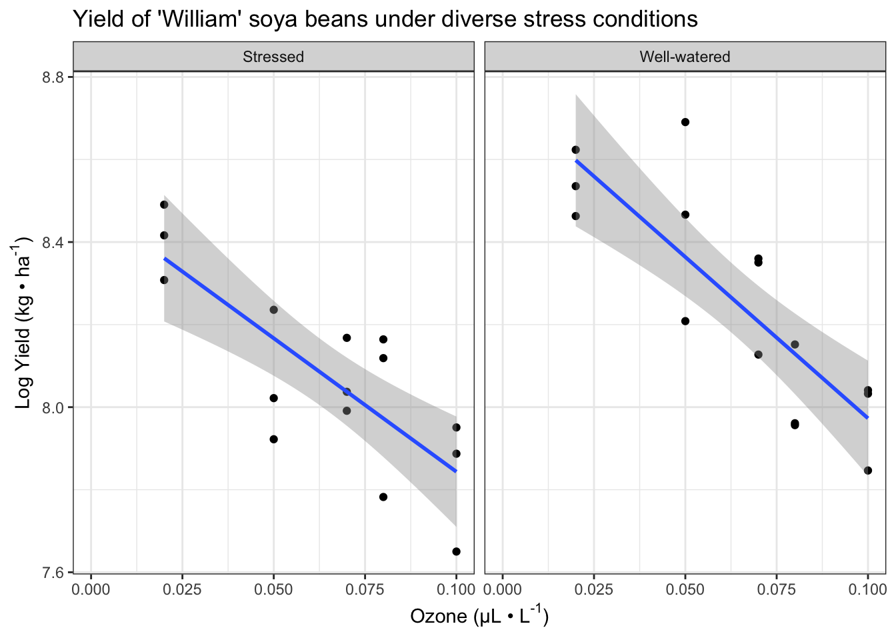
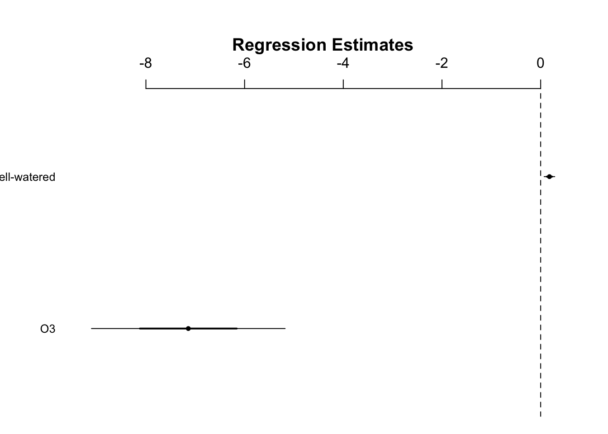
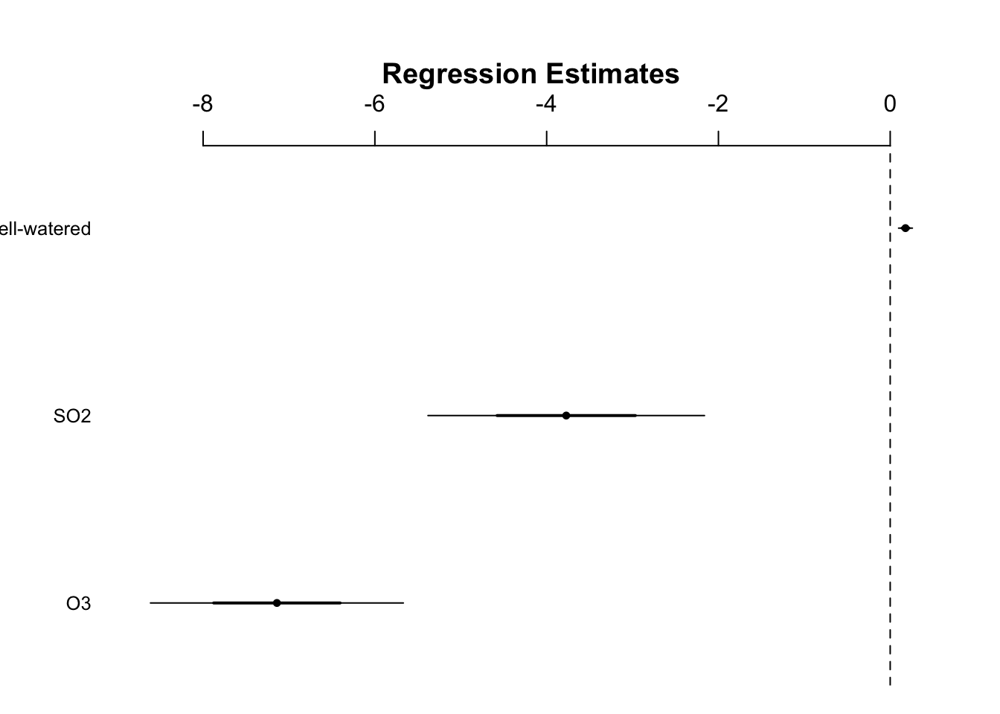

# Analysis of Covariance

## Introduction
- The last analysis dealt with an interaction between two categorical explanatory variables 
- Using ANCOVA, interactions between a categorical and continuous explanatory variables can be examined 
- Side note: 'ANCOVA' is also used to describe analysis in which there is a need to adjust for effects of uncontrolled variables called covariates 


```r
install.packages("arm",  repos = "https://cran.us.r-project.org")
install.packages("ggplot2",  repos = "https://cran.us.r-project.org")
install.packages("cowplot",  repos = "https://cran.us.r-project.org")
install.packages("patchwork",  repos = "https://cran.us.r-project.org")
install.packages("dplyr",  repos = "https://cran.us.r-project.org")
install.packages("Sleuth3",  repos = "https://cran.us.r-project.org")
```


```r
library(arm)
library(ggplot2)
library(cowplot)
library(dplyr)
library(patchwork)
library(Sleuth3)
```


## The agricultural pollution data 
- For this section on ANCOVA, we will look at a subset of variables from a study on the effects of low-level atmospheric pollutants and drought on agricultural yields 
- The aim of this experiment was to determine how the yields of two types of soya beans called 'Forrest' and 'William' were affected by two pollutants (low-level ozone $O_3$ and sulfur dioxide $SO_2$) and also how these pollutants interact with water stress 
- We will examine only the effects to the 'William' variety 
- We will look at the effect of each of the pollutants with water stress in separate ANCOVAs before combining all three variables in one linear model 


```r
head(case1402)
#>         Stress  SO2   O3 Forrest William
#> 1 Well-watered 0.00 0.02    4376    5561
#> 2 Well-watered 0.00 0.05    4544    5947
#> 3 Well-watered 0.00 0.07    2806    4273
#> 4 Well-watered 0.00 0.08    3339    3470
#> 5 Well-watered 0.00 0.10    3320    3080
#> 6 Well-watered 0.02 0.02    3747    5092
```
Quartile values: 

```r
summary(case1402)
#>           Stress        SO2                O3       
#>  Stressed    :15   Min.   :0.00000   Min.   :0.020  
#>  Well-watered:15   1st Qu.:0.00000   1st Qu.:0.050  
#>                    Median :0.02000   Median :0.070  
#>                    Mean   :0.02667   Mean   :0.064  
#>                    3rd Qu.:0.06000   3rd Qu.:0.080  
#>                    Max.   :0.06000   Max.   :0.100  
#>     Forrest        William    
#>  Min.   :2158   Min.   :2101  
#>  1st Qu.:3245   1st Qu.:2889  
#>  Median :3478   Median :3428  
#>  Mean   :3699   Mean   :3635  
#>  3rd Qu.:4327   3rd Qu.:4263  
#>  Max.   :5573   Max.   :5947
```

Structure of the data: 

```r
str(case1402)
#> 'data.frame':	30 obs. of  5 variables:
#>  $ Stress : Factor w/ 2 levels "Stressed","Well-watered": 2 2 2 2 2 2 2 2 2 2 ...
#>  $ SO2    : num  0 0 0 0 0 0.02 0.02 0.02 0.02 0.02 ...
#>  $ O3     : num  0.02 0.05 0.07 0.08 0.1 0.02 0.05 0.07 0.08 0.1 ...
#>  $ Forrest: int  4376 4544 2806 3339 3320 3747 4570 4635 3613 3259 ...
#>  $ William: int  5561 5947 4273 3470 3080 5092 4752 4232 2867 3106 ...
```
- Stress is a factor with 2 levels 
- SO2 and O3, as treatments, also have levels even though they are read into the dataframe as numeric values:

Levels of $SO_2$ and $O_3$: 

```r
unique(case1402$SO2)
#> [1] 0.00 0.02 0.06
unique(case1402$O3)
#> [1] 0.02 0.05 0.07 0.08 0.10
```

- These could be coerced into factors (using `as.factor()`), but we will maintain their status as numeric values because they form a continuum
  - This allows for the examination of them as continuous variables 
- This dataset has a balanced 2 x 3 x 5 fully factorial design (with respect to water stress x $SO_2$ x $O_3$)
  - By 'balanced' it is meant that there are an equal number of replicates for each treatment combination 
  - It has a completely randomized design in which treatment combinations were randomly positions to one of 30 growth chambers 

## ANCOVA with water stress and low-level ozone 
- This subsection will focus on $0_3$ and water stress and perform ANCOVA on their impacts on yield of 'William' beans 
- In this type of experiment soya yields are log transformed, so we will do this here
  - However, we must keep this transformation in mind later when interpretting the results 
- Possible outcomes: 
  - Both stresses decrease yields 
  - One plant exposed to drought stress might be more susceptible to pollutant stress (or vice versa) - syngergistic effect 
  - Obviously there cannot be negative yields, so yields are bounded at 0 - this will impose constraints 
  
Pretty labels: 

```r
xlabel <- expression(paste("Ozone (µL • L" ^ "-1", ")"))
ylabel <- expression(paste("Log Yield (kg • ha" ^ "-1", ")")) 
```

Create base plot of the data: 

```r
fig13_0 <- ggplot(case1402, aes(x= O3, 
                                y = log(William))) + #log transform the y values 
  geom_point() + 
  xlab(xlabel) + ylab(ylabel) + 
scale_x_continuous(limits = c(0, 0.1), #set x axis range 
                    breaks = seq(0,0.1, by = 0.025)) +  #x axis range and increments 
  facet_wrap(vars(Stress)) + theme_bw()
fig13_0
```


Visualize the data as two regressions: 

```r
fig13_1 <- fig13_0 + geom_smooth(method = "lm") + 
ggtitle("Yield of 'William' soya beans under diverse stress conditions") 
fig13_1
#> `geom_smooth()` using formula 'y ~ x'
```



- In this figure, the ANCOVA produces two regressions 
  - There is one regression for each level of water stress factor 
  - `geom_smooth()` adds the slopes 
- Based on this figure, 
  - I think there is probably an effect of ozone on soya bean yield 
  - There also could be an effect of drought stress the y intercepts of the lines look fairly similiar 
    - If anything, my guess would be that the effects are additive but there is no interaction 
  - The author also notes that the regression line in the stressed treatment is slightly flatter than that of the well-watered one 


Create model that considers the possibility of an interaction

```r
w1 <- lm(log(William) ~ O3 * Stress, data = case1402)
```

- This model is very similar to the two-way factorial ANOVA in the previous chapter. The only difference is that one of the explanatory variables is continous 
- The author skips checking the assumptions
  - He says that they are not perfectly normally distributed/equal variances, but there are no major issues 


```r
display(w1)
#> lm(formula = log(William) ~ O3 * Stress, data = case1402)
#>                       coef.est coef.se
#> (Intercept)            8.49     0.10  
#> O3                    -6.47     1.40  
#> StressWell-watered     0.26     0.14  
#> O3:StressWell-watered -1.35     1.98  
#> ---
#> n = 30, k = 4
#> residual sd = 0.15, R-Squared = 0.71
```

- This ANCOVA can be thought of as regressions within factor levels 
  - Therefore the table of coefficients contains four values: 
    - Two regression intercepts and two regression slopes 
    - One intercept and slope value for each regression 
- The linear model prints one factor level as the "(Intercept)"
  - It provides the intercept and slope for one of the regression lines in the first two rows
  - Then provides the difference of intercept and slope relative to the other factor for one of the regression lines in the next two rows
- Labels (from bottom to top): 
  - **O3:StressWell-watered** - this line addresses the interaction 
    - Provides the difference in slopes of the two stress levels 
  - **StressWell-watered**  - this line indicates the effect of the well watered treatment 
    - Provides the difference in intercepts for the regressions in the two stress levels 
  - **03** - ozone 
  - **Intercept** - the stressed level of the stress factor 
- Using arithmetic, we can solve for the four values for the two intercepts and slopes 

```r
#find the y intercept of the well-watered condition regression line 
coef(w1)[1] + #coefficient of the stressed condition 
  coef(w1)[3] #coefficient of the difference for the well watered condition 
#> (Intercept) 
#>     8.75446

#Find the slope of the well-watered condition regression line 
coef(w1)[2] +
  coef(w1)[4] #coefficient for the difference in slope of the well-watered condition 
#>       O3 
#> -7.81444
```

- The coefficent for the difference is slopes in the fourth row, which is for the interactive effect, is -1.35 with a standard error of -1.98 
  - The estimated difference is smaller than its SE, so the conventional rule of thumb suggests that this does not support the idea of there being an interactive effect 

To be more precise, we can look  at the confidence intervals to see if the row for the interactive effect contains zero: 

```r
confint(w1) #the fourth row encompasses 0
#>                             2.5 %     97.5 %
#> (Intercept)            8.28982454  8.6906347
#> O3                    -9.34777877 -3.5865375
#> StressWell-watered    -0.01918491  0.5476463
#> O3:StressWell-watered -5.42109500  2.7265306
```


```r
coefplot(w1)
```


Use the `anova()` function to formally test for an interaction: 

```r
anova(w1)
#> Analysis of Variance Table
#> 
#> Response: log(William)
#>           Df  Sum Sq Mean Sq F value    Pr(>F)    
#> O3         1 1.13812 1.13812 51.9277 1.185e-07 ***
#> Stress     1 0.23764 0.23764 10.8426  0.002859 ** 
#> O3:Stress  1 0.01013 0.01013  0.4621  0.502639    
#> Residuals 26 0.56985 0.02192                      
#> ---
#> Signif. codes:  
#> 0 '***' 0.001 '**' 0.01 '*' 0.05 '.' 0.1 ' ' 1
```
- The interactive effect row has a small F value and a p value of 0.50 

The `drop1()` function can also be used to first assess for an interaction: 

```r
drop1(w1, test = "F")
#> Single term deletions
#> 
#> Model:
#> log(William) ~ O3 * Stress
#>           Df Sum of Sq     RSS     AIC F value Pr(>F)
#> <none>                 0.56985 -110.91               
#> O3:Stress  1  0.010129 0.57998 -112.38  0.4621 0.5026
```

## Interactions in ANCOVA 
- Now that we have established that there is no interaction, we can do one of two things:
  - Keep the model as it is and move on to interpret the main effects of ozone and stress 
  - Or take a model simplification approach to remove the unimportant variables to attain a 'minimal adequate model' that only has terms in which it supports 
- There is no definitive answer, but the author moves on with model simplification 
- This produces a model that only has terms for the main effects of drought stress and ozone 
- Now the questions are: 
  - Is there a relationship (slope) with ozone? 
  - Is there a common relationship or do we need two lines with different slopes for the two water stress treatments? 

```r
w2 <- lm(log(William) ~ O3 + Stress, data = case1402)
display(w2)
#> lm(formula = log(William) ~ O3 + Stress, data = case1402)
#>                    coef.est coef.se
#> (Intercept)         8.53     0.07  
#> O3                 -7.14     0.98  
#> StressWell-watered  0.18     0.05  
#> ---
#> n = 30, k = 3
#> residual sd = 0.15, R-Squared = 0.70
```
- With a cursory look at ozone ($-7.14 \pm 0.98$) and the difference in intercepts ($0.18 \pm 0.05$) shows that we can be confident in both effects

Neither CI of either the ozone or the stress factor contains 0: 

```r
confint(w2)
#>                          2.5 %     97.5 %
#> (Intercept)         8.38292735  8.6837580
#> O3                 -9.15368606 -5.1279124
#> StressWell-watered  0.06819616  0.2878131
```
- We can reject the null hypothesis that they do not have an effect on yield 


```r
coefplot(w2)
```




## General linear models (Three-way)
- The author ends this chapter by positing that we can take this ANCOVA analysis a step further by creating a GLM that analysis water stress, ozone, and sulfur dioxide in combination 
- This design allows for us to include and look at a three way interaction, but we might not want to do this unless we have an *a priori* question that motivates the inclusion of this third term 
- With more complex designs that involve more terms, the results can be uninterpretable 
- In this situation, we don't have an *a priori* hypothesis it is reasonable that all three stresses could interact to reduce yield synergistically 


```r
summary(lm(log(William) ~ O3 * SO2 * Stress, data = case1402))
#> 
#> Call:
#> lm(formula = log(William) ~ O3 * SO2 * Stress, data = case1402)
#> 
#> Residuals:
#>       Min        1Q    Median        3Q       Max 
#> -0.222274 -0.067130  0.007202  0.054343  0.213667 
#> 
#> Coefficients:
#>                           Estimate Std. Error t value
#> (Intercept)                 8.5184     0.1111  76.703
#> O3                         -5.4844     1.5963  -3.436
#> SO2                        -1.0567     3.0414  -0.347
#> StressWell-watered          0.3605     0.1571   2.295
#> O3:SO2                    -36.8530    43.7175  -0.843
#> O3:StressWell-watered      -2.5543     2.2576  -1.131
#> SO2:StressWell-watered     -3.6102     4.3012  -0.839
#> O3:SO2:StressWell-watered  45.2629    61.8259   0.732
#>                           Pr(>|t|)    
#> (Intercept)                < 2e-16 ***
#> O3                         0.00236 ** 
#> SO2                        0.73158    
#> StressWell-watered         0.03162 *  
#> O3:SO2                     0.40831    
#> O3:StressWell-watered      0.27005    
#> SO2:StressWell-watered     0.41030    
#> O3:SO2:StressWell-watered  0.47183    
#> ---
#> Signif. codes:  
#> 0 '***' 0.001 '**' 0.01 '*' 0.05 '.' 0.1 ' ' 1
#> 
#> Residual standard error: 0.1152 on 22 degrees of freedom
#> Multiple R-squared:  0.8507,	Adjusted R-squared:  0.8032 
#> F-statistic: 17.91 on 7 and 22 DF,  p-value: 9.896e-08
```

- This ANOVA table provides even greater support that there are no interactions, and it tests the dual interactions too


```r
confint(lm(log(William) ~ O3 * SO2 * Stress, data = case1402))
#>                                   2.5 %      97.5 %
#> (Intercept)                  8.28808808   8.7487263
#> O3                          -8.79501554  -2.1738073
#> SO2                         -7.36420566   5.2508903
#> StressWell-watered           0.03478276   0.6862235
#> O3:SO2                    -127.51762948  53.8116264
#> O3:StressWell-watered       -7.23619363   2.1276089
#> SO2:StressWell-watered     -12.53043691   5.3100030
#> O3:SO2:StressWell-watered  -82.95626522 173.4820277
```


```r
coefplot(lm(log(William) ~ O3 * SO2 * Stress, data = case1402))
```


Simplify the model to eliminate the analysis of interactions: 

```r
display(lm(log(William) ~ O3 + SO2 + Stress, data = case1402))
#> lm(formula = log(William) ~ O3 + SO2 + Stress, data = case1402)
#>                    coef.est coef.se
#> (Intercept)         8.63     0.06  
#> O3                 -7.14     0.74  
#> SO2                -3.77     0.80  
#> StressWell-watered  0.18     0.04  
#> ---
#> n = 30, k = 4
#> residual sd = 0.11, R-Squared = 0.84
```

- This table of coefficients shows that the the S)2 coefficient estimate is -4.7x larger than its standard error 


```r
coefplot(lm(log(William) ~ O3 + SO2 + Stress, data = case1402))
```




Look at the F and p values through the anova table for the SO2 term: 

```r
anova(lm(log(William) ~ O3 + SO2 + Stress, data = case1402))
#> Analysis of Variance Table
#> 
#> Response: log(William)
#>           Df  Sum Sq Mean Sq F value    Pr(>F)    
#> O3         1 1.13812 1.13812  94.119 3.969e-10 ***
#> SO2        1 0.26558 0.26558  21.963 7.690e-05 ***
#> Stress     1 0.23764 0.23764  19.652 0.0001501 ***
#> Residuals 26 0.31440 0.01209                      
#> ---
#> Signif. codes:  
#> 0 '***' 0.001 '**' 0.01 '*' 0.05 '.' 0.1 ' ' 1
```

- ANCOVAs and a three-way general linear model all support clear negative effects of water stress, ozone, and sulfure dioxide on soya bean yield for the 'William' variety 


