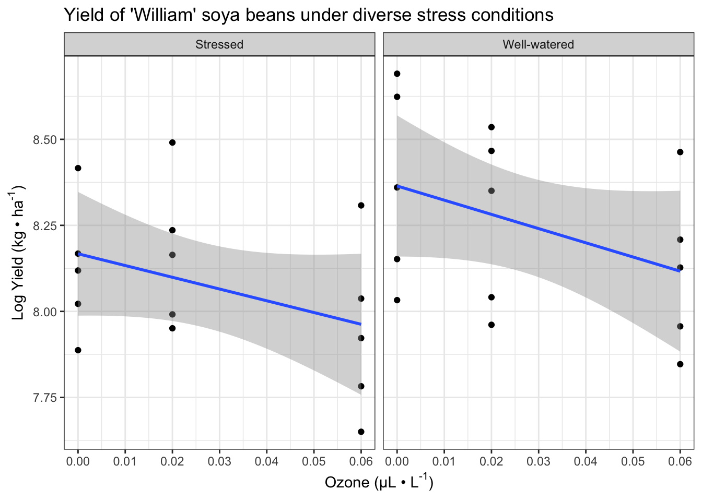

# Linear Model Complexities

## Introduction
- Earlier chapters investigated more complex forms of ANOVA plus ANCOVA too
- There were some complexities that arose in the analysis, but were skimmed over
- This chapter will investigate those complexities 


```r
install.packages("arm",  repos = "https://cran.us.r-project.org")
install.packages("ggplot2",  repos = "https://cran.us.r-project.org")
install.packages("cowplot",  repos = "https://cran.us.r-project.org")
install.packages("patchwork",  repos = "https://cran.us.r-project.org")
install.packages("dplyr",  repos = "https://cran.us.r-project.org")
install.packages("Sleuth3",  repos = "https://cran.us.r-project.org")
```


```r
library(arm)
library(ggplot2)
library(cowplot)
library(dplyr)
library(patchwork)
library(Sleuth3)
```

## Analysis of variance for balanced designs 
- The dataset that was used in one of the earlier chapters had a balanced design: 


```r
urlfile="https://raw.githubusercontent.com/apicellap/data/main/Data_Factorial.txt"
balanced<-read.table(url(urlfile), header = TRUE)
head(balanced) 
#>   Fert Light   FL Biomass.m2
#> 1   F-    L- F-L-      254.2
#> 2   F-    L- F-L-      202.0
#> 3   F-    L- F-L-      392.4
#> 4   F-    L- F-L-      455.3
#> 5   F-    L- F-L-      359.1
#> 6   F-    L- F-L-      386.5
```


```r
 names(balanced)[names(balanced) == 'Fert'] <- 'fert_'
 names(balanced)[names(balanced) == 'Light'] <- 'light_'
 names(balanced)[names(balanced) == 'FL'] <- 'fl_'
 names(balanced)[names(balanced) == 'Biomass.m2'] <- 'biomass'
 head(balanced)
#>   fert_ light_  fl_ biomass
#> 1    F-     L- F-L-   254.2
#> 2    F-     L- F-L-   202.0
#> 3    F-     L- F-L-   392.4
#> 4    F-     L- F-L-   455.3
#> 5    F-     L- F-L-   359.1
#> 6    F-     L- F-L-   386.5
```


Fit the same linear model and view anova output: 

```r
anova(lm(biomass ~ light_+ fert_ + fert_:light_, data = balanced))
#> Analysis of Variance Table
#> 
#> Response: biomass
#>              Df Sum Sq Mean Sq F value    Pr(>F)    
#> light_        1  96915   96915 11.3131  0.001345 ** 
#> fert_         1 319889  319889 37.3413 8.019e-08 ***
#> light_:fert_  1  36409   36409  4.2501  0.043587 *  
#> Residuals    60 513998    8567                      
#> ---
#> Signif. codes:  
#> 0 '***' 0.001 '**' 0.01 '*' 0.05 '.' 0.1 ' ' 1
```

- The model asks about the effect of light, fertilizer, and if there is an interaction effect between the two 
- Effects in ANOVA tables are assessed sequentially by the order laid out in the model 
- The model could be rewritten to reorder the treatments, but when there is a balanced design with equal numbers of replicates among treatments then the values of the sums of squares are not affected the order of terms in the model formula 
- The balanced design ensures orthogonality, which means that two or more explanatory variables can independently assessed. In other words, their effects do not depend on each other 

### Balance and orthogonality
- An experimental design is said to be orthogonal when the effects of response variables are uncorrelated 
  - This makes the sums of squares calculated for the two variables independent of the order in which they are included in the model formula 
- Balanced experimental designs with equal numbers of replicates for each treatment combination ensure orthoganility - Orthangonality is lost when replication numbers are unequal across the different treatment combinations 

- The independence of values of the sums of squares (and everything that follows) makes things simple 
  - For these reasons, balanced designs are strongly recommended 
- It is not always possible to design balanced experiments
- Also, balance can be lost when replicates are unintentionally lost 
- The analysis of unbalanced designs is more complicated but possible 

## Analysis of variance with unbalanced designs 
- This dataset comes from a paper by Shaw & Mitchell-Olds (1993). In this dataset: 
  - Response variable - final plant height
  - Explanatory variable #1 - removal of plant neighbors 
  - Explanatory variable #2 - initial size of the target plants 
- Both explanatory variables are factors, and they each have two levels 
  - Initial size levels = small and large 
  - The design is one that is fully factorialized with all four possible combinations of the treatments 
- The design is unbalanced and non-orthogonal because the different treatment combinations have different numbers of biological replicates 

We have to create the dataframe: 

```r
height <-  c(50, 57, 91, 94, 102, 110, 57, 71, 85, 105, 120)  
size <-  c(rep("Small", 2), rep("Large", 4), rep("Small", 3),  rep("Large", 2))  
treatment <- c(rep("Control", 6), rep("Removal", 5))  
unbalanced <- data.frame(height, size, treatment)  
unbalanced 
#>    height  size treatment
#> 1      50 Small   Control
#> 2      57 Small   Control
#> 3      91 Large   Control
#> 4      94 Large   Control
#> 5     102 Large   Control
#> 6     110 Large   Control
#> 7      57 Small   Removal
#> 8      71 Small   Removal
#> 9      85 Small   Removal
#> 10    105 Large   Removal
#> 11    120 Large   Removal
```

Summarize the two factor design in a table:

```r
table(size,treatment)
#>        treatment
#> size    Control Removal
#>   Large       4       2
#>   Small       2       3
```

A model that fits treatment first produces the following anova table:

```r
mod_TxS <- lm(height ~ treatment * size, data = unbalanced)
anova(mod_TxS)
#> Analysis of Variance Table
#> 
#> Response: height
#>                Df Sum Sq Mean Sq F value    Pr(>F)    
#> treatment       1   35.3    35.3  0.3309 0.5831478    
#> size            1 4846.0  4846.0 45.3658 0.0002686 ***
#> treatment:size  1   11.4    11.4  0.1068 0.7533784    
#> Residuals       7  747.8   106.8                      
#> ---
#> Signif. codes:  
#> 0 '***' 0.001 '**' 0.01 '*' 0.05 '.' 0.1 ' ' 1
```

Reverse the order in the model formula (put size first): 

```r
mod_SxT <- lm(height ~ size * treatment, data = unbalanced)
anova(mod_SxT)
#> Analysis of Variance Table
#> 
#> Response: height
#>                Df Sum Sq Mean Sq F value    Pr(>F)    
#> size            1 4291.2  4291.2 40.1718 0.0003896 ***
#> treatment       1  590.2   590.2  5.5249 0.0510495 .  
#> size:treatment  1   11.4    11.4  0.1068 0.7533784    
#> Residuals       7  747.7   106.8                      
#> ---
#> Signif. codes:  
#> 0 '***' 0.001 '**' 0.01 '*' 0.05 '.' 0.1 ' ' 1
```

- The good news about the two models' tables:
  - The **Sum Sq** value for the **size:treatment** row and the **Residuals** row are the same in both tables 
- The bad news:
  - The **Sum Sq** values for the two main effects are different in each table  
    - This remains the case if the test for an interactive effect is removed from the model formula (or if the terms are in reverse order): 


```r
mod_TS <- lm(height ~ treatment + size, data = unbalanced)
anova(mod_TS)
#> Analysis of Variance Table
#> 
#> Response: height
#>           Df Sum Sq Mean Sq F value    Pr(>F)    
#> treatment  1   35.3    35.3  0.3725    0.5586    
#> size       1 4846.0  4846.0 51.0676 9.746e-05 ***
#> Residuals  8  759.2    94.9                      
#> ---
#> Signif. codes:  
#> 0 '***' 0.001 '**' 0.01 '*' 0.05 '.' 0.1 ' ' 1
```


```r
mod_ST <- lm(height ~ size + treatment, data = unbalanced)
anova(mod_ST)
#> Analysis of Variance Table
#> 
#> Response: height
#>           Df Sum Sq Mean Sq F value    Pr(>F)    
#> size       1 4291.2  4291.2 45.2208 0.0001489 ***
#> treatment  1  590.2   590.2  6.2193 0.0372980 *  
#> Residuals  8  759.2    94.9                      
#> ---
#> Signif. codes:  
#> 0 '***' 0.001 '**' 0.01 '*' 0.05 '.' 0.1 ' ' 1
```

- In both models we can see that there is a high F value associated with the size term
  - Therefore, this means that it is related to the response variable 
- However, initial size is not the explanatory variable of interest for this experiment 
  - Size is a covariate that was added to the model to control for differences in initial size (if the initial size of the replicates were the same at the beginning of the experiment, then it wouldn't have to be accounted for in th model)
- The explanatory variable of whether plant removal was the one that is supposed to be addressed by this experiment
- Unfortunately the lack of balance has an outsized effect on the Sum of squares values for **treatmentt** in the two models 
- `lm(height ~ treatment + size, data = unbalanced)` 
  - treatment has a low F-value and a high P-value 
- `lm(height ~ size + treatment, data = unbalanced)
  - treatment has a much higher F-value and a small p-value 
- Now, the problem is that the two models produce different results 
  - The solution is to just pick the model of the two that makes the most sense for the data 
  - The author says that that the model that controls for size and then assess for the effect of treatment is the more appropriate one in this case \
  - He says that the whole objective of including the covariate for initial sisze was to adjust for its effects before addressing if there is an effect of treatment
  

## ANOVA tables versus coefficients: When F and t can disagree 
- The previous section looked at how the order dependence of ANOVA tables for unbalanaced, non-orthanganol designs and the F-tests that the contain 
- This section will look at estimates and t-tests in the table of coefficients 

Here are the estimates and t-testts for the model that gives priority to the treatment term:

```r
summary(mod_TS)
#> 
#> Call:
#> lm(formula = height ~ treatment + size, data = unbalanced)
#> 
#> Residuals:
#>      Min       1Q   Median       3Q      Max 
#> -13.1053  -6.2105   0.8947   4.7895  14.8947 
#> 
#> Coefficients:
#>                  Estimate Std. Error t value Pr(>|t|)    
#> (Intercept)         98.58       4.47  22.055 1.89e-08 ***
#> treatmentRemoval    15.26       6.12   2.494   0.0373 *  
#> sizeSmall          -43.74       6.12  -7.146 9.75e-05 ***
#> ---
#> Signif. codes:  
#> 0 '***' 0.001 '**' 0.01 '*' 0.05 '.' 0.1 ' ' 1
#> 
#> Residual standard error: 9.741 on 8 degrees of freedom
#> Multiple R-squared:  0.8654,	Adjusted R-squared:  0.8318 
#> F-statistic: 25.72 on 2 and 8 DF,  p-value: 0.0003281
```

Here is the same for the model that gives priority to intial size: 

```r
summary(mod_ST)
#> 
#> Call:
#> lm(formula = height ~ size + treatment, data = unbalanced)
#> 
#> Residuals:
#>      Min       1Q   Median       3Q      Max 
#> -13.1053  -6.2105   0.8947   4.7895  14.8947 
#> 
#> Coefficients:
#>                  Estimate Std. Error t value Pr(>|t|)    
#> (Intercept)         98.58       4.47  22.055 1.89e-08 ***
#> sizeSmall          -43.74       6.12  -7.146 9.75e-05 ***
#> treatmentRemoval    15.26       6.12   2.494   0.0373 *  
#> ---
#> Signif. codes:  
#> 0 '***' 0.001 '**' 0.01 '*' 0.05 '.' 0.1 ' ' 1
#> 
#> Residual standard error: 9.741 on 8 degrees of freedom
#> Multiple R-squared:  0.8654,	Adjusted R-squared:  0.8318 
#> F-statistic: 25.72 on 2 and 8 DF,  p-value: 0.0003281
```

- In contrasts to the sums of squares in the ANOVA tables, the estimates of the coefficients are unaffected by the order of the explanatory variables in the linear model formula 
- This is due to the fact that they are not calculated sequentially
  - Instead, the estimate for each term is made after controlling for effects of all other variables in the model (including interactions) 

## Marginality of main effects and interactions 
- Another glossed over issue is that of including or exlcuding the interaction term in the model if it isn't significant 
- The convention on this used to be that the model should be simplified and to remove the unsupported interactions
- More recently, thinking has changed to maintain interaction terms whether they are important or not 
- In chapter 13, when we extended the typical ANCOVA into a general linear model that added a third variable, the author skipped over an important complexity:
  - The importance of the main effects varying depending on whether interactions were present in the model or not 
- We will revisit this example now:


```r
xlabel <- expression(paste("Ozone (µL • L" ^ "-1", ")"))
ylabel <- expression(paste("Log Yield (kg • ha" ^ "-1", ")")) 
fig13_0 <- ggplot(case1402, aes(x= SO2, 
                                y = log(William))) + #log transform the y values 
  geom_point() + 
  geom_smooth(method = "lm") + 
  ggtitle("Yield of 'William' soya beans under diverse stress conditions") +
  xlab(xlabel) + ylab(ylabel) + 
scale_x_continuous(limits = c(0, 0.06), #set x axis range 
                    breaks = seq(0,0.06, by = 0.01)) +  #x axis range and increments 
  facet_wrap(vars(Stress)) + theme_bw()
fig13_0
#> `geom_smooth()` using formula 'y ~ x'
```



- Interestingly, this complexity doesn't necessarily arise because of having three variables in the model as it occurs in a model with just two variables (effects of water stress and pollutant ($SO_2$) stress)

Begin with the table of coefficients: 

```r
summary(lm(log(William) ~ SO2 * Stress, data = case1402))
#> 
#> Call:
#> lm(formula = log(William) ~ SO2 * Stress, data = case1402)
#> 
#> Residuals:
#>      Min       1Q   Median       3Q      Max 
#> -0.33175 -0.17513 -0.00192  0.17254  0.39154 
#> 
#> Coefficients:
#>                        Estimate Std. Error t value Pr(>|t|)
#> (Intercept)             8.16740    0.08926  91.499   <2e-16
#> SO2                    -3.41525    2.44456  -1.397    0.174
#> StressWell-watered      0.19703    0.12624   1.561    0.131
#> SO2:StressWell-watered -0.71339    3.45713  -0.206    0.838
#>                           
#> (Intercept)            ***
#> SO2                       
#> StressWell-watered        
#> SO2:StressWell-watered    
#> ---
#> Signif. codes:  
#> 0 '***' 0.001 '**' 0.01 '*' 0.05 '.' 0.1 ' ' 1
#> 
#> Residual standard error: 0.2362 on 26 degrees of freedom
#> Multiple R-squared:  0.2585,	Adjusted R-squared:  0.173 
#> F-statistic: 3.022 on 3 and 26 DF,  p-value: 0.04769
```

- Starting from the bottom of the table, 
  - There is no support for an interaction between the two variables 
  - There isn't clear evidence to support main effects either 
  - Looking at this table alone would present the idea that there is no effect of either variable alone or in combination on soya bean yield in this variety 
- However, the ANOVA table summary analysis presents a different picture of the data: 


```r
anova(lm(log(William) ~ SO2 * Stress, data = case1402))
#> Analysis of Variance Table
#> 
#> Response: log(William)
#>            Df  Sum Sq  Mean Sq F value  Pr(>F)  
#> SO2         1 0.26558 0.265581  4.7617 0.03833 *
#> Stress      1 0.23764 0.237642  4.2608 0.04911 *
#> SO2:Stress  1 0.00238 0.002375  0.0426 0.83812  
#> Residuals  26 1.45014 0.055775                  
#> ---
#> Signif. codes:  
#> 0 '***' 0.001 '**' 0.01 '*' 0.05 '.' 0.1 ' ' 1
```

- ANOVA table output
  - The ANOVA table also lacks support for an interaction effect
  - However, its F-tests for the main effects of water and $SO_2$ now support that there are effects from these variables on soya bean yield 
  - When we did a one-way anova for Darwin's Maize data the anova table f-tests and summary table t-tests produced identical p values 
  - However,the summary and anova tables in this situation are different and their values are incongruent 
- There are various situations in which the ANOVA table F-tests and summary table t-tests can differ 
  - Equivalency does require orthogonal designs, but this experimental design is balanced so that can't be the reason for the mismatched results 
  - Additionally, the result of the model are not affected by the order of the terms (data not shown)
  - In this case, the results are incongruent because the summary table and the anova table aren't presenting the same tests despite the similiar row names
- ANOVA table 
  - First row - main effect of $SO_2$
  - Second row - main effect of water stress 
  - Third row - interaction 
  - Fourth row - residual error 
- Summary table of coefficients: 
  - First row - intercept of the regression for $SO_2$ in the water stressed treatment level
  - Second row - the slope of the regression in the first row 
  - Third row - difference in the slope for the well watered treatment 
  - Fourth row - difference in the intercept for the well watered treatment 
- In summary, while both tables have a row labled 'SO2'
  - In the ANOVA table, the SO2 row quantifies how much variance is explained by the sulfure dioxide gradient and the F-value gives the ratio of variance relative to the unexplained noise 
  - In the summary table, the SO2 row estimates the slope of the regression of yield on sulfur dioxide concentration for the well-watered treatment after adjusting for the effects of the other terms in the model 
- When analyses are simple, these tables will produce identical results
- But when there are complexities such as non-orthagonality or the presence of an interaction (or both), then the two tables will not perform the same tests; thereby, producing differing results in their respective tables 
- Understanding models and explaining their ambiguities 
  - In the anova table, we see that there is not support for an interaction effect 
    - However, ideally this would manifest itself as having an F-value of 1 if there is absolutely no interaction 
  - In this case, the F value is much smaller than 1 
- This could be an example of a negative variance component (NVC)
  - These have two interpretations:
    - The NVC could indicate that something is wrong with the data and the analysis is not working as expected 
    - Also, the small variance could be an underestimate due to smapling variation
- The author says that the design of the experiment looks appropriate and the analysis is solid so it must be the latter reason of sampling variation 
- If we remove the interaction term from the model formula, then we find that the anova table and the table of coefficients come into agreement:


```r
summary(lm(log(William) ~ SO2 + Stress, data = case1402))
#> 
#> Call:
#> lm(formula = log(William) ~ SO2 + Stress, data = case1402)
#> 
#> Residuals:
#>     Min      1Q  Median      3Q     Max 
#> -0.3222 -0.1711 -0.0051  0.1737  0.3892 
#> 
#> Coefficients:
#>                    Estimate Std. Error t value Pr(>|t|)    
#> (Intercept)         8.17692    0.07507 108.920   <2e-16 ***
#> SO2                -3.77195    1.69764  -2.222   0.0349 *  
#> StressWell-watered  0.17800    0.08469   2.102   0.0450 *  
#> ---
#> Signif. codes:  
#> 0 '***' 0.001 '**' 0.01 '*' 0.05 '.' 0.1 ' ' 1
#> 
#> Residual standard error: 0.2319 on 27 degrees of freedom
#> Multiple R-squared:  0.2573,	Adjusted R-squared:  0.2023 
#> F-statistic: 4.677 on 2 and 27 DF,  p-value: 0.01803
```


```r
anova(lm(log(William) ~ SO2 + Stress, data = case1402))
#> Analysis of Variance Table
#> 
#> Response: log(William)
#>           Df  Sum Sq  Mean Sq F value  Pr(>F)  
#> SO2        1 0.26558 0.265581  4.9367 0.03486 *
#> Stress     1 0.23764 0.237642  4.4174 0.04504 *
#> Residuals 27 1.45252 0.053797                  
#> ---
#> Signif. codes:  
#> 0 '***' 0.001 '**' 0.01 '*' 0.05 '.' 0.1 ' ' 1
```


- Now both tables show that there is support for the main effects of $SO_2$ stress and water stress, which are biologically sensible 

- This example shows that retaining unimportant interactions in the model can lead to missing the importance of the main effects 
- To be safe, different models should be analysed to test for and without interaction effects 
- It's overall better to have greater sample sizes and even more important because a greater sample size will provide greater power to detect main effects even in the presence of non significant interactions 
- Retaining non significant interactions can also depend on the experiment's aim
  - When the focus is on hypothesis testing, simplifying to a minimal adequate model may be more consistent with the original aims 
- In conclusion, balanced, orthoganol designs are highly recommended to avoid complexities and ambiguities 
