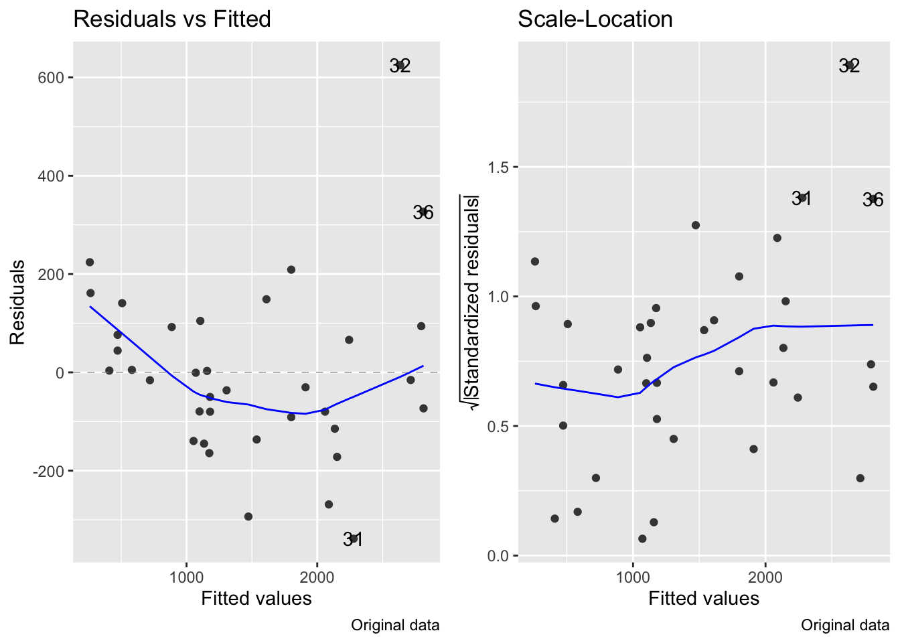
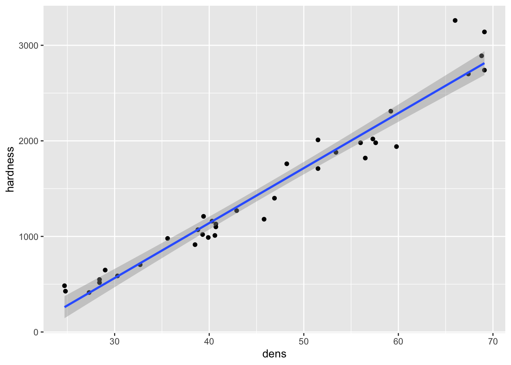
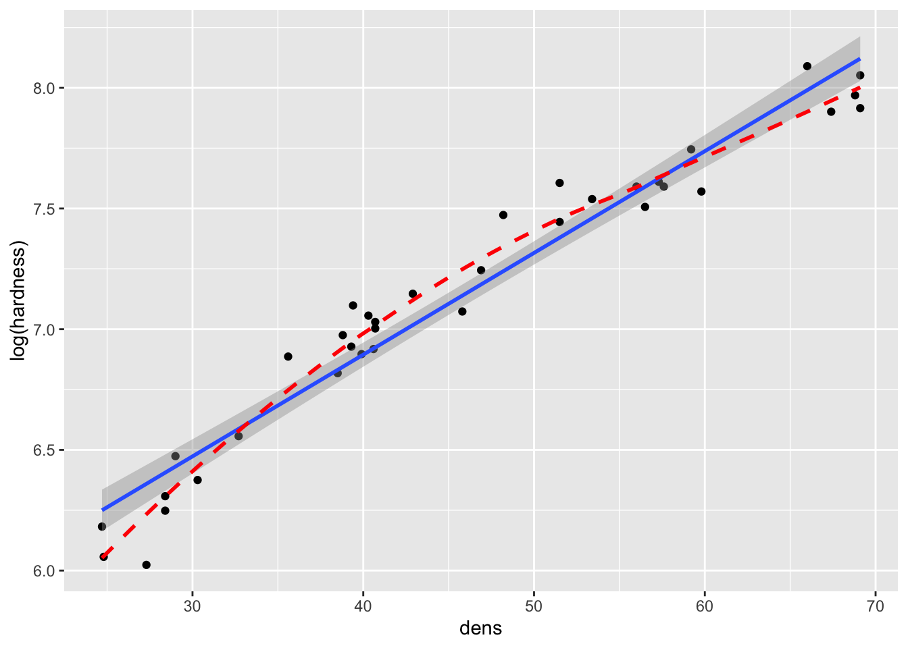
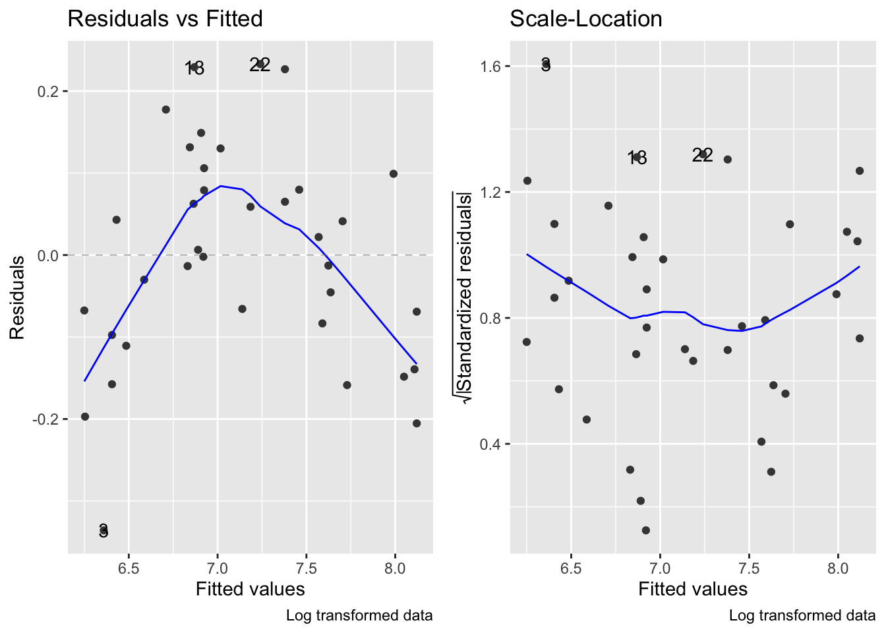
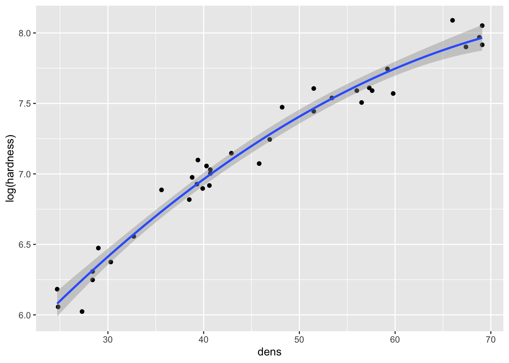
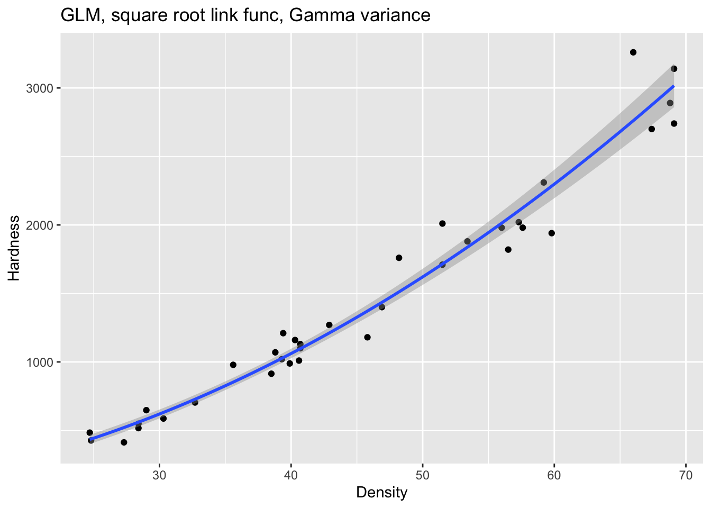

# Generalized Linear Models (GLMs)

## GLMs
- Chapter 7 used normal least squares to perform linear regression analysis using the `lm()` function
- The simple linear regression could not adequately accomodate curvature in the relationship between wood density and hardness
  - As a result, the normal least squares assumption of constant variance was infringed 
- A model with a greater degree of flexibility can model the mean and variance separately - this is what GLMs do 
- This chapter uses GLMs and the maximum likelihood methods on which GLMs are based to extend the linear regression example in new ways 


```r
install.packages("arm",  repos = "https://cran.us.r-project.org")
install.packages("ggplot2",  repos = "https://cran.us.r-project.org")
install.packages("cowplot",  repos = "https://cran.us.r-project.org")
install.packages("patchwork",  repos = "https://cran.us.r-project.org")
install.packages("dplyr",  repos = "https://cran.us.r-project.org")
install.packages("Sleuth3",  repos = "https://cran.us.r-project.org")
install.packages("SemiPar",  repos = "https://cran.us.r-project.org")
install.packages("ggfortify",  repos = "https://cran.us.r-project.org")
install.packages("MASS",  repos = "https://cran.us.r-project.org")
```


```r
library(arm)
library(ggplot2)
library(cowplot)
library(dplyr)
library(patchwork)
library(Sleuth3)
library(SemiPar)
library(ggfortify)
library(MASS)
```

## The trouble with transformations 
- In chapter 7, we created the following model: 


```r
data(janka)
janka.ls1 <- lm(hardness ~ dens, data = janka)
```

- When we looked at diagnostic plots, we found that the model wasn't completely appropriate for the data 
- Two key issues with model were that: 
  - There is some curvature in the relationship that could not be captured by a linear regression
  - Variance is not constant - it increases with the mean 
- One way to deal with these problems is to transform the response variable data
  - To deal with the upward bend in the relationship, a square root transformation can be applied 
  - This would reduce the higher values to be closer to the smaller ones, and may get all of the data to fall closer to a straight line relationship with density 

Directly transform the data in the model: 

```r
janka.sqrt <- lm(sqrt(hardness) ~ dens, data = janka)
```


Compare regression lines on graphs: 

```r
fig15_1a <- ggplot(janka, aes(x = dens, y = hardness)) + geom_point() + 
  geom_smooth(method = "lm") 
fig15_1a
#> `geom_smooth()` using formula 'y ~ x'

fig15_1b <- ggplot(janka, aes(x = dens, y = sqrt(hardness))) + geom_point() + 
  geom_smooth(method = "lm") 
fig15_1b
#> `geom_smooth()` using formula 'y ~ x'
```


- This transformation improves linearity (slightly, the correlation (R) value is actually only improved by 1.1%), but the residuals still increase with the mean: 


```r
fig7_5 <- autoplot(janka.ls1, which = c(1,3), ncol =2) + labs(caption = "Original data")
fig7_5 #this is for the diagnostics on the original model 
```



```r

fig15_2 <- autoplot(janka.sqrt, which = c(1,3), ncol =2) + labs(caption = "Transformed data")
fig15_2
```


- Another common transformation that could be assessed is a log (in this case natural log) transformation: 


```r
janka.log <- lm(log(hardness) ~ dens, data = janka)
```


```r
fig15_3a <- ggplot(janka, aes(x = dens, y = hardness)) + geom_point() + 
  geom_smooth(method = "lm") 
fig15_3a
#> `geom_smooth()` using formula 'y ~ x'

fig15_3b <- ggplot(janka, aes(x = dens, y = log(hardness))) + geom_point() + 
  geom_smooth(method = "lm") + 
  geom_smooth(se = FALSE, colour = "red", linetype = "dashed")
fig15_3b
#> `geom_smooth()` using formula 'y ~ x'
#> `geom_smooth()` using method = 'loess' and formula 'y ~ x'
```



- The natural log transformation over corrects the issue and causes curvature in the opposite direction 

Though the log transformation does correct the variance to be more constant: 

```r
fig7_5 <- autoplot(janka.ls1, which = c(1,3), ncol =2) + labs(caption = "Original data")
fig7_5 #this is for the diagnostics on the original model 
```


```r

fig15_4 <- autoplot(janka.log, which = c(1,3), ncol =2) + labs(caption = "Log transformed data")
fig15_4
```



- So basically the log transformation solves the variance issue, but creates another issue with the relationship
- The log transformation can be taken a step further by using a polynomial regression that trades in the linear term for a quadratic one ($density^2$)
  - Note this must be done using the `I()` function: 


```r
janka.quad <- lm(log(hardness) ~ dens + I(dens^2), data = janka)
```

- A quadratic polynomial regression converts the straight line relationship into one that is a simple curve:


```r
fig15_5a <- ggplot(janka, aes(x = dens, y = hardness)) + geom_point() + 
  geom_smooth(method = "lm") 
fig15_5a
#> `geom_smooth()` using formula 'y ~ x'

fig15_5b <- ggplot(janka, aes(x = dens, y = log(hardness))) + geom_point() + 
  geom_smooth(method = "lm", formula = y ~ x + I(x^2)) 
fig15_5b
```




```r
fig7_5 <- autoplot(janka.ls1, which = c(1,3), ncol =2) + labs(caption = "Original data")
fig7_5 #this is for the diagnostics on the original model 
```


```r

fig15_6 <- autoplot(janka.quad, which = c(1,3), ncol =2) + labs(caption = "Log transformed polynomial data")
fig15_6
```


- While the log transformed data combined with a polynomial regression does address the curved relataionship between wood density and hardness and rectifies the variance issues, the model is much more complex than the simple linear regression 
- Polynomial regressions often extrapolate poorly beyond the range of the data 

- Transformations summed up:
  - The square root transformation provided a linear relationship but the variance was not constant (increased with the mean)
  - A log transformation produced constant variance but overcorrected and introduced curvature in the relationship in the opposite direction 

## The Box-Cox power transform 
- There is an alternative transformation called the Box-Cox family of transformations 

### The Box-Cox family of transformations 
- Implemented through the `boxcox()` function in the MASS package 
- The transformation are performed by raising the data to a power (lambda) that is varied at different levels 
  - When lambda = 2, the data are squared 
  - When lambda = 0.5, the data are square rooted 
  - When lambda = 1, the data are not transformed 
  - When lambda = 0, the natural log is used 
- The R output of `boxcox()` plots the maximum likelihood with the maximum likelihood based 95% confidence interval 

### Maximum likelihood
- Maximum likelihood finds the values of the parameters of the statistical model that is most likely the reproduce the observed data (finds the best fit of the model for the data)
  - This is similiar to how least squares finds the line of best fit by minimizing the sum of squared differences 
- And as as far as data with normally distributed errors, the corresponding form of maximum likelihood analysis is the normal least squares which we already known 
- However, the normal distribution is not a good model for certain forms of data (i.e. binomial data)
- This is where generalized linear models come in because they can make use of other flavors of maximum likelihood (ML) that can be applied to a broader range of data 
- These other flavors of ML can make use of a more general approach to the calculation that underpins GLMs is known as iterative weighted least squares (IWLS) 
- IWLS can be thought of as being analogous to normal least squares approach that we are already familiar with 
- In contrast to the calculations involved with normal least squares that generate exact solutions, ML likelihood methods are iterative and approximate 
  - In other words, it means that ML methods generate many different potential lines of best fit using algorithms that graduately hone in on the actual best solution 

Determine which transformation to use: 

```r
fig15_6 <- boxcox(janka.ls1)
```


- In the above figure, the box-cox method is applied to the model to determine which type of transformation suits the data most appropriately 
  - It does this by comparing lambda values to the -log-likelihood scale
  - Given then corresponding -log-likelihood value for the 95% confidence interval, the respective x (lambda) value is which transformation to use 
  - Since for the janka.ls1 model, lambda = 0.5, then the response variable data must be square rooted 
    - Instead of doing an outright square root transformation, we will do the GLM equivalent 

## Generalized linear models in R 
- GLMs have three components 
  1. A linear predictor
    - The linear predictor follows to the tilde (~) in the `lm()` function formula 
    - In the janka data, the linear predictor is wood density (dens) 
  2. A variance function 
    - This aspect models the variation in the data 
      - This is similar to how normal least squares uses the normal distribution to model residual variation 
      - The difference in the case of GLMs is that they are not limited to the normal distribution 
        - GLMs can use several other types of distributions including Poisson, binomial, and gamma distributions
  3. A link function 
    - This aspect plays a role that is equivalent to the transformation of data in normal least squares models 
    - But instead of transforming the data, the predictions mad by the linear predictor are transformed 
    - Common link functions include log, square root, and logistic functions 
    
Create a GLM for the janka data: 

```r
janka.ml1 <- glm(hardness ~ dens, data = janka, 
                 family = gaussian(   #using the Gaussian/normal distribution as a model for the residual variability (this is the default)
                   link = "identity")) #used to model the mean. No transformation is being performed on the data (this is the default)
```

Take a look at the output from the original model:

```r
anova(janka.ls1)
#> Analysis of Variance Table
#> 
#> Response: hardness
#>           Df   Sum Sq  Mean Sq F value    Pr(>F)    
#> dens       1 21345674 21345674  636.98 < 2.2e-16 ***
#> Residuals 34  1139366    33511                      
#> ---
#> Signif. codes:  
#> 0 '***' 0.001 '**' 0.01 '*' 0.05 '.' 0.1 ' ' 1
```

Take a look at the output from the new GLM model:

```r
anova(janka.ml1)
#> Analysis of Deviance Table
#> 
#> Model: gaussian, link: identity
#> 
#> Response: hardness
#> 
#> Terms added sequentially (first to last)
#> 
#> 
#>      Df Deviance Resid. Df Resid. Dev
#> NULL                    35   22485041
#> dens  1 21345674        34    1139366
```

- GLM analysis of deviance (ANODEV) table
  - `anova(janka.ml1)` produces this type of table and not an ANOVA table 
  - Deviance is related to maximum likelihood 
    - This is the generalized version of sum of squares 
    - It is defined in terms of comparing pairs of models in which one is more complex than a simpler version 
    - Deviance is 2x the difference in the log-likelihoods of the more complex model, and follows the chi-squared distribution 
  - The generalized equivalent of the sum of squares for density are deviance and residual deviance in the bottom row
  - The top row of the ANODEV contains the total degrees of freedom and the total deviance 
  - The ANODEV does not contain the mean square values, statistics, or p-values 
  
- The box-cox (normal least squares) analysis showed that a square root transformation will produce the best fitting model 
- We can use this information to tweak our GLM 
- One snag is that we already know that the variance increased as the mean increased
- To circumvent this issue, we can do the square root transformation (we'll use a square root as the link function) in combination with a distribution in which variance increases with the mean 
  - The distribution that meets this need is the gamma distribution 

Fit a GLM with a square root link function and model the data on a gamma distribution: 

```r
janka.gamma <- glm(hardness ~ dens, data = janka,
                   family = Gamma(link = "sqrt"))
```

Draw a graph of the resulting model:

```r
fig15_7 <- ggplot(janka, aes(x = dens, y = hardness)) + 
  labs(x= "Density", y = "Hardness") + 
  ggtitle("GLM, square root link func, Gamma variance") + 
  geom_point() +
  geom_smooth(method = "glm", method.args = list(Gamma(link= "sqrt")))
fig15_7
#> `geom_smooth()` using formula 'y ~ x'
```



Derive regression point estimates for the intercept and slope values:

```r
coef(janka.gamma)
#> (Intercept)        dens 
#>   1.8672884   0.7677963
```

Get confidence intervals: 

```r
confint(janka.gamma)
#> Waiting for profiling to be done...
#>                  2.5 %    97.5 %
#> (Intercept) 0.09706551 3.6699483
#> dens        0.72361627 0.8122638
```

- CIs for GLMs are calculated using maximum likelihood methods called likelihood profile intervals which are more appropriate for GLMs 
  - Since these intervals are not based on the normal distribution, they do not need to be symmetric
  

```r
coefplot(janka.gamma)
```


