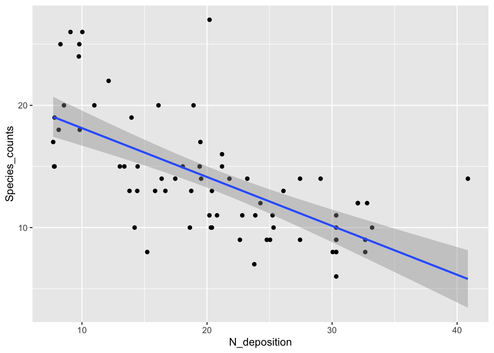
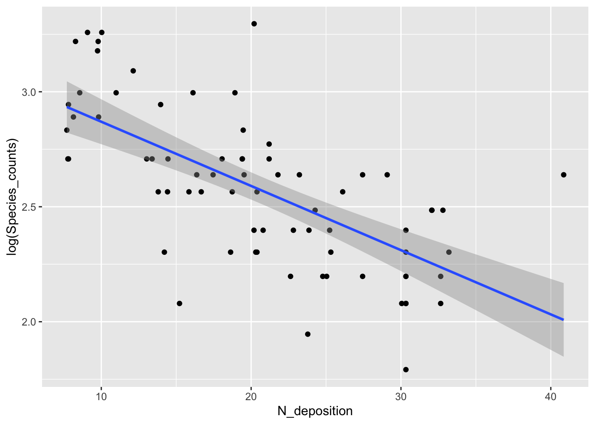
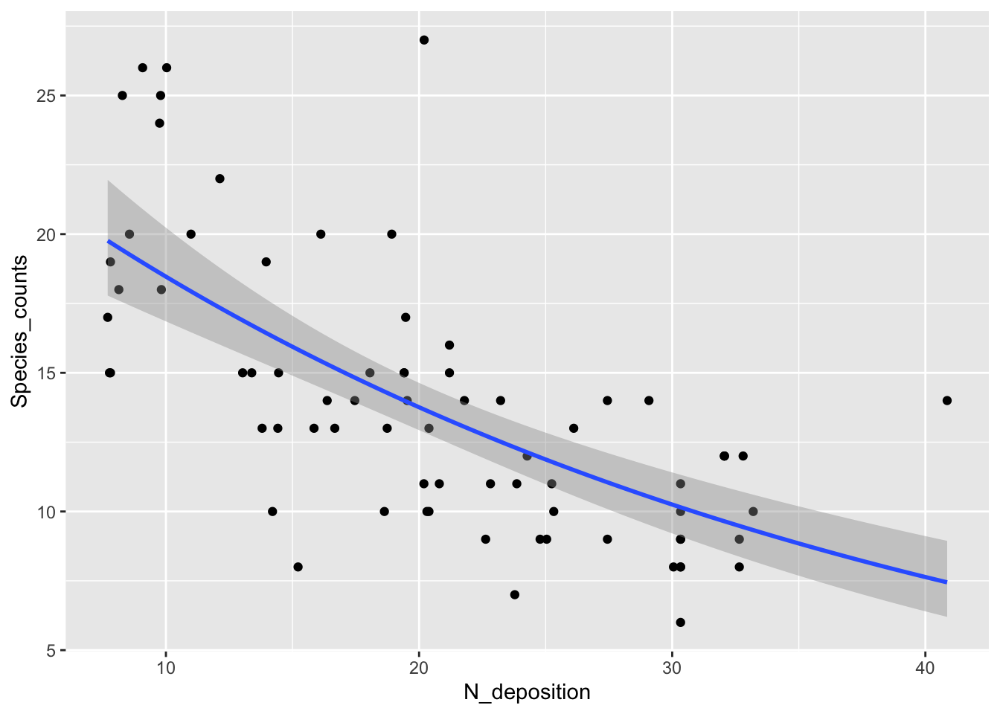
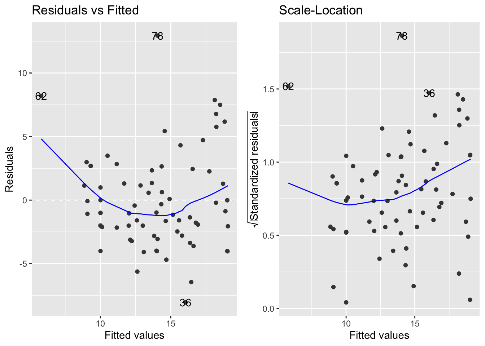
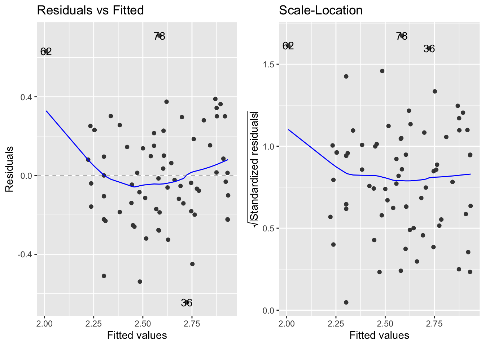

# GLMs for Count Data
## Introduction
- Count data are integers (i.e. whole numbers) that are numbers of individuals, species, times an event has occured etc. 
- The starting point with count data and a GLM is to use the Poisson distribution with a log link function 
  - The log link function makes sure that all predicted counts are positive by taking the exponential of the values generated by the linear predictor 
- In a Poisson distribution, the variance is equal to the mean, but this property must be examined before implementing the model 
- Count data that are good fits for the Poisson distribution usually have many 0s and small values 
- Poisson isn't necessarily a good fit for every type of count data 
- As the mean of the Poisson distribution increases, the distribution converges towards the normal distribution 


```r
install.packages("arm",  repos = "https://cran.us.r-project.org")
install.packages("ggplot2",  repos = "https://cran.us.r-project.org")
install.packages("dplyr",  repos = "https://cran.us.r-project.org")
install.packages("ggfortify",  repos = "https://cran.us.r-project.org")
install.packages("readr",  repos = "https://cran.us.r-project.org")
```


```r
library(arm)
library(ggplot2)
library(dplyr)
library(ggfortify)
library(readr)
```

## GLMs for count data 
- The example dataset encompasses counts of grassland plant species in relation to nitrogen deposition 
- It is an factorial designed experiment that examines if plant diversity changes following nitrogen pollution 
  - The nitrogen variable is continuous
  - The species count data are integers 

Load in and create dataframe: 

```r
urlfile="https://raw.githubusercontent.com/apicellap/data/main/Data_species_counts.txt"
species<-read.table(url(urlfile))
str(species) 
#> 'data.frame':	74 obs. of  2 variables:
#>  $ N_deposition  : num  8.56 7.7 8.28 8.14 10.99 ...
#>  $ Species_counts: int  20 17 25 18 20 10 13 14 15 15 ...
```


```r
summary(species)
#>   N_deposition   Species_counts 
#>  Min.   : 7.70   Min.   : 6.00  
#>  1st Qu.:14.26   1st Qu.:10.00  
#>  Median :20.25   Median :13.00  
#>  Mean   :20.58   Mean   :13.91  
#>  3rd Qu.:27.11   3rd Qu.:15.00  
#>  Max.   :40.86   Max.   :27.00
```

Visualize the data: 

```r
fig16_1 <- ggplot(species, aes(x =N_deposition, y = Species_counts )) + geom_point() + 
  geom_smooth(method = "lm")
fig16_1
#> `geom_smooth()` using formula 'y ~ x'
```



- Data seem to support the idea of a negative relationship between input of nitrogen into this grassland environment and plant diversity
- However, the linear regression at higher nitrogen levels would predict negative species counts, which wouldn't make sense 
- Additionally, the variability in the data is higher when species counts are higher, but the linear regression does not do a great job of modeling this 
- We can try to use a Poisson GLM to fit the data: 


```r
glm1 <- glm(Species_counts ~ N_deposition, 
            family = poisson(link = "log"), data = species)
```

- Check if the Poisson GLM is appropriate for the data: 
  - A poisson glm is defined as having a variance that is equivalent to the mean 
  - If this assumption is met, the ratio of residual deviance to degrees of freedom (the dispersion) should be approximately 1:1 

```r
summary(glm1)
#> 
#> Call:
#> glm(formula = Species_counts ~ N_deposition, family = poisson(link = "log"), 
#>     data = species)
#> 
#> Deviance Residuals: 
#>     Min       1Q   Median       3Q      Max  
#> -2.1788  -0.6813  -0.1904   0.5825   3.1749  
#> 
#> Coefficients:
#>               Estimate Std. Error z value Pr(>|z|)    
#> (Intercept)   3.210340   0.080655  39.803  < 2e-16 ***
#> N_deposition -0.029436   0.003975  -7.405 1.31e-13 ***
#> ---
#> Signif. codes:  
#> 0 '***' 0.001 '**' 0.01 '*' 0.05 '.' 0.1 ' ' 1
#> 
#> (Dispersion parameter for poisson family taken to be 1)
#> 
#>     Null deviance: 120.778  on 73  degrees of freedom
#> Residual deviance:  64.707  on 72  degrees of freedom
#> AIC: 396.2
#> 
#> Number of Fisher Scoring iterations: 4
```

- According to the `summary()` output, the ratio is 64.707:72 (0.90)
  - This level of variation is expected if the data are Poisson distributed
    - A ratio of residual variance to DF above 1.2, and we continued to use the Poisson distribution to model the data, then we would be underestimating the true level of variation in the data 
    - One approach to deploy when data are overdispersed is quasi-maximum likelihood, which will be discussed in the next section 
  - The calculated ratio is approximately 1 (it's 0.9), so suggests that the model is appropriate for this dataset 
- The Poisson GLM is like fitting a straight line through log-transformed counts 
  - The slope and intercept of this representation are in the table of coefficients and can be visualized in the following plot: 
  

```r
fig16_1b <- ggplot(species, aes(x =N_deposition, y = log(Species_counts) )) + geom_point() + 
  geom_smooth(method = "lm")
fig16_1b
#> `geom_smooth()` using formula 'y ~ x'
```



Produce new visualization with the GLM model superimposed: 

```r
fig16_2 <- ggplot(species, aes(x =N_deposition, y = Species_counts )) + geom_point() + 
  stat_smooth(method = "glm", method.args = list(family = "poisson"))
fig16_2
#> `geom_smooth()` using formula 'y ~ x'
```



- This curvilinear relationship (it is linear on the log-y scale) does not predict negative species counts and does a better job of modelling the higher variability at higher species counts 

## Quasi-maximum likelihood 
- Classical maximum likelihood assumes that the level of variability is approximately as predicted for the distribution being applied 
- On the other hand, quasi-maximum likelihood estimates the observed level of variation in the data and adjusts the standard errors accordingly


```r
qlm1 <- glm(Species_counts ~ N_deposition, 
            family = quasipoisson, data = species)
summary(qlm1)
#> 
#> Call:
#> glm(formula = Species_counts ~ N_deposition, family = quasipoisson, 
#>     data = species)
#> 
#> Deviance Residuals: 
#>     Min       1Q   Median       3Q      Max  
#> -2.1788  -0.6813  -0.1904   0.5825   3.1749  
#> 
#> Coefficients:
#>               Estimate Std. Error t value Pr(>|t|)    
#> (Intercept)   3.210340   0.078168   41.07  < 2e-16 ***
#> N_deposition -0.029436   0.003853   -7.64 7.18e-11 ***
#> ---
#> Signif. codes:  
#> 0 '***' 0.001 '**' 0.01 '*' 0.05 '.' 0.1 ' ' 1
#> 
#> (Dispersion parameter for quasipoisson family taken to be 0.9392865)
#> 
#>     Null deviance: 120.778  on 73  degrees of freedom
#> Residual deviance:  64.707  on 72  degrees of freedom
#> AIC: NA
#> 
#> Number of Fisher Scoring iterations: 4
```

- Comparing `summary(glm1)` to `summary(qlm1)` we find that the estimates for slope and intercept are the same, but the standard errors are slightly different 
  - Since the level of variation is approximately what we would expect for a Poisson distribution, the changes in the SEs are small
  - However, if the dispersion index value were greater than 1.2, then this modification in the model to using quasi maximum likelihood would bring about larger changes to the standard errors for the intercept and slope values
- We can look at the diagnostic plots for the linear regression model and take a closer look at the residual variation: 


```r
fig16_3 <- autoplot(lm(Species_counts ~ N_deposition, data = species), 
                    which = c(1,3))
fig16_3
```



- The left to right fan shapes in the residuals indicate that there is an increase in the variance as the mean species count increases instead of a constant level of variation, which is assumed by linear regression 

Log transformation of the response variable does not rectify the variance: 

```r
autoplot(lm(log(Species_counts) ~ N_deposition, data = species), 
                    which = c(1,3))
```



- A type of log transformation is applied through the Poisson GLM through the log link function  
  - By using the poisson distribution, we would expect variation to increase with the mean because the variation is supposed to equal the mean 
  - The use of this function in the GLM means that the model can not produce negative values for species counts at high nitrogen deposition levels
- The GLM does a better job by modelling the patterns in the mean and variance separately than using the one sized fits all approach of transforming the data 

