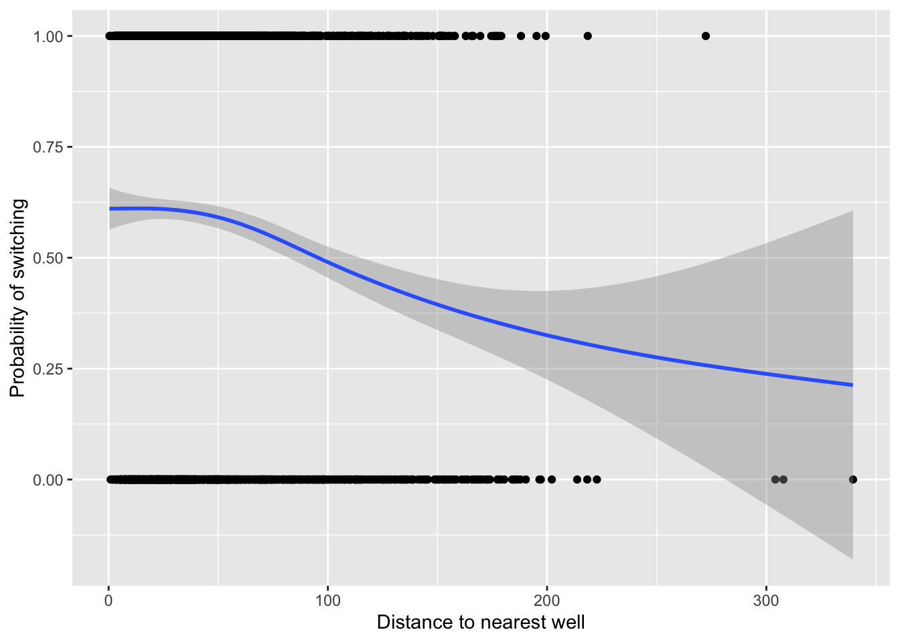
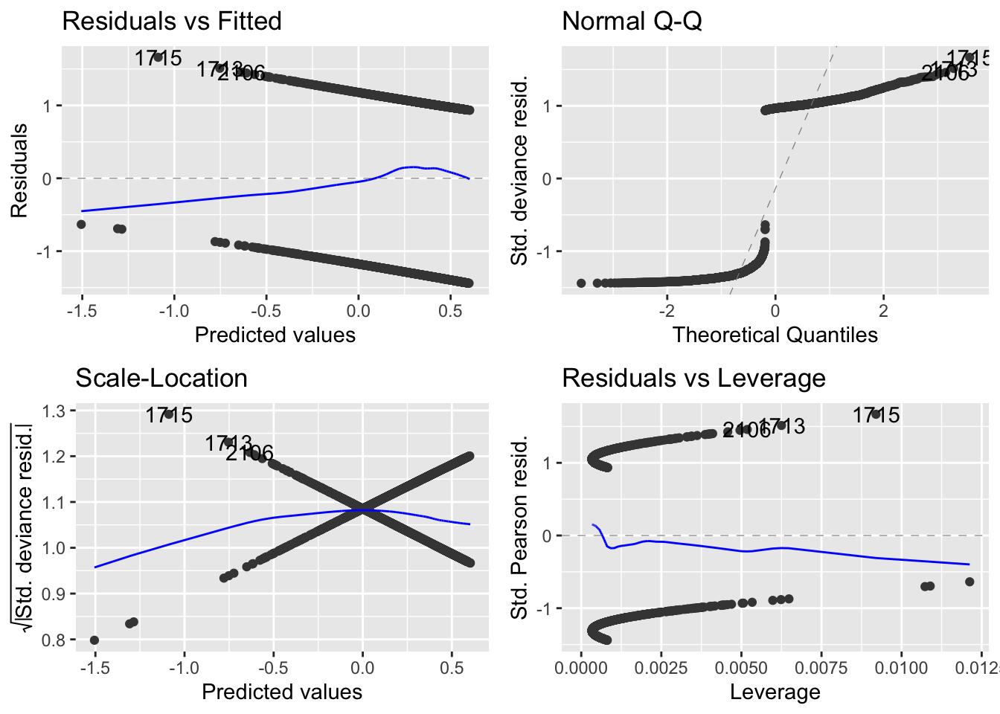
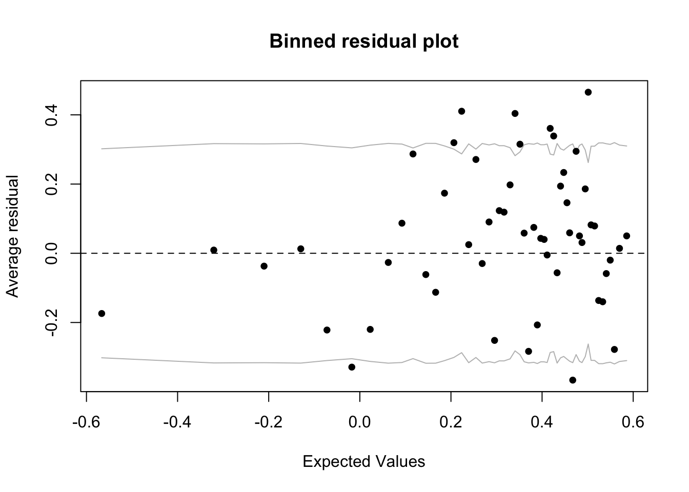
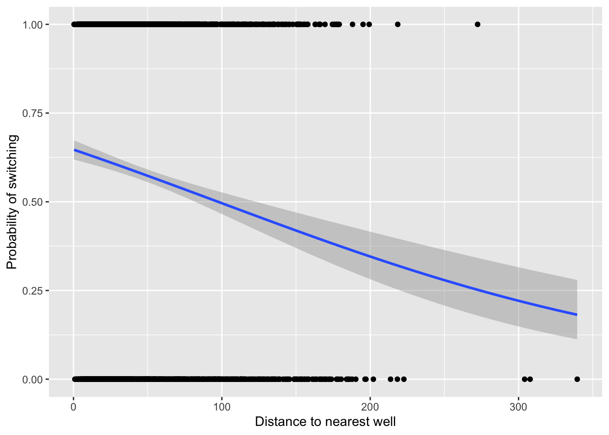
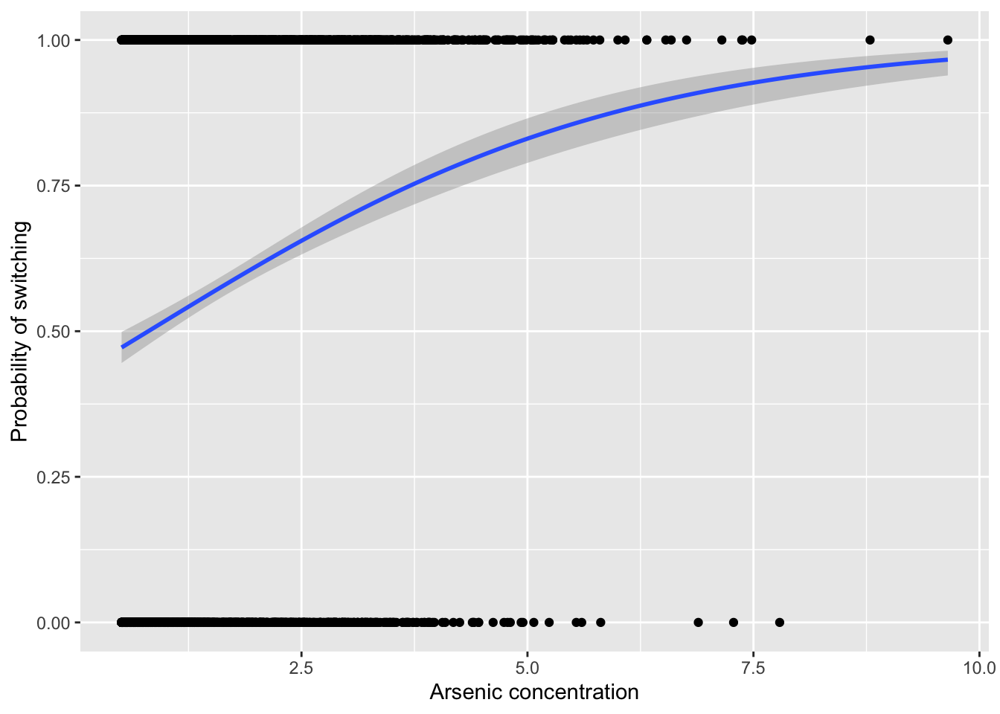

# GLMs for binary data 

## Binary data 
- Binary data is a type of binomial count data in which the binomial denominator is one 
  - Therefore, every trial has a value of either one or zero 
- This type of data can be analyzed using the GLM with a binomial distribution with the same set of link functions to prevent predictions below zero and above one 
- However, since this type of data is so constrained, there are some differences: 
  - The ratio of residual deviance: DF to diagnose under/overdispersion does not apply 
  - But we can use the `binnedplot()` function in the arm package to diagnose dispersion 


```r
install.packages("arm",  repos = "https://cran.us.r-project.org")
install.packages("ggplot2",  repos = "https://cran.us.r-project.org")
install.packages("ggfortify",  repos = "https://cran.us.r-project.org")
install.packages("patchwork",  repos = "https://cran.us.r-project.org")
install.packages("dplyr",  repos = "https://cran.us.r-project.org")
install.packages("Sleuth3",  repos = "https://cran.us.r-project.org")
install.packages("readr",  repos = "https://cran.us.r-project.org")
```


```r
library(arm)
library(ggplot2)
library(ggfortify)
library(dplyr)
library(patchwork)
library(Sleuth3)
library(readr)
```

## The wells data set for the binary GLM example 
- The example dataset for this chapter come from Gelman and Hill (2006): 
- The data concern a Bangladeshi region in whcih many drinking water wells are contaminated by naturally occuring arsenic: 

```r
urlfile="https://raw.githubusercontent.com/apicellap/data/main/Data_Binary_Wells.csv"
wells<-read_csv(url(urlfile))
#> Rows: 3020 Columns: 5
#> ── Column specification ────────────────────────────────────
#> Delimiter: ","
#> dbl (5): switch, arsenic, dist, assoc, educ
#> 
#> ℹ Use `spec()` to retrieve the full column specification for this data.
#> ℹ Specify the column types or set `show_col_types = FALSE` to quiet this message.
str(wells)
#> spec_tbl_df [3,020 × 5] (S3: spec_tbl_df/tbl_df/tbl/data.frame)
#>  $ switch : num [1:3020] 1 1 0 1 1 1 1 1 1 1 ...
#>  $ arsenic: num [1:3020] 2.36 0.71 2.07 1.15 1.1 3.9 2.97 3.24 3.28 2.52 ...
#>  $ dist   : num [1:3020] 16.8 47.3 21 21.5 40.9 ...
#>  $ assoc  : num [1:3020] 0 0 0 0 1 1 1 0 1 1 ...
#>  $ educ   : num [1:3020] 0 0 10 12 14 9 4 10 0 0 ...
#>  - attr(*, "spec")=
#>   .. cols(
#>   ..   switch = col_double(),
#>   ..   arsenic = col_double(),
#>   ..   dist = col_double(),
#>   ..   assoc = col_double(),
#>   ..   educ = col_double()
#>   .. )
#>  - attr(*, "problems")=<externalptr>
```

- The dataframe consists of three important variables (the other two we will ignore):
  - switch - the binary response of whether or not people switch the well from which they were drinking 
  - arsenic - the concentration of arsenic 
  - dist - the distance to the nearest safe well 
  
Define some labels: 

```r
xlabel <- "Distance to nearest well"
ylabel <- "Probability of switching"
```

Visualize the data of how distance to a safe well may predict switching probability: 

```r
fig18_1 <- ggplot(wells, aes(x = dist, y = switch)) + 
  labs(x = xlabel, y = ylabel) + 
  geom_point() + 
  geom_smooth()
fig18_1
#> `geom_smooth()` using method = 'gam' and formula 'y ~ s(x, bs = "cs")'
```



- From the figure it seems like distance to a well may influence whether someone switches 

Rescale the x axis values: 

```r
wells$dist100 <- wells$dist/100
```

Fit a GLM for switching vs distance: 

```r
fit_1 <- glm(switch ~ dist100, binomial(link = "logit"), data = wells)
```

Check the model's diagnostics: 

```r
autoplot(fit_1)
```



- Due to the constrained nature of the binary data, the diagnostic plots are of little value 

Diagnose dispersion: 

```r
x <- predict(fit_1) #extract predicted values from the model
y <- resid(fit_1) #extract the residuals from the model 
fig18_3 <- binnedplot(x, y)
```



- The gray lines on the plot indicate $\pm2$ standard errors within which approximately 95% of the binned residuals lie 
- Ideally for this type of graph, we'd want plenty of bins and plenty of datapoints per each bin, so this approach works well for smaller datasets 
- The expectation that around 95% of the residuals falls within the bounds seems to be met, so we can proceed: 

Examine the coefficents: 

```r
coef(fit_1)
#> (Intercept)     dist100 
#>   0.6059594  -0.6218819
```

Examine the 95% confidence interval: 

```r
confint(fit_1)
#> Waiting for profiling to be done...
#>                  2.5 %     97.5 %
#> (Intercept)  0.4882230  0.7246814
#> dist100     -0.8140762 -0.4319795
```

- This CI supports the hypothesis that the further away a well is, the less likely people will switch to it 
  - Gelman & Hill (2006) suggest a rule of thumb for interpretting the slope of a logistic regression: 
    - The 'divide by four rule' in which you divide the coefficient for the logistic regression slope by 4 to get an approximate estimate of the maximum predicted effect of a unit change in the predictor on the response 
    
    
Plot the data superimposed with a binomial GLM: 

```r
fig18_4 <- ggplot(wells, aes(x = dist, y = switch)) + 
    labs(x = xlabel, y = ylabel) + 
  geom_point() + 
  geom_smooth(method = "glm", method.args = "binomial")
fig18_4
#> `geom_smooth()` using formula 'y ~ x'
```



Evaluate the effect of arsenic concentration: 

```r
fit_2 <- glm(switch ~ arsenic, binomial(link = "logit"), 
             data = wells)
display(fit_2)
#> glm(formula = switch ~ arsenic, family = binomial(link = "logit"), 
#>     data = wells)
#>             coef.est coef.se
#> (Intercept) -0.31     0.07  
#> arsenic      0.38     0.04  
#> ---
#>   n = 3020, k = 2
#>   residual deviance = 4008.7, null deviance = 4118.1 (difference = 109.4)
```

- Given this model and the following figure, there also seems to be a clear positive effect of higher arsenic concentrations leading to greater probabilities of switching wells: 


```r
fig18_5 <- ggplot(wells, aes(x = arsenic, y = switch)) + 
    labs(x = "Arsenic concentration", y = ylabel) + 
  geom_point() + 
  geom_smooth(method = "glm", method.args = "binomial")
fig18_5
#> `geom_smooth()` using formula 'y ~ x'
```



## Centering 
- Both the effect of arsenic concentration and distance to the nearest safe well can be examined in the same model 
- Prior to fitting the GLM, we can make life easier by centering the explanatory variables by subtracting their mean value 
  - This approach has advantages when a regression intercept value of zero is unhelpful or doesn't make sense 
  

```r
wells$c.dist100 <- wells$dist100 - mean(wells$dist100)
wells$c.arsenic <- wells$arsenic - mean(wells$arsenic)
head(wells)
#> # A tibble: 6 × 8
#>   switch arsenic  dist assoc  educ dist100 c.dist100
#>    <dbl>   <dbl> <dbl> <dbl> <dbl>   <dbl>     <dbl>
#> 1      1    2.36  16.8     0     0   0.168   -0.315 
#> 2      1    0.71  47.3     0     0   0.473   -0.0101
#> 3      0    2.07  21.0     0    10   0.210   -0.274 
#> 4      1    1.15  21.5     0    12   0.215   -0.268 
#> 5      1    1.1   40.9     1    14   0.409   -0.0746
#> 6      1    3.9   69.5     1     9   0.695    0.212 
#> # … with 1 more variable: c.arsenic <dbl>
```

- Considering arsenic and distance simultaneously introduces the possibility of an interaction:


```r
fit_5 <- glm(switch ~ c.dist100 + c.arsenic + c.dist100:c.arsenic,
       family = binomial, data = wells )
display(fit_5)
#> glm(formula = switch ~ c.dist100 + c.arsenic + c.dist100:c.arsenic, 
#>     family = binomial, data = wells)
#>                     coef.est coef.se
#> (Intercept)          0.35     0.04  
#> c.dist100           -0.87     0.10  
#> c.arsenic            0.47     0.04  
#> c.dist100:c.arsenic -0.18     0.10  
#> ---
#>   n = 3020, k = 4
#>   residual deviance = 3927.6, null deviance = 4118.1 (difference = 190.5)
```

- `display(fit_5)` output:
  - second row - effect of a change of 100 m when arsenic is at the average level 
  - third row - effect of a unit change of arsenic for a well at average distance 
  - fourth row (interaction) - for every 100 m increase, there is an additional -0.18 for the arsenic coefficient 
- Compare ratios of estimates to their respective standard errors to get a sense of the effect of each coefficient 
  - The interaction term's estimate not even 2x as big as its SE, so while the interaction between contaminant concentration and distance is going in that direction, it probably isn't significant 
  - We can look at whether the null hypotheses can be rejected or not by checking the 95% CI: 


```r
confint(fit_5)
#> Waiting for profiling to be done...
#>                          2.5 %      97.5 %
#> (Intercept)          0.2732603  0.42951145
#> c.dist100           -1.0808894 -0.66992679
#> c.arsenic            0.3882846  0.55325092
#> c.dist100:c.arsenic -0.3795821  0.02232171
```


