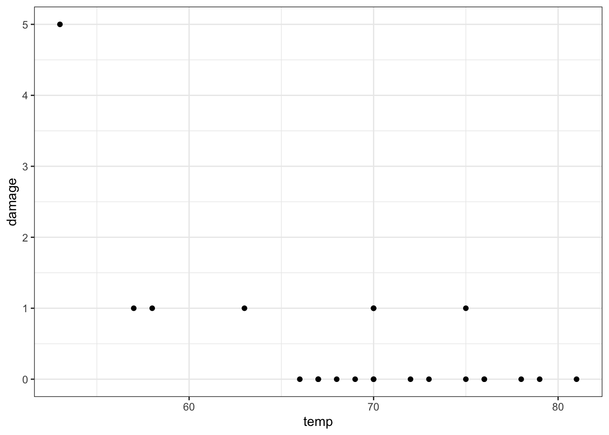

# Motivation 

## A matter of life and death 
- The author introduces the chapter with an anecdote about the Space Shuttle the Challenger built in 1986 
- It is infamous for exploding soonafter launch, killing all astronauts aboard 
- An investigation of disaster found that these o-rings, which would have otherwise prevented fuel leaks, failed 
- The investigation found that their failure was the result of colder than typical temperatures on the day of the launch, causing the o-rings to become brittle and allow fuel to leak
- Data from the investigation can be found in the package 'faraway' 


```r
install.packages("faraway",repos = "https://cran.us.r-project.org")
install.packages("ggplot2",repos = "https://cran.us.r-project.org")
```


```r
library(faraway)
library(ggplot2)

head(orings)
```

Plot the data from the orings dataset: 

```r
fig2_2 <- ggplot(orings, aes(x = temp, y = damage)) + geom_point() + theme_bw()
fig2_2
```



The question that the data pose is if the number of leaks is associated with temperature. But NASA scientists and engineers did not draw up a graph like this to ask the question. 

## Summary: statistics 
- The Challenger o-rings data is too complex for now, but the author will start with data from Charles Darwin 

## Summary: R 
