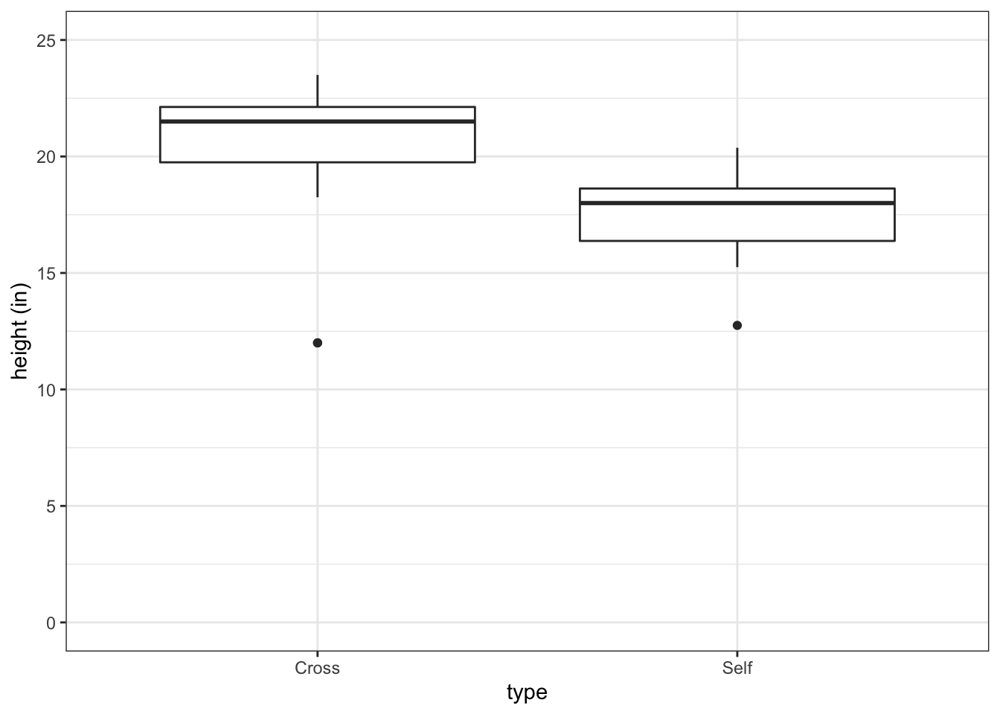
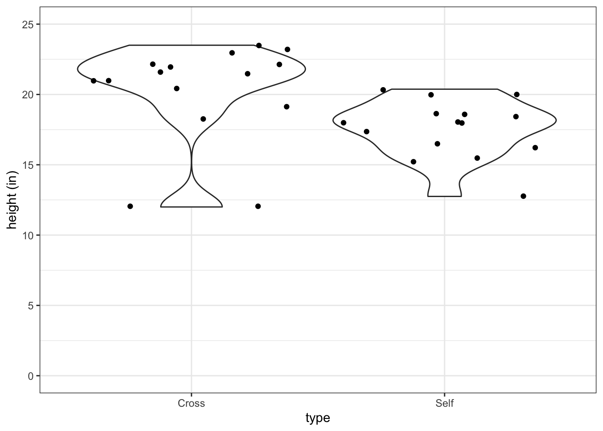
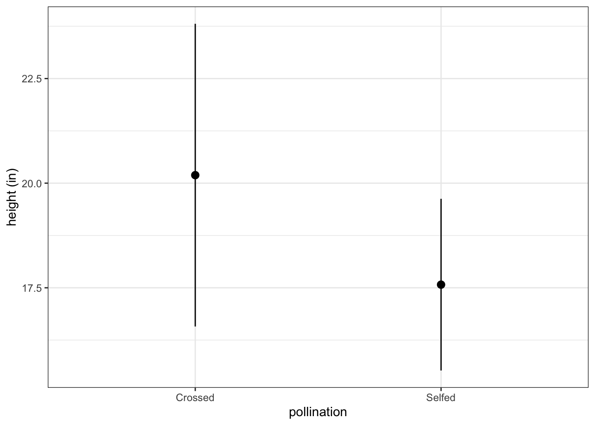

# Description

## Introduction 
- Author starts the chapter by introducing linear-model analysis in which the goal is to compare the effects of different treatments 
  - Each treatment is applied to a group of experimental units (biological replicates) 
  - If the treatments produce a change in the replicates, then there will be a quantifiable difference between groups 
- This chapter focuses on treatment effects and hypohthesis *testing* is saved for later 


## Darwin's maize pollination data 
- Darwin's book *The Effects of Cross and Self-Fertilization in the Vegetable Kingdom* (1876) describes he produced maize seeds by pollinating the flowers of the parent from the same individual or with pollen from another plant 
- Pairs of seeds taken from selfed or out-crossed plants were then grown in pots 
- The height of the young seedlings was recorded as a measure for fitness 
- Darwin wanted to know whether inbreeding reduced fitness of the selfed plants 
- Darwin's data is in the package 'SMPracticals' 
- The dataframe that contains the data is 'darwin' 
- R terminology 
  - single values = scalars
  - columns of numerical data = vectors


```r
head(darwin)
#>   pot pair  type height
#> 1   I    1 Cross 23.500
#> 2   I    1  Self 17.375
#> 3   I    2 Cross 12.000
#> 4   I    2  Self 20.375
#> 5   I    3 Cross 21.000
#> 6   I    3  Self 20.000
```

### Known your data 

Understand structure of the dataframe: 

```r
str(darwin)
#> 'data.frame':	30 obs. of  4 variables:
#>  $ pot   : Factor w/ 4 levels "I","II","III",..: 1 1 1 1 1 1 2 2 2 2 ...
#>  $ pair  : Factor w/ 15 levels "1","2","3","4",..: 1 1 2 2 3 3 4 4 5 5 ...
#>  $ type  : Factor w/ 2 levels "Cross","Self": 1 2 1 2 1 2 1 2 1 2 ...
#>  $ height: num  23.5 17.4 12 20.4 21 ...
```

- Structure: 
  - The first three variables are Factors 
    - These are categorical varaibles that divide data into discrete groups called levels 
  - The last variable is a numerical one. It is a continuous measure of heigth 

Generate summary statistics for the dataframe: 

```r
summary(darwin)
#>   pot          pair       type        height     
#>  I  : 6   1      : 2   Cross:15   Min.   :12.00  
#>  II : 6   2      : 2   Self :15   1st Qu.:17.53  
#>  III:10   3      : 2              Median :18.88  
#>  IV : 8   4      : 2              Mean   :18.88  
#>           5      : 2              3rd Qu.:21.38  
#>           6      : 2              Max.   :23.50  
#>           (Other):18
```

### Summarizing and describing data
- Plant height is the response variable 
- The treatments involved are two types of hand-pollination (selfing and crossing). This is the explanatory variable 
- The goal is to see if we can explain the differences in plant height as a function of pollination treatment 
- There are 15 replicates in each treatment group, planted in pairs 
- This dataframe is in the long or tidy format, which is typically ideal
- Darwin data in the wide format can be found in the package, Sleuth3, and specifcally in the dataframe, exo0428 


```r
head(ex0428)
#>   Cross  Self
#> 1 23.50 17.38
#> 2 12.00 20.38
#> 3 21.00 20.00
#> 4 22.00 20.00
#> 5 19.13 18.38
#> 6 21.50 18.63
```

Visualize the data in a boxplot:

```r
fig3_1 <- ggplot(darwin, aes(x=type, y=height)) + geom_boxplot() + 
  ylab("height (in)") + theme_bw() + scale_y_continuous(limits = c(0,25),  breaks=c(0,5,10,15,20,25))
fig3_1
```



- Figure takeaways: 
  - Bold central horizontal line is the median
  - Top horizontal part of box is the third quartile
  - Bottom horizontal part of the box is the first quartile
    - These contain the middle of the data 
  - The whiskers contain 95% of the data 
  - The datapoints are outliers 
  
Violin plot can show the higher and lower 'centers of gravity' of the distributions of the data: 

```r
fig3_2 <- ggplot(darwin, aes(x=type, y=height)) +
  geom_violin() + 
  ylab("height (in)") + theme_bw() + scale_y_continuous(limits = c(0,25),  breaks=c(0,5,10,15,20,25)) + geom_jitter()
fig3_2
```



- The author sums up the goal of the analysis by quoting a statistician, Nate Silver, who says that the aim is to find if there is any systematic pattern (signal) in the data that stands out above the background variability (noise)
  - Signal is often quantified through finding the average (also median and mode)

Determine the mean for all data (ignoring treatment groups): 

```r
with(data = darwin, mean(height)) #average height for all 30 plants 
#> [1] 18.88333
```

- Now the problem is how to quantify variability. 
- Variance is quantified through a process called 'least squares', more on this later
- Variance is also known as mean squares and is referred to as 
  - $S^{2}$ when a sample of data is being discussed (as here) and 
  - $\sigma$$^{2}$ (sigma) when the population from which the sample is drawn is being discussed
  
Calculate the variance in the data as a whole: 

```r
var(darwin$height) 
#> [1] 10.11846
```

- The catch about this estimate of variability is not on the same scale as our data 
- This is on a squared scale, where as the data at hand is unsquared 
- This means that the measure of signal (plant height) is in inches and the varibility of the plant height is in squared inches, which doesn't make sense 
- So you have to take the square root of variance to get back to the same scale as the original data 
  - Effectively, this means that you have to find the standard devation (SD): 
<center>
$SD = \sqrt{s^2}$
</center>

- Again, $\sigma$ is used when referring to the whole population standard deviation
- The latin $s$ is used for the sample SD
- SD is the average difference between an individual measurement (i.e. a single plant height measurement) and the mean value

Calculate the SD in R: 

```r
a <- sd(darwin$height)
a
#> [1] 3.180953
```

Double check derivation of SD: 

```r
b = sd(darwin$height)
isTRUE(a==b)
#> [1] TRUE
```

### Comparing groups

Calculate means of groups (this approach does not scale well): 

```r
mean(ex0428$Cross)
#> [1] 20.19333
mean(ex0428$Self)
#> [1] 17.57667
```

Calculate summary statistics more efficiently:

```r
with(data = darwin, tapply(height, type, mean))
#>    Cross     Self 
#> 20.19167 17.57500
with(data = darwin, tapply(height, type, sd))
#>    Cross     Self 
#> 3.616945 2.051676
```

Assign calculated values to objects:

```r
means <- tapply(darwin$height, darwin$type,mean)
sds <- tapply(darwin$height, darwin$type,sd)
```

Create a new column to contain text to soon merge into the dataframe: 

```r
pollination <- c("Crossed","Selfed")
dar_sum_stats <- data.frame(pollination, means, sds) 
dar_sum_stats
#>       pollination    means      sds
#> Cross     Crossed 20.19167 3.616945
#> Self       Selfed 17.57500 2.051676
```

Plot these summary statistics: 

```r
fig3_3 <- ggplot(dar_sum_stats, aes(x=pollination, y=means)) +
  geom_pointrange(aes(ymin = means - sds, max = means + sds)) + 
  ylab("height (in)") + theme_bw() 
fig3_3
```



