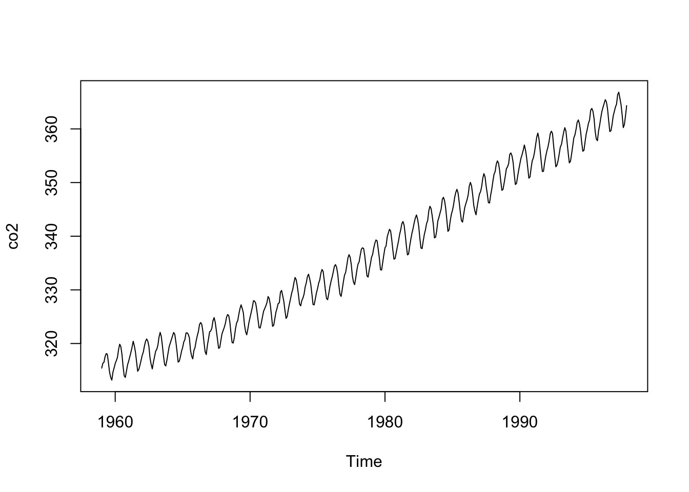

# Reproducible Research 

## The reproducibility crisis
- A concerning amount of research studies have been discovered over the last decade to not be reproducible 
- One aim of this chapter is to demonstrate how to write a script and then convert it into an Rmarkdown document 


## R Scripts 

Summary statistics on dataframe about atmospheric carbon dioxide concentrations: 

```r
summary(co2)
#>    Min. 1st Qu.  Median    Mean 3rd Qu.    Max. 
#>   313.2   323.5   335.2   337.1   350.3   366.8
```

Plot the data: 

```r
plot(co2)
```



## Analysis notebooks 
- The author says that one way to combat the reproducibility crisis is to document exactly how data analysis is done
- This can be accomplished through RMarkdown 
- Scripts can still be written in .R files, but should be converted to .Rmd files too

## RMarkdown
- He gives a basic overview of RMarkdown including how to convert it into a pdf
- He emphasizes that R is updated roughly every six months

Record which version of R was used to create script running: 

```r
sessionInfo()
#> R version 4.1.1 (2021-08-10)
#> Platform: aarch64-apple-darwin20 (64-bit)
#> Running under: macOS Monterey 12.4
#> 
#> Matrix products: default
#> BLAS:   /Library/Frameworks/R.framework/Versions/4.1-arm64/Resources/lib/libRblas.0.dylib
#> LAPACK: /Library/Frameworks/R.framework/Versions/4.1-arm64/Resources/lib/libRlapack.dylib
#> 
#> locale:
#> [1] en_US.UTF-8/en_US.UTF-8/en_US.UTF-8/C/en_US.UTF-8/en_US.UTF-8
#> 
#> attached base packages:
#> [1] stats     graphics  grDevices utils     datasets 
#> [6] methods   base     
#> 
#> other attached packages:
#> [1] SMPracticals_1.4-3 ellipse_0.4.3      ggplot2_3.3.6     
#> 
#> loaded via a namespace (and not attached):
#>  [1] tidyselect_1.1.2 xfun_0.31        bslib_0.3.1     
#>  [4] purrr_0.3.4      splines_4.1.1    lattice_0.20-44 
#>  [7] colorspace_2.0-3 vctrs_0.4.1      generics_0.1.2  
#> [10] htmltools_0.5.2  yaml_2.2.1       utf8_1.2.2      
#> [13] survival_3.2-11  rlang_1.0.2      jquerylib_0.1.4 
#> [16] pillar_1.7.0     glue_1.6.1       withr_2.4.3     
#> [19] DBI_1.1.2        lifecycle_1.0.1  stringr_1.4.0   
#> [22] munsell_0.5.0    gtable_0.3.0     memoise_2.0.1   
#> [25] evaluate_0.15    knitr_1.39       fastmap_1.1.0   
#> [28] fansi_1.0.2      highr_0.9        scales_1.1.1    
#> [31] cachem_1.0.6     jsonlite_1.7.3   fs_1.5.2        
#> [34] digest_0.6.29    stringi_1.7.6    bookdown_0.27   
#> [37] dplyr_1.0.9      grid_4.1.1       cli_3.2.0       
#> [40] tools_4.1.1      magrittr_2.0.3   sass_0.4.0      
#> [43] tibble_3.1.6     crayon_1.5.0     pkgconfig_2.0.3 
#> [46] downlit_0.4.0    Matrix_1.3-4     ellipsis_0.3.2  
#> [49] MASS_7.3-58      xml2_1.3.3       assertthat_0.2.1
#> [52] rmarkdown_2.14   rstudioapi_0.13  R6_2.5.1        
#> [55] nlme_3.1-152     compiler_4.1.1
```


