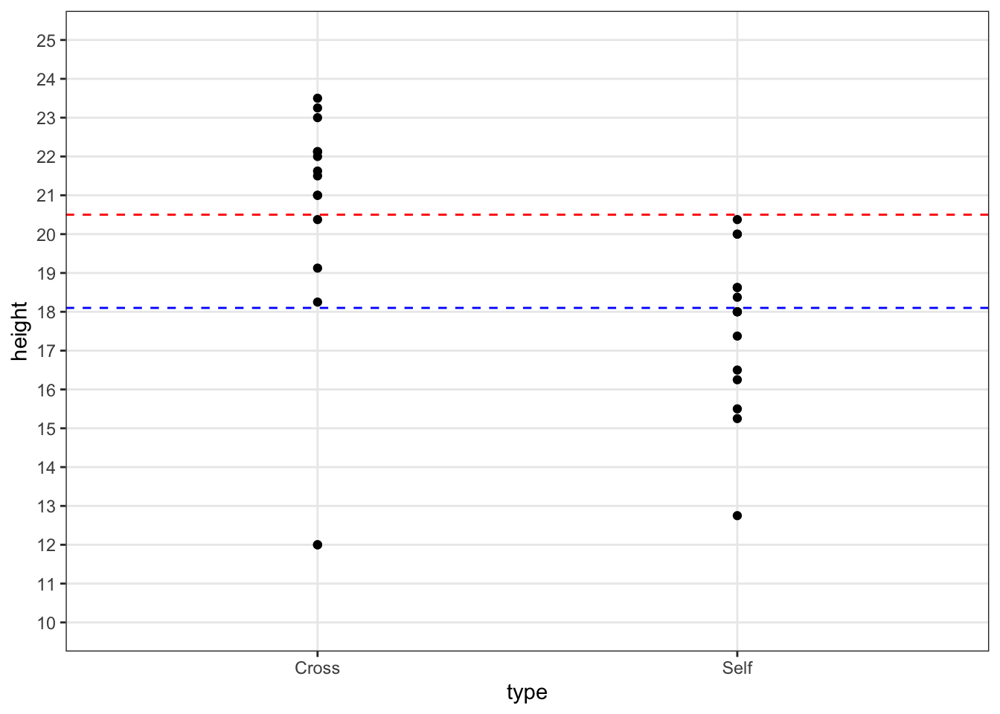
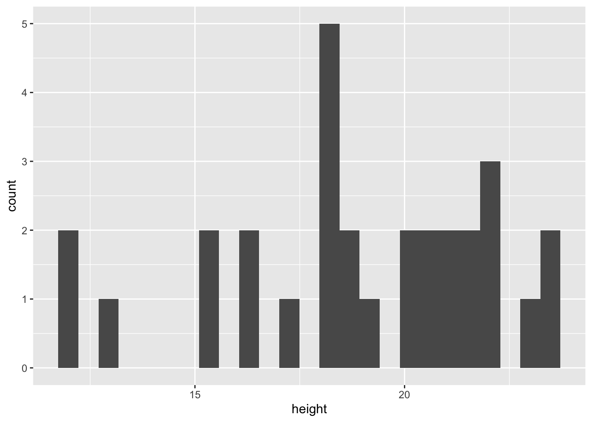
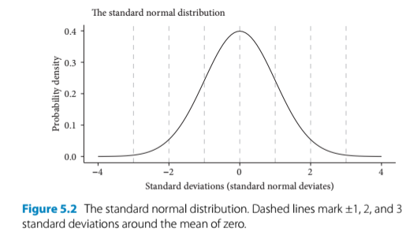

# Estimation 

## Introduction 
- In Darwin's pollination experiments, he wanted to find out whether selfing is detrimental to plant fitness. This question concerns the differences in plant height 
- This chapter addresses that by estimating the mean heights of the two pollination treatments and the difference between them + quantify our confidence in the estimates which are used to determine whether they are statistically different 


```r
install.packages("arm", repos = "https://cran.us.r-project.org")
install.packages("ggplot2", repos = "https://cran.us.r-project.org")
install.packages("Sleuth3", repos = "https://cran.us.r-project.org")
install.packages("SMPracticals", repos = "https://cran.us.r-project.org")
```


```r
library(arm)
library(ggplot2)
library(Sleuth3)
library(SMPracticals)
```


## Quick tests 
- Author talks about Tukey quick tests to assess variability of groups of data (treatments)
  - It is makeshift because there are outliers in the data and you can’t actually run this test if there are outliers
  - But he ignores them for the purpose of the exercise 
- The test is supposed to determine whether there is a relative shift in y values in one group compared to the other: 

Plot the quick tukey test: 

```r
fig5_1 <- ggplot(darwin, aes(x = type, y = height)) + 
  geom_point() +
  geom_hline(yintercept = c(18.1, 20.5), #draw line that intercepts with the y axis at these y values 
             colour = c("blue", "red"),  #give these dotted lines these colors, respectively 
              linetype = 2) + #linetype 2 is a dotted line; 1 is solid 
  theme_bw() + 
  scale_y_continuous(limits = c(10,25), minor_breaks = seq(10,25,1),
                     breaks =seq(10, 25,1)) 
              
fig5_1    
```



- Figure takeaways: 
  - If the outliers were ignored, then the test would show a fairly strong upward shift in height values for the cross pollinated progeny relative to the selfed progeny 
  - This would support Darwin’s hypothesis about fitness and outcrossing 

## Differences between groups
- Since Darwin's data consists of matched pairs of seedlings, it is better to work with differences in height rather than the treatment means 


Calculate difference between each value in Cross and Self data in a new column:

```r
ex0428$difference <- ex0428$Cross - ex0428$Self 
head(ex0428)
#>   Cross  Self difference
#> 1 23.50 17.38       6.12
#> 2 12.00 20.38      -8.38
#> 3 21.00 20.00       1.00
#> 4 22.00 20.00       2.00
#> 5 19.13 18.38       0.75
#> 6 21.50 18.63       2.87
```

Calculate the mean of the difference column: 

```r
mean(ex0428$difference) 
#> [1] 2.616667
```

Calculate the sd of the difference column: 

```r
sd(ex0428$difference)
#> [1] 4.719373
```

- Standard deviation is for assessing the value of variation within one sample (population) 
  - It’s the average distance between a datapoint and the mean 
  - It’s not for testing how confident we are that a difference between samples exists 
- That’s where standard error and confidence intervals come in 

## Standard deviations and standard errors 
- Again, standard deviation is a descriptive statistic that means the variability (dispersion) in a sample of data 
  - It applies to individual datapoints 
- Shifting focus from individual datapoints to comparing means, we need to utilize the standard error 
- Standard error is a measure of the variance with the sample size and the standard deviation factored in:

<center> 
$SE = \sqrt{\frac{s^2}{n}}$
</center>

- $\sigma$ would be used when dealing with the population as whole
- $s^2$ - the sample variance (again, $\sigma^2$ is used when the entire population is being addressed)
- $n$ = the sample size 
  - Standard error describes the variability around the mean that would be expected among samples if the experiment was repeated over and over
    - The new mean of the data collected in these experiments would likely fall within the SE bounds
  - Since sample size is in the denominator, a higher sample size decreases the SE value. 
  - This reflects a decreasing level of uncertainty in the data, but it is a diminishing returns relationship. To halve uncertainty, sample size must be quadrupled 

Calculate the standard error of the mean difference in height: 

```r
x<-format(round(sd(ex0428$difference)/sqrt(15), 2), nsmall = 2) #round to 2 decimal places 
x <- as.numeric(x)
x
#> [1] 1.22
```

Assess the distribution of the data: 

```r
ggplot(darwin, aes(x = height)) + geom_histogram(bins=25)
```



- A null hypothesis can be used understand how SEs can be used to infer the level of confidence in the data and whether there is a difference between groups
- Null hypothesis - there is no difference (a difference of 0) between the crossed and selfed progeny in terms of their mean height 
  - The mean difference is 2.62 inches 
  - Given the mean difference, need to determine how likely is it to have estimated this difference (of 2.62) if the null hypothesis is correct and there is no difference between treatments. A normal distribution is used to ascertain this. 

## The normal distribution and the central limit theorem 
- Defined by two parameters: the mean and the standard deviation (SD)
  - Bell curve is centered at the mean (the value of zero on the x axis)
  - 67.8% of the data are within 1 SD of the mean 
  - 95% of the data are within 2 SDs of the mean 
  - 99.8% of the data are within 3 SDs of the mean


```r

```


- We use the normal distribution as a model for our data and assume that our data are approximately normal. 
  - We will more formally test this by making models and looking at the diagnostics
- Side note: using the properties of a normal distribution as a model of variability in a sample works less effectively in small sample sizes
- We are asking, How likely are we to see a difference of 2.62 inches if the null hypothesis is true? How many SEs away from zero is 2.62? 
- We will assume that these data are approximately normal so that we can use the normal distribution to model our data on 

Bell curve to represent the plant height data: 


- Figure 5.3 
  - The center of the bell curve is the mean (2.62 inches)
  - The red line, which shows 0, is beyond two standard errors of the mean 
  - Because 0 lies beyond 2 SEs of the mean, or outside of 95& of the data, we can reject the null hypothesis that there is no difference in height at this level of confidence 
  - This is the lowest level of confidence for statistical significance 
  - We fail to reject the null hypothesis at a confidence level of 99% (three SEs) or greater 

## Confidence intervals 
- Two standard errors encompasesses the central 95% of the data under the normal curve 
  - This is referred to as a 95% confidence interval (CI)
  - CIs are defined by their upper and lower limits (bounds)
  - They can be calculated in the following ways: 

Calculate the lower bound of 95% CI: 

```r
2.62 - (2*x) #x = 1.22. This is one standard error of the mean. 
#> [1] 0.18
```

Calculate upper bound of the 95% CI: 

```r
2.62 + (2*x) 
#> [1] 5.06
```
- Conventionally, a 95% CI is calculated with the upper and lower bounds 2 SEs from the mean 
- The 95% refers to an imaginary repetition of experiments/samples in which the interval will capture the true value (i.e. an unknown population mean) 95% of the time (in a long term sense) 
- Report as mean difference of height of 2.62 [0.18, 5.06] inches (95% CI)
- CI takeaways: 
  - since 0 is outside the 95% CI bounds, we can reject the null hypothesis at this level
  - but it will fail at a 99% CI (3 standard errors from the mean)
  


