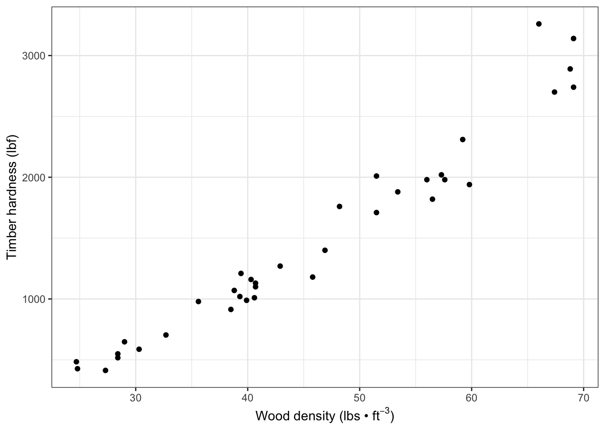

# Regression

## Introduction 


```r
install.packages("arm",  repos = "https://cran.us.r-project.org")
install.packages("ggplot2",  repos = "https://cran.us.r-project.org")
install.packages("MASS",  repos = "https://cran.us.r-project.org")
install.packages("SemiPar",  repos = "https://cran.us.r-project.org")
install.packages("agricolae",  repos = "https://cran.us.r-project.org")
install.packages("ggfortify",  repos = "https://cran.us.r-project.org")
```


```r
library(arm)
library(ggplot2)
library(MASS)
library(SemiPar)
library(agricolae)
library(ggfortify)
```

## Linear regression 
- Linear regression
  - Used to define a relationship between a response and explanatory variable 
  - A scatter plot is used to draw a straight line through it to model the mean 
  - Variability around the mean is captured by the size of the standard errors 
    - and is reflected by the confidence intervals calculated from them 
  - We use $y = b + mx$ 
    - $y$ = the predicted value of the response variable (i.e. hardness in janka data)
    - $b$ = the regression intercept ($y$ when $x = 0$)
    - $m$ = the slope of the regression line
    - $x$ = the value of the explanatory variable (i.e. density in janka data)
  - Unexplained residual (error) variation can be added as an additional term, $e$ 
    - $y = b + mx + e$
    
## Janka timber hardness data 
- The goal of collecting this data was to establish a linear relationship between wood density and hardness 
- Density is easier to measure than hardness so this is testing if density can be used as a proxy 
- This dataset includes 36 samples of wood from unique tree species 
- Once a linear relationship is established, the model can be used to predict timber hardness of wood with a known density value 
- Data are found in the SemiPar package and in the dataframe, janka 

Need to load the data from the semipar package: 

```r
data(janka)
head(janka)
#>   dens hardness
#> 1 24.7      484
#> 2 24.8      427
#> 3 27.3      413
#> 4 28.4      517
#> 5 28.4      549
#> 6 29.0      648
```


```r
str(janka)
#> 'data.frame':	36 obs. of  2 variables:
#>  $ dens    : num  24.7 24.8 27.3 28.4 28.4 29 30.3 32.7 35.6 38.5 ...
#>  $ hardness: int  484 427 413 517 549 648 587 704 979 914 ...
```


```r
xlabel <- expression(paste("Wood density (lbs • ", ft^-3, ")")) #expression allows you to modify certain parts of the text of the label
ylabel <- "Timber hardness (lbf)"
```

Visualize the data - Wood hardness as a function of density - via a scatterplot: 

```r
fig7_1 <- ggplot(janka, aes(x = dens, y = hardness)) + geom_point() +
    xlab(xlabel) + ylab(ylabel) + theme_bw()
fig7_1
```



There is a positive relationship and the relationship between wood hardness and density seems to be linear 

## Correlation 

Test the strength of the correlation: 

```r
with(janka, cor(dens, hardness))
#> [1] 0.9743345
```

- This value is very close to +1; therefore, there is a strong positive linear relationship between the two variables 
- We can go beyond correlation and argue that higher wood density causes higher timber hardness by using linear regression
  - Mathematically, that would be to say changes in $x$ lead to changes in $y$
  
## Linear regression in R
- The data are similiar to the Darwin data except that the explanatory variable, density, is continuous 

Create a linear model: 

```r
janka.ls1 <- lm(hardness ~ dens, data = janka)
```

- The model estimates a 'line of best fit' (the regression line) by using the method of least squares to minimize the error sums of squares, which is the average distance between datapoints and the line (see appendix 7b)
  

Add the linear model regression line (and a 95% CI band) to the the scatter plot: 

```r
fig7_2 <- fig7_1 +
  geom_smooth(method = "lm")  #fit a linear model regression line to the data points 
fig7_2
#> `geom_smooth()` using formula 'y ~ x'
```


- Figure takeaways: 
  - The CI has curved upper and lower bounds that are narrowest in the middle 
  - This results from it being calculated from standard errors for the regression intercept and regression slope 
  - There is uncertainty about the elevation of the line and its gradient 
  
Check the model's estimates of the coefficients: 

```r
display(janka.ls1)
#> lm(formula = hardness ~ dens, data = janka)
#>             coef.est coef.se 
#> (Intercept) -1160.50   108.58
#> dens           57.51     2.28
#> ---
#> n = 36, k = 2
#> residual sd = 183.06, R-Squared = 0.95
```
  - display(janka.ls1) takeaways: 
   - **Intercept** refers to the hardness variable 
      - The  **Intercept**'s **coef.est** ($y = -1160.50$ is for when $x (density) = 0$
        - Side note: it's not possible to have a negative hardness or a density of zero, so this is somewhat of an artifact of the analysis
      - **coef.se** is the standard errorr of the regression intercept 
    - One thing to do to get more meaning out of this data is a technique called centering 
      - Centering means subtracting the average density value (x) from each individual value 
      - This is a useful strategy because they provide the value of the response for the average value of the explanatory variable
  - **dens** = 57.51 is the value of the regression slope 
      - increase of 1 unit wood density means an increase in timber hardness by 57.51 units 
  - **n** = sample size 
  - **k** = number of estimated parameters (regression intercept and slope)
  - **R-squared** = proportion of the variation in the data explained by the linear regression analysis 
  
  Find CI (95%) upper and lower bounds: 

```r
  confint(janka.ls1)
#>                   2.5 %     97.5 %
#> (Intercept) -1381.16001 -939.83940
#> dens           52.87614   62.13721
```
    
## Assumptions 

- The linear model here makes all the same assumptions about the data as we have seen before including: 
  - The assumption that the unexplained variability around the regression line (the residuals) is approximately normal and has constant variance 
  - The residuals are the differences observed between the observed datapoints and the fitted values predicted by the model 
    - Residual differences are the vertical distances between the datapoints and the corresponding points on the regression line (fitted values) 
    - Residuals are represented in the red lines on the Figure 7.3 

Display (two of the) residuals graphically on the fitted regression data: 

```r
fig7_3 <- 
  fig7_1 + geom_smooth(method = "lm", 
                       se = FALSE) + 
  geom_segment(aes(x = 66, xend = 66, y =3250, yend = 2650), color = "red") + 
    geom_segment(aes(x = 59.8, xend = 59.8, y =1955, yend = 2265), color = "red") 
fig7_3
#> `geom_smooth()` using formula 'y ~ x'
```


- Figure 7.3 takeaways: 
  - In this graph, we see two of those residuals, which are vertical differences 
    - Each datapoint has a corresponding fitted value at each x value 
  - The linear model analysis finds the regression 'line of best fit' by using the method of least squares to minimize the average distance between the datapoints and the line (the unexplained variation
    - If we imagine a red line from each datapoint to the blue line
      - These vertical distances are used for the best fit calculation
    - This method will be discussed further in chapter 11 

Extract the fitted values predicted by the linear model: 

```r
fitted(janka.ls1)
#>         1         2         3         4         5         6 
#>  259.9152  265.6658  409.4325  472.6899  472.6899  507.1939 
#>         7         8         9        10        11        12 
#>  581.9525  719.9686  886.7379 1053.5073 1070.7593 1099.5126 
#>        13        14        15        16        17        18 
#> 1105.2633 1134.0166 1157.0193 1174.2713 1180.0220 1180.0220 
#>        19        20        21        22        23        24 
#> 1306.5366 1473.3060 1536.5633 1611.3220 1801.0940 1801.0940 
#>        25        26        27        28        29        30 
#> 1910.3567 2059.8741 2088.6274 2134.6328 2151.8848 2243.8954 
#>        31        32        33        34        35        36 
#> 2278.3994 2634.9408 2715.4502 2795.9595 2813.2115 2813.2115
```

Extract the residuals: 

```r
head(residuals(janka.ls1))
#>          1          2          3          4          5 
#> 224.084837 161.334170   3.567483  44.310140  76.310140 
#>          6 
#> 140.806135
tail(residuals(janka.ls1)) #displays the last 6 rows in the dataframe 
#>         31         32         33         34         35 
#> -338.39945  625.05917  -15.45018   94.04048  -73.21152 
#>         36 
#>  326.78848
```

Check normality of the data: 

```r
fig7_4 <- autoplot(janka.ls1, which = c(2), ncol =1)
fig7_4
```


- figure shows that the data are fairly normally distributed 
- outliers are individually labelled on the plot 
  - These values have a much bigger value than what is normal for this dataset 

Check the variability of the data: 

```r
fig7_5 <- autoplot(janka.ls1, which = c(1,3), ncol =2)
fig7_5
```


- Figure 7.5 takeaways: 
  - Left - raw residuals as a function of the fitted values 
  - Right - 
    - Displays the absolute value of the residuals (|residuals|)
    - Standardizes them by:
    <center>
    $\sqrt\frac{residual}{residualSD}$
    </center>
  - Both plots suggest that the residuals don't have constant variance 
    - Their variability seems to increase as the mean increases 
    - In later chapters, we will see if there is a more appropriate model for this data 
