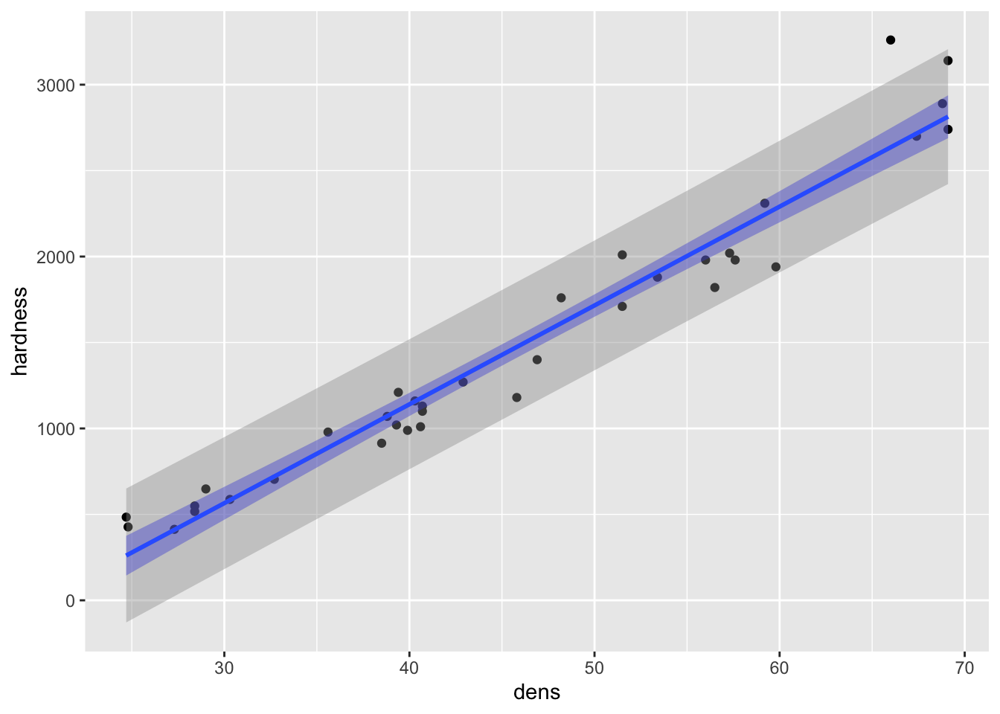

# Prediction

## Introduction 
- In the previous section, a linear regression tot model the relationship between wood density and timber hardness was established 
- The coefficients of the linear model - the regression intercept and the slop - were found 
- In this section, the coefficients will be used to predict timber hardness from new density values 


```r
install.packages("ggplot2",  repos = "https://cran.us.r-project.org")
install.packages("dplyr",  repos = "https://cran.us.r-project.org")
install.packages("SemiPar",  repos = "https://cran.us.r-project.org")
```


```r
library(ggplot2)
library(dplyr)
library(SemiPar)
```

## Predicting timber hardness from wood density 

- Predicting wood hardness from a known density value
- Rather than using $y = mx + b$ to solve for y, we can use tools in R 
- The model that was created in the last section has data that encompasses density values of between 20-70 lbs/$ft^3$ and correspondingly, up to about 3000 units on the janka timber hardness scale

Reload janka data: 

```r
data(janka)
janka.ls1 <- lm(hardness ~ dens, data = janka)
```

The estimates of the intercept and slope are: 

```r
coef(janka.ls1)
#> (Intercept)        dens 
#> -1160.49970    57.50667
```


To find timber hardness for a density value of 65: 

```r
coef(janka.ls1)[1] + coef(janka.ls1)[2] *65 #b + mx = timber hardness value 
#> (Intercept) 
#>    2577.434
```
- numbers in brackets refer to which coefficent 
  - 1 refers to the intercept
  - 2 refers to the slope 
  
We can accomplish the same thing with the predict function: 

```r
predict(object = janka.ls1, #the model used to make the prediction 
        newdata = list(dens=65)) #the value(s) we want to make the prediction for 
#>        1 
#> 2577.434
```

By default, a prediction is made for all 36 density values: 

```r
predict(object = janka.ls1)
#>         1         2         3         4         5         6 
#>  259.9152  265.6658  409.4325  472.6899  472.6899  507.1939 
#>         7         8         9        10        11        12 
#>  581.9525  719.9686  886.7379 1053.5073 1070.7593 1099.5126 
#>        13        14        15        16        17        18 
#> 1105.2633 1134.0166 1157.0193 1174.2713 1180.0220 1180.0220 
#>        19        20        21        22        23        24 
#> 1306.5366 1473.3060 1536.5633 1611.3220 1801.0940 1801.0940 
#>        25        26        27        28        29        30 
#> 1910.3567 2059.8741 2088.6274 2134.6328 2151.8848 2243.8954 
#>        31        32        33        34        35        36 
#> 2278.3994 2634.9408 2715.4502 2795.9595 2813.2115 2813.2115
```
- These are the fitted values (predictions) we saw last chapter - the data points on the regression line
  - The density (x) values are fed into the model (the $y = b + mx$ equation model) and the output is the fitted or predicted values 
- R calculates the fitted values by combining the estimates of the coefficents with the model matrix (X-matrix)

Take a look at the model matrix:

```r
head(model.matrix(janka.ls1))
#>   (Intercept) dens
#> 1           1 24.7
#> 2           1 24.8
#> 3           1 27.3
#> 4           1 28.4
#> 5           1 28.4
#> 6           1 29.0
tail(model.matrix(janka.ls1))
#>    (Intercept) dens
#> 31           1 59.8
#> 32           1 66.0
#> 33           1 67.4
#> 34           1 68.8
#> 35           1 69.1
#> 36           1 69.1
```

- (Intercept), here, refers to the other (response) variable, in this case, hardness 
  - just like we have seen with display(janka.ls1)
  - the column of 1s include the value that we rarely see in model formulas: 
  
  The model formula for janka.ls1 written above can also be written as: 

```r
janka.ls1 <- lm(formula = 1 + #shows that 1 is factored into the model as a starting point for the model calculation 
                  hardness ~ dens, data = janka)
```
- as in: 
  - $y = b\cdot1 + m\cdot x$
    - here, the intercept, b, is multiplied by 1

To calculate the predicted hardness for a wood sample with the lowest density, we take the estimated values of intercept and slope: 

```r
coef(janka.ls1)
#> (Intercept)        dens 
#> -1159.49970    57.50667
```

and combine them with values from the first row of the model matrix: 

```r
model.matrix(janka.ls1)[1,]
#> (Intercept)        dens 
#>         1.0        24.7
```

like so: 

```r
-1160.49970*1 +57.50667*24.7
#> [1] 259.915
```
- this translates to $b\cdot1 + m\cdot x = 259.915$ in which: 
  - $b$ = -1160.49970 
  - $m$ = 57.50667
  - $x$ = 24.7
  
R figures this out more easily (and precisely without rounding error): 

```r
coef(janka.ls1)[1] * model.matrix(janka.ls1)[1,1] +
coef(janka.ls1)[2] * model.matrix(janka.ls1)[1,2]
#> (Intercept) 
#>    260.9152
```

## Confidence intervals and prediction intervals 

It's easy to plot data with a regression line plus a 95% CI: 

```r
Fig8_1 <- ggplot(janka, aes(x=dens, y = hardness)) + geom_point() +
  geom_smooth(method = "lm")
Fig8_1
#> `geom_smooth()` using formula 'y ~ x'
```


- Remember that the 95% CI reflects our confidence in the average relationship - the regression line itself (conveys the inferential uncertainty)
- Now we want to use this relationship to predict new y values (hardness) of new wood samples based on their x values (density)
- We need to accompany our prediction with an interval that shows our confidence in it 
  - The 95% CI does not achieve this 
- Instead, we use the a prediction interval (PI), which conveys inferential uncertainty because it shows our confidence in our estimate of the regression relationship 
- There is scatter around the regression line so there is inherently some uncertainty with the prediction of new y values based on corresponding x values (predictive uncertainty)
- PI is quantified through residual variance (the residual or error mean square)
- The `predict()` functiton will provide the SE, the upper/lower bounds of the confidence interval, OR the upper and lower bounds of the prediction interval (PI) (95% PI is the default)

Calculate the point estimate based on an x (density) value: 

```r
predict(janka.ls1, newdata = list(dens=65),
        se = TRUE) #display standard error 
#> $fit
#>        1 
#> 2578.434 
#> 
#> $se.fit
#> [1] 53.46068
#> 
#> $df
#> [1] 34
#> 
#> $residual.scale
#> [1] 183.0595
```

Now the same point estimate with a 95% CI: 

```r
predict(janka.ls1, newdata = list(dens=65), interval = "confidence") 
#>        fit      lwr      upr
#> 1 2578.434 2469.789 2687.079
```

Finally, the prediction of hardness based on the same density value with a 95% prediction interval:

```r
predict(janka.ls1, newdata = list(dens=65), interval = "predict")
#>        fit      lwr      upr
#> 1 2578.434 2190.873 2965.996
```

- The process of generating predicted values and their corresponding PIs can be extended to a range of x values 
- But we only have 36 density values and they are not evenly spread 
- We need to generate a longer, regular sequence of x values (i.e. 100 equally spaced values) to get a smooth interval 

Create the sequence: 

```r
xseq <- seq(from = min(janka$dens), 
            to = max(janka$dens), 
            length.out = 100) #number of values between the min and max parameters 
```

Use the newly generated sequence to create a dataframe of all of the new predicted values and their respective PIs: 

```r
prediction_interval <- 
predict(janka.ls1, newdata = list(dens = xseq), interval = "predict")
head(prediction_interval)
#>        fit         lwr      upr
#> 1 260.9152 -128.610798 650.4411
#> 2 286.7060 -102.305865 675.7179
#> 3 312.4969  -76.011353 701.0052
#> 4 338.2878  -49.727303 726.3029
#> 5 364.0787  -23.453754 751.6111
#> 6 389.8695    2.809255 776.9298
```

Add the x values to the dataframe: 

```r
fig_data <- data.frame(xseq, prediction_interval)
head(fig_data)
#>       xseq      fit         lwr      upr
#> 1 24.70000 260.9152 -128.610798 650.4411
#> 2 25.14848 286.7060 -102.305865 675.7179
#> 3 25.59697 312.4969  -76.011353 701.0052
#> 4 26.04545 338.2878  -49.727303 726.3029
#> 5 26.49394 364.0787  -23.453754 751.6111
#> 6 26.94242 389.8695    2.809255 776.9298
```

- this allows us to plot the values on an x and y plot 

Rename the dataframe variable names to more familiar ones: 

```r
fig_data <- rename(fig_data, dens = xseq, hardness = fit)
head(fig_data)
#>       dens hardness         lwr      upr
#> 1 24.70000 260.9152 -128.610798 650.4411
#> 2 25.14848 286.7060 -102.305865 675.7179
#> 3 25.59697 312.4969  -76.011353 701.0052
#> 4 26.04545 338.2878  -49.727303 726.3029
#> 5 26.49394 364.0787  -23.453754 751.6111
#> 6 26.94242 389.8695    2.809255 776.9298
```

Redraw the figure with the CI (in blue) and the PI (in grey): 

```r
Fig8_2 <- ggplot(janka, aes(x = dens, y =hardness)) + geom_point() + 
  geom_smooth(data = janka, method = "lm", fill = "blue") + 
  geom_smooth(data = fig_data, aes(ymin = lwr, ymax = upr), stat = "identity")
Fig8_2
#> `geom_smooth()` using formula 'y ~ x'
```



- major takeaway: the PI is much wider than the CI
  - but more datapoints would make both more narrow 
